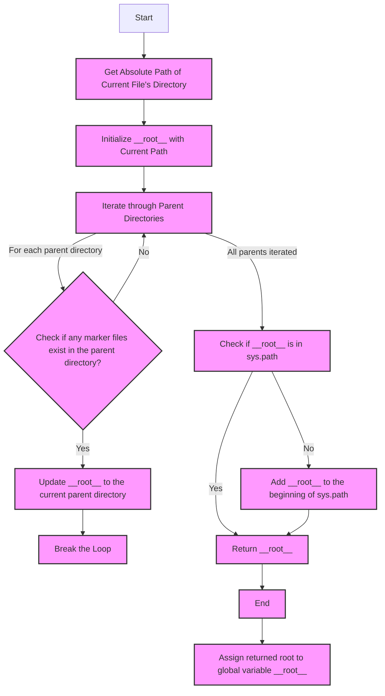

## ИНСТРУКЦИЯ:

Анализируй предоставленный код подробно и объясни его функциональность. Ответ должен включать три раздела:  

1. **<алгоритм>**: Опиши рабочий процесс в виде пошаговой блок-схемы, включая примеры для каждого логического блока, и проиллюстрируй поток данных между функциями, классами или методами.  
2. **<mermaid>**: Напиши код для диаграммы в формате `mermaid`, проанализируй и объясни все зависимости, 
    которые импортируются при создании диаграммы. 
    **ВАЖНО!** Убедитесь, что все имена переменных, используемые в диаграмме `mermaid`, 
    имеют осмысленные и описательные имена. Имена переменных вроде `A`, `B`, `C`, и т.д., не допускаются!  
    
    **Дополнительно**: Если в коде есть импорт `import header`, добавьте блок `mermaid` flowchart, объясняющий `header.py`:\
    ```mermaid\
    flowchart TD\
        Start --> Header[<code>header.py</code><br> Determine Project Root]\
    \
        Header --> import[Import Global Settings: <br><code>from src import gs</code>] \
    ```

3. **<объяснение>**: Предоставьте подробные объяснения:  
   - **Импорты**: Их назначение и взаимосвязь с другими пакетами `src.`.  
   - **Классы**: Их роль, атрибуты, методы и взаимодействие с другими компонентами проекта.  
   - **Функции**: Их аргументы, возвращаемые значения, назначение и примеры.  
   - **Переменные**: Их типы и использование.  
   - Выделите потенциальные ошибки или области для улучшения.  

Дополнительно, постройте цепочку взаимосвязей с другими частями проекта (если применимо).  

Это обеспечивает всесторонний и структурированный анализ кода.
## Формат ответа: `.md` (markdown)
**КОНЕЦ ИНСТРУКЦИИ**
## <алгоритм>
1. **Начало**: Запуск скрипта `header.py`.
2. **Инициализация**:
   - Определить переменную `current_path` как абсолютный путь к директории, содержащей файл `header.py`.
   - Определить переменную `__root__` и присвоить ей значение `current_path` в начале.
     *Пример:* Если `header.py` находится в `/home/user/project/src/webdriver/chrome/`, то `current_path` будет `/home/user/project/src/webdriver/chrome/`.
3. **Поиск корневой директории**:
   - Итерация по родительским директориям `current_path` (включая саму `current_path`):
        *Пример*: `/home/user/project/src/webdriver/chrome/`, `/home/user/project/src/webdriver/`, `/home/user/project/src/`, `/home/user/project/`, `/home/user/` , `/home/`, `/`.
   - Проверка существования хотя бы одного из `marker_files` (`__root__`, `.git`) в каждой родительской директории:
      - *Пример 1*: Если в `/home/user/project/` существует файл `.git`, то цикл прерывается и `__root__` присваивается `/home/user/project/`.
      - *Пример 2*: Если ни в одной из родительских директорий не найден ни один из `marker_files`, то `__root__` останется равным начальному `current_path`.
4. **Добавление корневой директории в `sys.path`**:
    - Проверить, содержится ли `__root__` в списке путей поиска модулей `sys.path`.
    - Если нет, то добавить `__root__` в начало списка `sys.path`.
5. **Возврат**:
   - Вернуть `__root__` как путь к корневой директории проекта.
6. **Определение глобальной переменной**:
   - Присвоить результат функции `set_project_root()` глобальной переменной `__root__`.

## <mermaid>

## <объяснение>
### Импорты
- `sys`: Предоставляет доступ к некоторым переменным и функциям, используемым или поддерживаемым интерпретатором. Используется для добавления пути к корневой директории проекта в `sys.path`, что позволяет импортировать модули из этого проекта.
- `json`: Модуль не используется в коде, он вероятно остался от предыдущей версии.
- `packaging.version`: Модуль не используется в коде, он вероятно остался от предыдущей версии.
- `pathlib.Path`: Используется для представления путей к файлам и директориям в кроссплатформенном формате, что упрощает операции с путями.

### Классы
- В данном коде нет классов.

### Функции
- `set_project_root(marker_files: tuple = ('__root__', '.git')) -> Path`:
  - **Аргументы**:
    - `marker_files`: `tuple` - Кортеж строк, представляющих имена файлов или директорий, которые могут идентифицировать корневую директорию проекта. По умолчанию `('__root__', '.git')`.
  - **Возвращаемое значение**:
    - `Path`: Объект `pathlib.Path`, представляющий путь к корневой директории проекта. Если ни один из маркеров не найден, возвращается путь директории, где расположен скрипт.
  - **Назначение**:
    - Функция предназначена для автоматического определения корневой директории проекта, начиная с места, где расположен текущий скрипт, путем подъема по родительским директориям и поиска наличия маркеров (`__root__` или `.git` по умолчанию).
  - **Примеры**:
    - Если в директории `/home/user/project/` есть файл `.git`, а скрипт находится в `/home/user/project/src/webdriver/chrome/header.py`, то `set_project_root()` вернёт `Path('/home/user/project')`.
    - Если маркеры не найдены, и скрипт расположен в `/home/user/project/src/webdriver/chrome/header.py`, то вернёт `Path('/home/user/project/src/webdriver/chrome')`.
  - **Поток данных**:
     - Функция получает путь к текущей директории.
     - Итерирует по родительским директориям, пока не найдет маркер.
     - Возвращает найденный путь, либо начальный путь если маркеры не найдены.

### Переменные
- `__root__`:
  -  `Path`: Глобальная переменная, хранящая путь к корневой директории проекта.
  -  Используется для определения местоположения корневой директории проекта и добавления этого пути в `sys.path`, что позволяет импортировать модули из этого проекта.
- `current_path`:
   - `Path`: Локальная переменная, хранящая путь к директории, где находится текущий скрипт `header.py`.
   - Используется для старта поиска корневой директории проекта.
- `marker_files`:
    - `tuple`: Кортеж, содержащий имена файлов или директорий, используемых для идентификации корневой директории проекта.
    - Используется в функции `set_project_root` для поиска корневой директории проекта.
- `parent`:
    - `Path`: Локальная переменная, используемая в цикле для итерации по родительским директориям.

### Потенциальные ошибки и области для улучшения
1. **Обработка ошибок:**
  -  В коде нет явной обработки исключений. В случае если не удастся получить абсолютный путь к файлу или произойдет любая другая неожиданная ошибка во время поиска родительских директорий, программа может завершиться с ошибкой.
2. **Расширяемость списка маркеров**:
  -  Список `marker_files` задан по умолчанию в функции. Можно улучшить это, позволяя передавать список маркеров извне, например, через переменную окружения или конфигурационный файл.
3. **Улучшение читаемости**:
  - Можно вынести часть логики, например, проверку существования маркеров в отдельную функцию для улучшения читаемости.

### Взаимосвязь с другими частями проекта
- Данный модуль является фундаментом проекта, так как он определяет корневую директорию, от которой зависят все остальные модули, используя `sys.path` для импорта модулей.
- Другие модули проекта, такие как `src.webdriver.chrome`, будут использовать определенную в `header.py` глобальную переменную `__root__` для доступа к другим частям проекта.