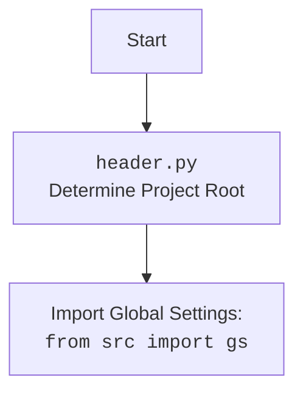

## АНАЛИЗ КОДА `hypotez/src/webdriver/chrome/header.py`

### 1. <алгоритм>

**Функция `set_project_root(marker_files=('__root__', '.git'))`:**

1.  **Начало:** Получаем абсолютный путь к каталогу, в котором находится файл `header.py`.
    *   **Пример:** Если `header.py` находится в `/home/user/hypotez/src/webdriver/chrome`, то `current_path` будет `/home/user/hypotez/src/webdriver/chrome`.
2.  **Инициализация:** Переменной `__root__` присваивается значение `current_path`.
    *   **Пример:** `__root__` = `/home/user/hypotez/src/webdriver/chrome`
3.  **Поиск корневого каталога:**
    *   Итерируемся по текущему каталогу и его родительским каталогам.
        *   **Пример:** Для начального `current_path` из примера выше, итерируемся по `/home/user/hypotez/src/webdriver/chrome`, `/home/user/hypotez/src/webdriver`, `/home/user/hypotez`, `/home/user`, `/home`, и `/` (если это корень файловой системы).
    *   Для каждого каталога проверяем наличие хотя бы одного файла-маркера (по умолчанию `'__root__'` или `'.git'`).
        *   **Пример:** Проверяем наличие `/home/user/hypotez/src/webdriver/chrome/__root__`, `/home/user/hypotez/src/webdriver/chrome/.git`, `/home/user/hypotez/src/webdriver/__root__`, `/home/user/hypotez/src/webdriver/.git`, и так далее для каждого каталога-кандидата.
    *   Если файл-маркер найден, обновляем `__root__` и прерываем цикл.
        *   **Пример:** Если `/home/user/hypotez/.git` существует, то `__root__` становится `/home/user/hypotez` и цикл прерывается.
4.  **Обновление `sys.path`:** Если `__root__` отсутствует в путях поиска Python, добавляем его в начало списка путей.
5.  **Возврат:** Возвращаем `__root__` как путь к корневому каталогу проекта.

**Основная часть кода:**

1.  **Вызов `set_project_root()`:** Определяем корневой каталог проекта и сохраняем его в глобальную переменную `__root__`.
2.  **Импорт `gs`:** Импортируем глобальные настройки из `src.gs`.
3.  **Загрузка настроек:**
    *   Пытаемся открыть файл `settings.json` из каталога `src` в корневом каталоге.
    *   Загружаем JSON-содержимое в переменную `settings`. Если происходит ошибка, пропускаем блок `try`.
4. **Чтение README.MD**:
    *   Пытаемся открыть файл `README.MD` из каталога `src` в корневом каталоге.
    *   Читаем содержимое файла в переменную `doc_str`. Если происходит ошибка, пропускаем блок `try`.
5.  **Инициализация переменных:** На основе полученных настроек и `doc_str`, или значений по умолчанию, инициализируются следующие переменные:
    *   `__project_name__`: имя проекта.
    *   `__version__`: версия проекта.
    *   `__doc__`: документация проекта из `README.MD`.
    *   `__details__`: детальная информация о проекте (по умолчанию пустая строка).
    *   `__author__`: автор проекта.
    *   `__copyright__`: информация об авторских правах.
    *    `__cofee__`:  информация для поддержки разработчика.

### 2. <mermaid>

```mermaid
flowchart TD
    Start --> FindRoot[<code>set_project_root()</code><br> Find Project Root]
    FindRoot --> GetCurrentPath[Get current script directory]
    GetCurrentPath --> InitializeRoot[Initialize root = current path]
    InitializeRoot --> IterateParents[Iterate through parent directories]
    IterateParents --> CheckMarkers{Check for marker files <br> ('__root__', '.git')}
    CheckMarkers -- Yes --> UpdateRoot[Update root to current directory]
    UpdateRoot --> BreakLoop[Break iteration loop]
    CheckMarkers -- No --> IterateParents
    IterateParents -->  FinishIteration{All parents checked?}
    FinishIteration -- Yes --> AddRootToPath[Add root to `sys.path` if needed]
    AddRootToPath --> ReturnRoot[Return Project Root]
    FinishIteration -- No --> IterateParents
    ReturnRoot --> SetGlobalRoot[Set global `__root__`]
     SetGlobalRoot --> ImportGS[Import Global Settings: <br><code>from src import gs</code>]
    ImportGS --> LoadSettings[Load settings.json]
    LoadSettings --> LoadReadme[Load README.MD]
    LoadReadme --> InitProjectVars[Initialize project variables: <br> name, version, doc, etc.]
    InitProjectVars --> End
    
    
    
  
```

**Зависимости, импортируемые при создании диаграммы:**

*   `pathlib.Path`:  Используется для работы с путями к файлам и каталогам, предоставляя объектно-ориентированный интерфейс.
*  `sys`: Используется для работы с интерпретатором Python, в частности для изменения путей поиска модулей.
* `json`: используется для чтения и загрузки данных из файла `settings.json`.
* `src.gs`: Импортируются глобальные настройки проекта из модуля `src.gs`, предоставляя доступ к общим параметрам и путям.

**Дополнительный `mermaid` flowchart для `header.py`:**



### 3. <объяснение>

**Импорты:**

*   `import sys`: Модуль `sys` используется для работы с интерпретатором Python, в данном случае для изменения `sys.path`. `sys.path` — это список каталогов, в которых Python ищет модули при импорте.
*   `import json`: Модуль `json` используется для работы с файлами в формате JSON (JavaScript Object Notation). В этом коде он используется для чтения файла `settings.json`.
*   `from packaging.version import Version`: Импортируется класс `Version` из библиотеки `packaging` для работы с версиями. В данном коде не используется, но импорт присутствует, возможно, для дальнейшего использования.
*   `from pathlib import Path`: Импортируется класс `Path` из модуля `pathlib` для работы с путями к файлам и директориям. `pathlib` обеспечивает более объектно-ориентированный и удобный способ работы с файловыми путями по сравнению со строковыми манипуляциями.
*   `from src import gs`: Импортирует модуль `gs` из пакета `src`. Вероятно, `gs` содержит глобальные настройки, используемые в проекте, например, пути к каталогам или общие переменные.

**Функция `set_project_root`:**

*   **Назначение:** Функция предназначена для автоматического определения корневого каталога проекта.
*   **Аргументы:**
    *   `marker_files` (tuple, по умолчанию `('__root__', '.git')`): кортеж с именами файлов или директорий, которые сигнализируют о том, что текущий каталог является корневым.
*   **Возвращаемое значение:** `Path` объект, представляющий путь к корневому каталогу проекта. Если корневой каталог не найден, возвращается путь к каталогу, где находится файл `header.py`.
*   **Пример:**
    ```python
    root_path = set_project_root()
    print(root_path) # Выведет путь к корневому каталогу проекта.
    ```

**Переменные:**

*   `__root__` (Path): Глобальная переменная, хранящая путь к корневому каталогу проекта. Инициализируется вызовом `set_project_root()`
*   `settings` (dict): Словарь, содержащий настройки проекта из файла `settings.json`.
*   `doc_str`(str): Строка, содержащая документацию проекта из файла `README.MD`
*   `__project_name__` (str): Имя проекта, считанное из файла `settings.json` или значение по умолчанию (`hypotez`).
*   `__version__` (str): Версия проекта, считанная из файла `settings.json` или пустая строка.
*   `__doc__` (str): документация проекта из файла `README.MD`, или пустая строка
*   `__details__` (str):  детальная информация о проекте, по умолчанию пустая строка.
*   `__author__` (str): автор проекта, считанный из файла `settings.json`, или пустая строка.
*   `__copyright__` (str): информация об авторских правах, считанная из файла `settings.json` или пустая строка.
*   `__cofee__`(str): сообщение, предлагающее угостить разработчика кофе, считанное из файла `settings.json` или  значение по умолчанию.

**Потенциальные ошибки и области для улучшения:**

*   **Обработка ошибок:** Код обрабатывает ошибки `FileNotFoundError` и `json.JSONDecodeError` при чтении `settings.json` и `README.MD` просто `...`, что означает пропуск исключения. Это может привести к тому, что приложение продолжит работать, не имея необходимых настроек и документации, и в конечном итоге, это может вызвать сбой в другом месте кода.  Стоит добавить обработку ошибок с выводом сообщений в лог или с установкой значений по умолчанию.
*   **Зависимость от структуры каталогов:** Функция `set_project_root()` полагается на наличие файлов-маркеров, таких как `__root__` или `.git`. Если эти маркеры отсутствуют, функция может вернуть неверный корень проекта.
*   **Жёстко заданные пути:** Путь к файлам `settings.json` и `README.MD` жёстко задан как `gs.path.root / 'src' /  'settings.json'` и  `gs.path.root / 'src' /  'README.MD'` что делает его менее гибким. Было бы полезно вынести  `'src'` в виде константы или переменной конфигурации.
*   **Отсутствие логирования:** Код не ведёт логирования. Это затрудняет отладку и поиск ошибок, особенно если файлы настроек или маркеры не найдены.
*   **Переменная `__details__`:** Переменная `__details__` инициализируется пустой строкой и в дальнейшем нигде не используется. Ее использование в дальнейшем коде стоит пересмотреть.
*  **Отсутствие проверки версии:** Хотя `packaging.version` импортируется, он не используется для проверки версии. Это может быть потенциальная область для расширения функциональности.

**Взаимосвязь с другими частями проекта:**

*   Этот модуль напрямую зависит от модуля `src.gs`, где предположительно хранятся глобальные настройки проекта, и от наличия файлов `settings.json` и `README.MD` в каталоге `src`.
*   Определенная переменная `__root__` используется другими модулями проекта для доступа к файлам и каталогам относительно корня проекта.
*   Глобальные переменные `__project_name__`, `__version__`, `__doc__` и тд могут использоваться для определения метаданных проекта, например, при формировании документации, или в процессе отображения информации.

В целом, данный код является важным компонентом проекта, поскольку он устанавливает корень проекта, загружает основные настройки и предоставляет метаинформацию о проекте. Однако требуется доработка обработки ошибок и логирования.