## Анализ кода `hypotez/src/webdriver/chrome/header.py`

### <алгоритм>

1.  **`set_project_root(marker_files)`**:
    *   Начало: Получает абсолютный путь к директории, где расположен текущий файл (`__file__`).
    *   Инициализация: `__root__` устанавливается равным текущему пути.
    *   Поиск корня проекта: Проходит по текущей директории и ее родительским директориям. Для каждой директории проверяется наличие хотя бы одного файла из `marker_files`.
        *   Пример: Если `marker_files` - это `('pyproject.toml', 'requirements.txt', '.git')`, то поиск остановится на директории, где находится один из этих файлов.
    *   Обновление `__root__`: Если маркерный файл найден, то `__root__` обновляется до пути родительской директории.
    *   Добавление в `sys.path`: Если `__root__` не в `sys.path`, добавляет `__root__` в начало `sys.path`. Это позволяет импортировать модули из корневой директории.
    *   Возврат: Возвращает `__root__`, который является путем к корневой директории проекта.
2.  **Получение корневой директории `__root__`**:
    *   Вызывает функцию `set_project_root()` для определения корневой директории проекта.
3.  **Импорт `gs`**:
    *   Импортирует модуль `gs` из пакета `src`.
4.  **Загрузка настроек из `settings.json`**:
    *   Инициализация `settings` в `None`.
    *   Попытка открыть файл `settings.json`, расположенный в `src` в корневой директории проекта.
        *   Пример: Если корневая директория `/home/user/project`, то файл будет `/home/user/project/src/settings.json`.
    *   Если файл успешно открыт, читает `json` и загружает его в словарь `settings`.
    *   Если файл не найден или не может быть декодирован, то `settings` остается `None`.
5.  **Загрузка документации из `README.MD`**:
    *   Инициализация `doc_str` в `None`.
    *   Попытка открыть файл `README.MD`, расположенный в `src` в корневой директории проекта.
    *   Если файл успешно открыт, читает его содержимое и сохраняет в `doc_str`.
    *   Если файл не найден, то `doc_str` остается `None`.
6.  **Инициализация глобальных переменных**:
    *   `__project_name__`: Получает имя проекта из `settings`, если они есть, иначе устанавливает значение `hypotez`.
    *   `__version__`: Получает версию проекта из `settings`, если они есть, иначе устанавливает значение `''`.
    *   `__doc__`:  Использует `doc_str` если он не `None`, иначе устанавливает значение `''`.
    *   `__details__`: Устанавливает значение `''`.
    *   `__author__`: Получает автора из `settings`, если они есть, иначе устанавливает значение `''`.
    *   `__copyright__`: Получает информацию об авторских правах из `settings`, если они есть, иначе устанавливает значение `''`.
    *   `__cofee__`: Получает ссылку для поддержки разработчика из `settings`, если они есть, иначе использует значение по умолчанию.

```mermaid
graph TD
    A[Начало] --> B{Определение пути текущего файла};
    B --> C{Инициализация __root__};
    C --> D{Цикл по родительским директориям};
    D --> E{Проверка наличия маркерных файлов};
    E -- Да --> F{Обновление __root__};
    F --> G{Конец цикла};
    E -- Нет --> D;
    G --> H{Проверка __root__ в sys.path};
    H -- Нет --> I{Добавление __root__ в sys.path};
    I --> J{Возврат __root__};
    H -- Да --> J;
    J --> K[Получение корневой директории];
    K --> L{Импорт gs};
    L --> M{Попытка загрузки settings.json};
     M --> N{Загрузка settings};
     N --> O{Попытка загрузки README.MD};
     O --> P{Загрузка doc_str};
     P --> Q{Инициализация глобальных переменных};
     Q --> R[Конец];
    
    style A fill:#f9f,stroke:#333,stroke-width:2px
     style R fill:#f9f,stroke:#333,stroke-width:2px
```

### <mermaid>



**Описание зависимостей:**

*   `A`: Начало выполнения скрипта.
*   `B`: Получение пути к файлу. Зависит от встроенной переменной `__file__`.
*   `C`: Инициализация переменной `__root__`.
*   `D`: Цикл по родительским каталогам.
*   `E`: Проверка наличия маркерных файлов. Зависит от списка маркерных файлов, передаваемых в функцию.
*   `F`: Обновление переменной `__root__`.
*   `G`: Конец цикла, выход из цикла for.
*   `H`: Проверка на наличие пути в списке `sys.path`. Зависит от модуля `sys`.
*   `I`: Добавление пути в список `sys.path`. Зависит от модуля `sys`.
*  `J`: Возврат переменной `__root__`.
*  `K`: Присваивание переменной `__root__` результата выполнения функции `set_project_root`
*   `L`: Импорт модуля `gs`. Зависит от наличия пакета `src` в проекте.
*  `M`: Попытка открытия и загрузки файла `settings.json`. Зависит от модуля `json`.
*   `N`: Загрузка словаря `settings`.
* `O`: Попытка открытия и чтения файла `README.MD`
*   `P`: Загрузка строки `doc_str`
*  `Q`: Инициализация глобальных переменных на основе загруженных данных из файлов.
*  `R`: Конец выполнения скрипта.

### <объяснение>

#### Импорты:
*   `sys`: Используется для доступа к системным переменным и функциям, в частности для работы с `sys.path`. Это позволяет добавлять корневую директорию проекта для импорта модулей.
*   `json`: Используется для работы с JSON файлами, в частности для загрузки файла `settings.json`.
*   `packaging.version.Version`: Используется для сравнения версий. В данном коде не используется, возможно, запланировано к использованию.
*   `pathlib.Path`: Используется для работы с путями в файловой системе.
*   `src.gs`: Импортирует модуль `gs` из пакета `src`, который, предположительно, содержит глобальные переменные и пути проекта.

#### Классы:
В данном файле классы не используются.

#### Функции:

*   **`set_project_root(marker_files)`**:
    *   **Аргументы**:
        *   `marker_files` (tuple): Кортеж, содержащий имена файлов или директорий, которые используются для определения корневой директории проекта. По умолчанию: `('pyproject.toml', 'requirements.txt', '.git')`.
    *   **Возвращаемое значение**:
        *   `Path`:  Объект `Path` корневой директории проекта или путь к текущему файлу, если корневая директория не найдена.
    *   **Назначение**:
        *   Определяет корневую директорию проекта путем поиска вверх по родительским директориям, пока не найдет один из маркерных файлов.
        *   Добавляет путь к корневой директории в `sys.path`, чтобы можно было импортировать модули из корневой директории.
    *   **Пример**:
        ```python
        marker_files = ('config.ini', 'data.db')
        project_root = set_project_root(marker_files)
        print(project_root)
        ```
        Если один из файлов  `config.ini` или `data.db` будет найден, то путь к родительской директории станет корневой.

#### Переменные:
*   `MODE`: (str) Определяет режим работы приложения, в данном случае установлен в `dev`.
*   `__root__`: (Path) Абсолютный путь к корневой директории проекта, вычисляется функцией `set_project_root`.
*   `settings`: (dict) Словарь, содержащий настройки проекта, загружаемые из файла `settings.json`. Если файл не найден, будет `None`.
*   `doc_str`: (str) Строка, содержащая документацию проекта, загружаемая из файла `README.MD`. Если файл не найден, будет `None`.
*   `__project_name__`: (str) Имя проекта, берется из `settings`, или значение по умолчанию `hypotez`.
*    `__version__`: (str) Версия проекта, берется из `settings`, или пустая строка.
*   `__doc__`: (str) Документация проекта, берется из `doc_str`, или пустая строка.
*   `__details__`: (str) Детали проекта, в данном случае всегда пустая строка.
*   `__author__`: (str) Автор проекта, берется из `settings`, или пустая строка.
*   `__copyright__`: (str) Авторское право, берется из `settings`, или пустая строка.
*   `__cofee__`: (str) Сообщение для поддержки разработчика, берется из `settings`, или значение по умолчанию.

#### Потенциальные ошибки и области для улучшения:

*   Обработка ошибок: В блоках `try...except` при чтении `settings.json` и `README.MD` используется `...` для пропуска ошибок. Это может привести к проблемам, если файлы не будут найдены. Лучше логировать ошибки или выдавать информативные сообщения.
*   Жестко заданные пути: Путь к файлам `settings.json` и `README.MD` жестко задан через конкатенацию с `gs.path.root`.  Может быть лучше использовать `pathlib` для более гибкого построения путей.
*  Зависимости: Зависимость от `gs.path.root` делает этот файл зависимым от структуры проекта и модуля `src.gs`. Это можно исправить путем более универсального задания путей.
* `__details__` : Переменная всегда пуста, можно убрать или доработать.
* Отсутствие проверок типов при чтении из `settings`.

#### Взаимосвязи с другими частями проекта:

*   Модуль `gs`: Этот файл зависит от модуля `gs` из пакета `src`, который, вероятно, хранит глобальные переменные проекта, включая путь к корневой директории.
*   `settings.json`: Файл, содержащий настройки проекта. Отсутствие этого файла приведет к использованию значений по умолчанию для переменных проекта.
*   `README.MD`: Файл, содержащий документацию проекта. Отсутствие этого файла не приведет к ошибке, но `__doc__` останется пустой строкой.

Этот файл `header.py` является важным для инициализации проекта, поскольку он определяет его корневую директорию, загружает настройки и предоставляет доступ к глобальным переменным проекта.