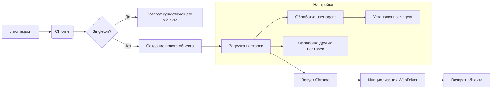

```MD
# Анализ кода Chrome WebDriver

## <input code>

```rst
.. module:: src.webdriver.chrome
```
# Chrome WebDriver для Selenium

Этот репозиторий предоставляет кастомную реализацию Chrome WebDriver с использованием Selenium. Он интегрирует настройки конфигурации, определённые в файле `chrome.json`, такие как user-agent и настройки профиля браузера, чтобы обеспечить гибкие и автоматизированные взаимодействия с браузером.

## Ключевые особенности

- **Централизованная конфигурация**: Конфигурация управляется через файл `chrome.json`.
- **Множественные профили браузера**: Поддерживает несколько профилей браузера, что позволяет настраивать различные параметры для тестирования.
- **Улучшенное логирование и обработка ошибок**: Предоставляет подробные логи для инициализации, проблем с конфигурацией и ошибок WebDriver.

## Требования

Перед использованием этого WebDriver убедитесь, что установлены следующие зависимости:

- Python 3.x
- Selenium
- Fake User Agent
- WebDriver бинарник для Chrome (например, `chromedriver`)

Установите необходимые зависимости Python:

```bash
pip install selenium fake_useragent
```

Кроме того, убедитесь, что бинарник `chromedriver` доступен в `PATH` вашей системы или укажите путь к нему в конфигурации.

## Конфигурация

Конфигурация для Chrome WebDriver хранится в файле `chrome.json`.

(Далее следует пример конфигурации в формате JSON и описание полей)

## Использование

(Далее следует пример использования в Python)

## Логирование и отладка

(Далее следует информация о логировании)


```

## <algorithm>

К сожалению, предоставленный код представляет собой описание, а не код на Python.  Поэтому построить подробную блок-схему невозможно.  Описание описывает работу класса `Chrome`, использующего паттерн Singleton для управления одним экземпляром WebDriver.  Он подгружает конфигурацию из файла `chrome.json`,  используя эту конфигурацию для запуска Chrome с заданными параметрами. Также описан способ задания пользовательского User-Agent.

## <mermaid>



**Описание диаграммы:**

* **`chrome.json`**:  Входной файл с настройками для Chrome WebDriver.
* **`Chrome`**:  Класс, реализующий WebDriver.
* **`Singleton?`**: Проверка, существует ли уже экземпляр класса `Chrome` (Singleton).
* **`Возврат существующего объекта`**: Если экземпляр класса уже существует, возвращается он.
* **`Создание нового объекта`**: Если экземпляр класса не существует, он создаётся.
* **`Загрузка настроек`**: Считывание и обработка конфигурации из `chrome.json`.
* **`Запуск Chrome`**: Запуск браузера Chrome с заданными параметрами.
* **`Инициализация WebDriver`**:  Инициализация Selenium WebDriver.
* **`Возврат объекта`**: Возврат готового объекта WebDriver.
* **`Обработка user-agent`**: Обработка параметра `user-agent`.
* **`Обработка других настроек`**: Обработка прочих параметров из `chrome.json`.
* **`Установка user-agent`**: Установка заданного `user-agent`.


## <explanation>

**Импорты**:  Отсутствуют явные импорты, так как это описание, а не код.  В случае реального кода, ожидаются импорты `selenium`, `fake_useragent`, а также, скорее всего, `logging` (для логирования) и модули для работы с JSON.  Связь с `src.` предполагает, что эти модули находятся в пакете `src`.

**Классы**: Описывается класс `Chrome`, который, скорее всего, использует паттерн Singleton для управления единственным экземпляром WebDriver.

**Функции**: В описании примерах функций нет, это описание класса.

**Переменные**: В описании переменные (например, `user_agent`) — аргументы конструктора класса `Chrome` или локальные переменные внутри методов класса.  Их типы (строка, словарь) определяются контекстом.


**Возможные ошибки или улучшения**:

* **Обработка ошибок**: Отсутствует описание обработки возможных ошибок при чтении/парсинге `chrome.json`, инициализации WebDriver и запуске Chrome.
* **Проверка валидности конфигурации**: Необходимо добавить проверку корректности данных в файле `chrome.json`.
* **Модульное тестирование**:  Для уверенности в корректной работе необходимо писать модульные тесты.
* **Документация**: Необходимо дополнить документацию примерами использования в различных сценариях, а также описанием поведения класса `Chrome` (особенно логики Singleton) с точки зрения производительности.

**Взаимосвязи с другими частями проекта**:

* **`src.logger`**:  Зависимость от модуля логирования `logger` указывает на возможность записи сообщений в файл или консоль, как для отслеживания действий, так и для вывода ошибок.
* **`src.config`**:  Если `chrome.json` — часть большей системы конфигурации, то связь будет с модулем `config`.
* **`src.selenium`**:  Использование Selenium подразумевает взаимодействие с веб-драйвером.