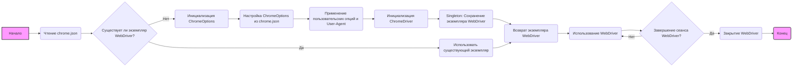

## Анализ кода `README.md`

### <алгоритм>

1.  **Чтение файла конфигурации (`chrome.json`)**:
    *   Пример: `{"options": {"log-level": "5"}, "profile_directory": {"os": "..."}, ...}`
    *   Данные JSON загружаются из `chrome.json` файла.
    *   Данные используются для конфигурации Chrome WebDriver.
2.  **Инициализация Chrome WebDriver**:
    *   Пример: `browser = Chrome(user_agent="...", options=["--headless"])`
    *   Класс `Chrome` принимает `user_agent` и `options` как аргументы.
    *   Класс `Chrome` читает конфигурацию из файла `chrome.json`.
    *   Используется паттерн Singleton. Если экземпляр WebDriver существует, используется существующий.
    *   Если WebDriver еще не создан, он инициализируется с параметрами из конфигурации и переданных аргументов.
    *   Используются `ChromeOptions` для настройки WebDriver.
3.  **Настройка опций Chrome**:
    *   Пример:  Установка уровня логирования, отключение `dev-shm`, установка порта отладки и аргументов командной строки.
    *   Значения из поля `options` применяются к `ChromeOptions`.
    *   Значения из поля `disabled_options` отключаются в `ChromeOptions`.
    *   Устанавливаются пути профилей, если они указаны в поле `profile_directory`.
    *   Устанавливаются пути к бинарникам Chrome из поля `binary_location`.
    *   Устанавливаются пользовательские заголовки из поля `headers`
4.  **Использование WebDriver**:
    *   Пример: `browser.get("https://www.example.com")`
    *   WebDriver открывает указанную веб-страницу.
    *   WebDriver используется для автоматизации браузера.
5.  **Закрытие WebDriver**:
    *   Пример: `browser.quit()`
    *   WebDriver закрывает браузер.

### <mermaid>

**Объяснение `mermaid` диаграммы:**

*   **`Начало`**: Начальная точка выполнения.
*   **`Чтение chrome.json`**: Загрузка конфигурации из файла `chrome.json`.
*   **`Существует ли экземпляр WebDriver?`**: Проверка, существует ли уже созданный экземпляр WebDriver (Singleton).
*   **`Использовать существующий экземпляр`**: Если экземпляр существует, он используется повторно.
*   **`Инициализация ChromeOptions`**: Создание объекта `ChromeOptions` для настройки параметров браузера.
*   **`Настройка ChromeOptions из chrome.json`**: Применение настроек из файла `chrome.json` к `ChromeOptions`.
*   **`Применение пользовательских опций и User-Agent`**: Добавление пользовательских опций и `user-agent`, переданных при инициализации.
*   **`Инициализация ChromeDriver`**: Создание экземпляра `ChromeDriver` с настроенными опциями.
*   **`Singleton: Сохранение экземпляра WebDriver`**: Сохранение созданного экземпляра `ChromeDriver`.
*   **`Возврат экземпляра WebDriver`**: Возврат (или использование существующего) экземпляра WebDriver.
*   **`Использование WebDriver`**: Выполнение действий с помощью WebDriver (например, открытие страниц).
*   **`Завершение сеанса WebDriver?`**: Проверка, нужно ли закрыть WebDriver.
*   **`Закрытие WebDriver`**: Завершение работы экземпляра WebDriver и закрытие браузера.
*   **`Конец`**: Конечная точка выполнения.

### <объяснение>

**Импорты:**

В предоставленном тексте `README.md` не упоминаются импорты Python, так как он является инструкцией по использованию модуля, а не самим кодом. Однако, исходя из описания, можно предположить, что в коде самого модуля `src.webdriver.chrome` используются следующие импорты:

*   `selenium` - Основной пакет для автоматизации браузера. Используется для создания экземпляра `ChromeDriver` и управления браузером.
*   `selenium.webdriver.chrome.options` -  Используется для настройки параметров Chrome.
*   `selenium.webdriver.chrome.service` -  Используется для настройки параметров сервиса Chrome.
*   `fake_useragent` -  Пакет для генерации случайных `user-agent`. Используется, если не задан пользовательский user-agent.
*   `src.logger` - Логирование действий и ошибок. Взаимодействует с модулем логирования.
*   `json` - Модуль для работы с файлом конфигурации `chrome.json`

**Классы:**

*   **`Chrome`**:
    *   **Роль:**  Основной класс для управления экземпляром Chrome WebDriver.
    *   **Атрибуты:**
        *   `_instance`: Приватный статический атрибут, хранит экземпляр WebDriver (для паттерна Singleton).
        *   `logger`: Экземпляр логгера для записи сообщений.
    *   **Методы:**
        *   `__init__`: Инициализирует экземпляр WebDriver, читает конфигурацию из `chrome.json`, применяет настройки, использует паттерн Singleton.
        *   `get`: Открывает веб-страницу по URL.
        *   `quit`: Закрывает браузер.
    *   **Взаимодействие:**
        *   Использует `ChromeOptions` для настройки Chrome.
        *   Использует `ChromeDriver` из `selenium`.
        *   Использует `logger` для записи логов.
        *   Использует `json` для чтения файла конфигурации.

**Функции:**

В `README.md` не описаны конкретные функции, но класс `Chrome` имеет методы:

*   `__init__(self, user_agent=None, options=None)`:
    *   **Аргументы:**
        *   `user_agent` (str, optional): Пользовательский User-Agent.
        *   `options` (list, optional): Список дополнительных опций Chrome.
    *   **Возвращаемое значение:** None (метод-инициализатор).
    *   **Назначение:** Инициализация WebDriver с настройками из файла конфигурации и переданными аргументами.
    *   **Пример:** `Chrome(user_agent="...", options=["--headless"])`
*   `get(self, url)`:
    *   **Аргументы:** `url` (str): URL веб-страницы для открытия.
    *   **Возвращаемое значение:** None.
    *   **Назначение:** Открывает веб-страницу по указанному URL в браузере.
    *   **Пример:** `browser.get("https://www.example.com")`
*   `quit(self)`:
    *   **Аргументы:** None.
    *   **Возвращаемое значение:** None.
    *   **Назначение:** Закрывает браузер и завершает сессию WebDriver.
    *   **Пример:** `browser.quit()`

**Переменные:**

*   **`_instance`**: Статическая переменная класса `Chrome`, хранит экземпляр WebDriver (для паттерна Singleton). Тип: `ChromeDriver` or `None`.
*   **`logger`**: Экземпляр логгера, для записи логов. Тип: Зависит от реализации модуля `src.logger`.
*   **Конфигурационные переменные**: (в файле `chrome.json`)
    *   `options`: Словарь параметров Chrome (ключ: строка, значение: строка или список строк).
    *   `disabled_options`: Словарь отключенных параметров Chrome (ключ: строка, значение: строка).
    *   `profile_directory`: Словарь путей к профилям пользователя (ключ: строка, значение: строка).
    *   `binary_location`: Словарь путей к бинарникам (ключ: строка, значение: строка).
    *   `headers`: Словарь HTTP-заголовков (ключ: строка, значение: строка).
    *   `proxy_enabled`: Булевое значение, указывающее на использование прокси.

**Потенциальные ошибки и области для улучшения:**

*   **Обработка ошибок**: В тексте упоминается логирование ошибок, но нет подробностей о том, как обрабатываются исключения. Нужно добавить более детальную обработку, чтобы избежать неожиданного завершения программы.
*   **Пути к бинарникам**: Пути к бинарникам Chrome и ChromeDriver могут отличаться в зависимости от системы. В `chrome.json` должны быть определены пути для разных операционных систем.
*   **Проверка конфигурации**:  Необходимо проверять корректность структуры файла `chrome.json` при его чтении и сообщать об ошибках.
*   **Singleton**: Применение паттерна Singleton может усложнить тестирование и настройку. Возможно, стоит предусмотреть возможность создания нескольких экземпляров WebDriver.
*   **Недостаточная гибкость**: Файл `chrome.json` имеет жесткую структуру. Возможно, стоит использовать более гибкий формат, например YAML, или предусмотреть возможность добавления новых конфигурационных параметров.
*   **Отсутствие возможности настройки прокси**: В конфигурационном файле есть параметр `proxy_enabled`, но нет описания того, как именно будет настроен прокси. Нужно добавить поддержку прокси.
*   **Управление версиями драйверов**: Отсутствует возможность управления версиями ChromeDriver.

**Цепочка взаимосвязей:**

*   `src.webdriver.chrome` использует `selenium` для управления браузером.
*   `src.webdriver.chrome` использует `fake_useragent` для генерации `user-agent`.
*   `src.webdriver.chrome` использует `src.logger` для логирования.
*   `src.webdriver.chrome` считывает конфигурацию из `chrome.json`.
*   `src.webdriver.chrome` является частью более крупного проекта автоматизации, который может взаимодействовать с другими модулями проекта.