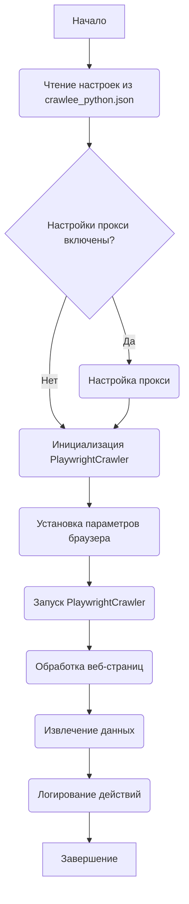

## Анализ кода `README.MD` для `src.webdriver.crawlee_python`

### 1. <алгоритм>

1.  **Чтение конфигурации:**
    *   Читается файл `crawlee_python.json`.
    *   Пример файла:
        ```json
        {
          "max_requests": 10,
          "headless": true,
          "browser_type": "chromium",
          "options": ["--disable-dev-shm-usage", "--no-sandbox"],
          "user_agent": "...",
          "proxy": {"enabled": false, "server": "...", "username": "...", "password": "..."},
          "viewport": {"width": 1280, "height": 720},
          "timeout": 30000,
          "ignore_https_errors": false
        }
        ```
2.  **Инициализация `CrawleePython`:**
    *   Класс `CrawleePython` инициализируется.
    *   Пример: `crawler = CrawleePython(max_requests=10, headless=True, browser_type='chromium', options=["--headless"])`.
    *   При инициализации происходит загрузка настроек из `crawlee_python.json`.
    *   Дополнительно, можно передать пользовательские параметры в конструктор класса.
3.  **Настройка Playwright:**
    *   Настраиваются параметры запуска браузера Playwright на основе конфигурации (например, `headless`, `browser_type`, `options`, `user_agent`, `proxy`, `viewport`, `timeout`, `ignore_https_errors`).
    *   Используется `PlaywrightCrawler` из библиотеки Crawlee.
4.  **Запуск краулера:**
    *   Вызывается метод `run` класса `CrawleePython`, передавая в него список URL для обхода.
    *   Пример: `await crawler.run(['https://www.example.com'])`.
5.  **Обработка страниц:**
    *   `PlaywrightCrawler` обходит страницы, используя настроенные параметры.
    *   (Дальнейшая обработка страниц и извлечение данных не описаны в `README.MD`, но подразумеваются).
6.  **Логирование:**
    *   В процессе работы логируются все важные события, ошибки и предупреждения.
    *   Используется `logger` из `src.logger`.

### 2. <mermaid>



**Анализ зависимостей:**

*   `graph TD`: Объявление графа направленного типа.
*   `A[Начало]`, `K[Завершение]`: Узлы, представляющие начало и конец процесса.
*   `B(Чтение настроек из crawlee_python.json)`: Узел, представляющий чтение конфигурационного файла.
*   `C{Настройки прокси включены?}`: Узел решения (ромб), представляющий проверку включения прокси.
*   `D(Настройка прокси)`: Узел, представляющий настройку прокси-сервера.
*   `E(Инициализация PlaywrightCrawler)`: Узел, представляющий инициализацию `PlaywrightCrawler` из библиотеки Crawlee.
*   `F(Установка параметров браузера)`: Узел, представляющий установку параметров браузера на основе конфигурации.
*    `G(Запуск PlaywrightCrawler)`: Узел, представляющий запуск краулера.
*   `H(Обработка веб-страниц)`: Узел, представляющий обработку веб-страниц.
*   `I(Извлечение данных)`: Узел, представляющий извлечение данных из обработанных страниц.
*   `J(Логирование действий)`: Узел, представляющий логирование процесса.

### 3. <объяснение>

#### Импорты

*   В самом файле `README.MD` нет импортов Python, но предполагается, что в коде модуля `src.webdriver.crawlee_python` используются следующие импорты:
    *   `crawlee`: Библиотека Crawlee для создания краулеров.
    *   `playwright`: Библиотека Playwright для управления браузерами.
    *   `src.logger`: Пользовательский модуль для логирования, который находится в проекте.
    *   `json`: Для работы с файлом `crawlee_python.json` (стандартная библиотека).
    *   `asyncio`: Для асинхронного программирования.

#### Классы

*   **`CrawleePython`**:
    *   **Роль:** Класс, реализующий логику краулера на основе Playwright и Crawlee, загружающий настройки из `crawlee_python.json`.
    *   **Атрибуты:**
        *   Неявно: атрибуты, которые будут определены на основе загруженной конфигурации (например, `max_requests`, `headless`, `browser_type` и т.д.).
        *   Экземпляр `PlaywrightCrawler`.
    *   **Методы:**
        *   `__init__`: Инициализация класса, чтение настроек из `crawlee_python.json` и настройка `PlaywrightCrawler` с учетом этих настроек. Принимает аргументы, переопределяющие значения из JSON файла, и  `**kwargs` для дополнительных параметров.
        *    `run`: Запуск процесса краулинга, принимает список URL.
    *   **Взаимодействие:**
        *   Взаимодействует с библиотеками `crawlee` и `playwright`, а также с модулем `src.logger`.

#### Функции

*   `main()`:
    *   **Аргументы:** Нет.
    *   **Возвращаемое значение:** Нет (async function).
    *   **Назначение:** Пример использования `CrawleePython`. Создает экземпляр класса `CrawleePython` и запускает краулер для заданных URL.
    *   **Пример:**
        ```python
        async def main():
            crawler = CrawleePython(max_requests=10, headless=True, browser_type='chromium', options=["--headless"])
            await crawler.run(['https://www.example.com'])
        ```
    *   `asyncio.run(main())`: Запускает асинхронную функцию `main`.

#### Переменные

*   Переменные, используемые в конфигурационном файле `crawlee_python.json` описаны в разделе "Конфигурация". Они определяют параметры работы `PlaywrightCrawler`.
*   Переменные, используемые в примере кода - это `crawler` в функции `main`, который является экземпляром класса `CrawleePython`.

#### Потенциальные ошибки и области для улучшения

*   **Обработка ошибок JSON:** Не описана явная обработка ошибок при загрузке и парсинге файла `crawlee_python.json`. Необходимо добавить `try-except` для ситуаций, когда файл отсутствует, поврежден или содержит некорректные данные.
*   **Валидация конфигурации:** Не проводится валидация данных из JSON. Необходимо проверять типы и значения конфигурационных параметров перед их использованием.
*   **Обработка исключений краулера:** В `README.MD` нет явного описания обработки ошибок, возникающих во время краулинга (например, сетевые ошибки, ошибки парсинга, и т.д.). Необходимо добавить логику обработки и логирования таких ошибок.
*   **Гибкость конфигурации:** Сейчас конфигурация ограничена параметрами, указанными в файле `crawlee_python.json`. Можно добавить поддержку дополнительных настроек, которые можно передавать через код (например, callback-функции).
*   **Отсутствует описание обработки страниц:** `README.MD` не описывает каким образом данные извлекаются с веб-страниц и что с ними происходит. Необходимо добавить раздел в `README.MD`, объясняющий как настраивается функция `requestHandler`, которая используется в `PlaywrightCrawler`.

#### Цепочка взаимосвязей с другими частями проекта

*   **`src.logger`**: Этот модуль используется для логирования всех действий, ошибок и предупреждений.
*   **Возможно `src.utils`**: Если есть какие-либо вспомогательные функции, они могут быть в этом модуле.
*   **Другие части проекта**: Модуль `crawlee_python` является частью `src.webdriver` и будет использован для автоматизации сбора данных в различных частях проекта.