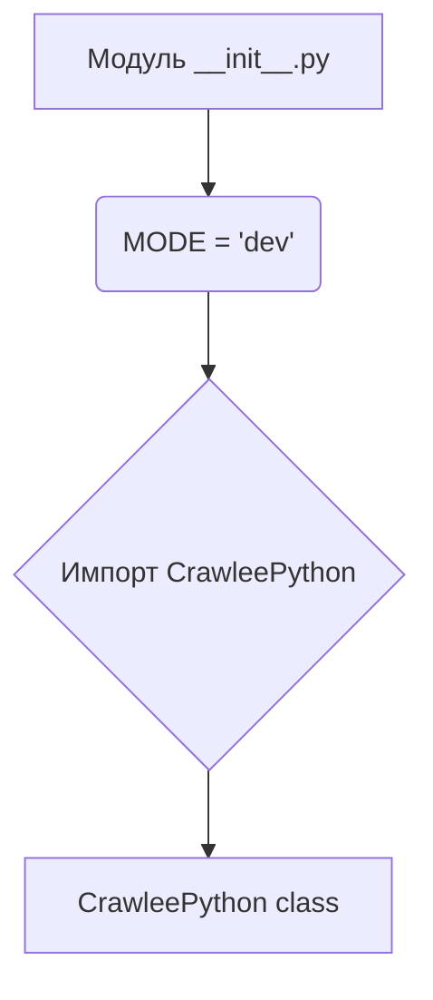
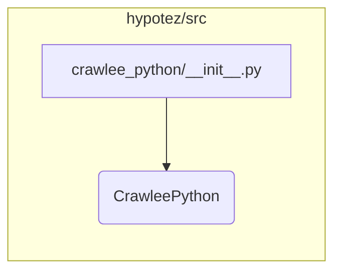

```MD
# Анализ кода hypotez/src/webdriver/crawlee_python/__init__.py

## <input code>

```python
## \file hypotez/src/webdriver/crawlee_python/__init__.py
# -*- coding: utf-8 -*-\
#! venv/Scripts/python.exe
#! venv/bin/python/python3.12

"""
.. module: src.webdriver.crawlee_python 
	:platform: Windows, Unix
	:synopsis:

"""
MODE = 'dev'

from .crawlee_python import CrawleePython
```

## <algorithm>



**Описание алгоритма:**

Модуль `__init__.py` - это инициализирующий файл для пакета `crawlee_python`.  Он задаёт глобальную переменную `MODE` со значением 'dev'.  Ключевая часть — это импорт класса `CrawleePython` из подпакета `crawlee_python`.  Это указывает интерпретатору Python, что этот модуль предоставляет доступ к классу `CrawleePython`.  Данные не перемещаются между функциями/классами в данном файле, он лишь импортирует необходимый класс.

## <mermaid>



## <explanation>

**Импорты:**

- `from .crawlee_python import CrawleePython`: Этот импорт подключает класс `CrawleePython` из файла `crawlee_python.py` внутри той же директории. Значок `.` перед именем файла указывает на поиск в текущем подпакете.  Это типичный способ импорта элементов из связанных файлов Python внутри проекта.

**Классы:**

- `CrawleePython`:  Этот класс, импортированный, но не определенный в данном `__init__.py`, предполагается, что содержит реализацию логики для веб-скрапинга. Точные детали его методов и атрибутов не видны из этого файла.  Это предполагает, что `crawlee_python.py` (или другой файл внутри того же подпакета) содержит определение самого класса.

**Функции:**

- Нет функций в `__init__.py`  Этот файл не содержит функций.

**Переменные:**

- `MODE = 'dev'`: Это константа, вероятно, используемая для выбора режима работы (например, «dev» для разработки, «prod» для производства).  Её значение может влиять на поведение последующих частей проекта, изменяя параметры или логику обработки.  Типичная практика для конфигураций.

**Возможные ошибки/улучшения:**

- **Неопределенный класс**: Фраза `CrawleePython` не определяется внутри модуля `__init__.py`.  По сути, он просто объявляет намерение использовать класс.  Следует убедиться, что файл `crawlee_python.py` существует и содержит определение класса `CrawleePython`.

**Взаимосвязи с другими частями проекта:**

Файл `__init__.py` в данном случае играет роль точки входа в пакет `webdriver.crawlee_python`.  Он устанавливает связь между этим пакетом и другими частями проекта, предоставляя доступ к классу `CrawleePython`. Далее в коде, который использует этот пакет, импортированный класс `CrawleePython` будет использоваться для взаимодействия с веб-драйвером и другими методами для работы с сайтом.  Это ключевая связь для работы с `webdriver`.  Отсутствуют прямые импорты из других модулей или классов вне `webdriver/crawlee_python`, но зависимость от `webdriver` предполагается, так как `crawlee_python` является подпакетом `webdriver`.