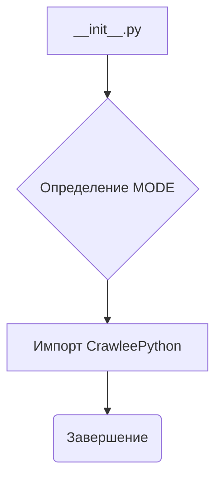
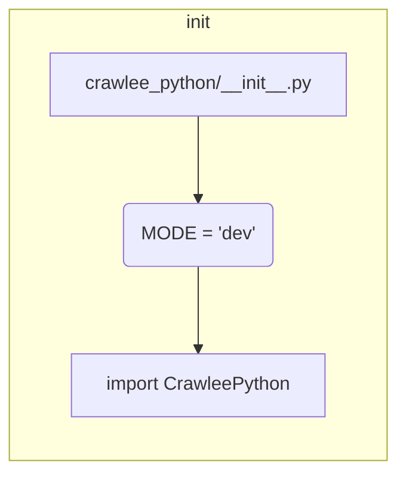

```MD
# Анализ файла hypotez/src/webdriver/crawlee_python/__init__.py

## <input code>

```python
## \file hypotez/src/webdriver/crawlee_python/__init__.py
# -*- coding: utf-8 -*-\
#! venv/Scripts/python.exe
#! venv/bin/python/python3.12

"""
.. module: src.webdriver.crawlee_python 
	:platform: Windows, Unix
	:synopsis:

"""
MODE = 'dev'

from .crawlee_python import CrawleePython
```

## <algorithm>

Файл `__init__.py` - это инициализирующий файл для пакета `crawlee_python`.  Он не содержит сложной логики, но определяет константу `MODE` и импортирует класс `CrawleePython` из модуля `crawlee_python`.

**Блок-схема:**



* **Шаг 1:** Определение константы `MODE` с значением 'dev'. Это, вероятно, указывает на режим разработки или тестирования.
* **Шаг 2:** Импорт класса `CrawleePython`.  Этот импорт позволяет использовать класс `CrawleePython` в других частях проекта.

**Примеры:**

В данном коде нет выполнения каких-либо действий.  Пример использования `MODE` и `CrawleePython` можно представить в другой части кода, где эти значения будут использованы для настройки программы.


## <mermaid>



**Объяснение зависимости:**

Файл `__init__.py` импортирует `CrawleePython` из своего же пакета (`crawlee_python`).  Таким образом, `CrawleePython` должен быть определён в файле `crawlee_python.py` внутри той же директории.  Есть имплицитная зависимость от того, что `crawlee_python.py` (или другой файл) находится в директории `hypotez/src/webdriver/crawlee_python/`.

## <explanation>

**Импорты:**

- `from .crawlee_python import CrawleePython`: Этот импорт позволяет использовать класс `CrawleePython` из модуля `crawlee_python`, находящегося в той же директории. Символ `.` указывает на текущий пакет. Это стандартный подход для импорта модулей и классов из внутрипакета.


**Классы:**

- `CrawleePython`:  Этот класс не определён в данном файле. Он должен быть определён в файле `crawlee_python.py` внутри той же директории.  Этот класс, вероятно, реализует логику для работы с веб-драйвером (webdriver) и отвечает за выполнение задач (скрейпинг, взаимодействие с сайтом).


**Функции:**

В данном файле нет функций.


**Переменные:**

- `MODE = 'dev'`:  Строковая переменная, которая хранит константу.  Она скорее всего используется для выбора режима работы программы (разработка, производство и т. д.).


**Возможные ошибки и улучшения:**

- Не хватает документации для `CrawleePython`.
- Для улучшения кода необходимо добавить документацию к классу `CrawleePython` и его методам.
- Желательно использовать более описательные имена переменных (например, `DEVELOPMENT_MODE`).
- Добавить обработку исключений при работе с веб-драйвером (например, `NoSuchElementException`).
- Потенциально, этот `__init__.py` файл может быть излишен, если в нём только импорт.

**Взаимосвязи с другими частями проекта:**

Этот файл служит входом для взаимодействия с классом `CrawleePython`, который, вероятно, взаимодействует с веб-драйвером для сбора данных.  Дальнейшие взаимодействия зависят от того, как `CrawleePython` используется в других частях проекта (например, в скриптах, классах для анализа данных и т.д.).  Без контекста других файлов проекта, определить эти связи сложно.