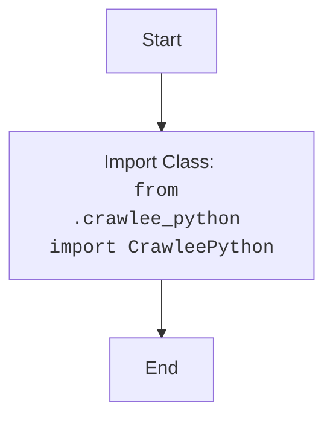

## <алгоритм>
1. **Импорт модуля `CrawleePython`**:
   - Начинаем с импорта класса `CrawleePython` из модуля `crawlee_python` (который находится в той же директории).
   - Пример: `from .crawlee_python import CrawleePython` импортирует класс, который предположительно содержит логику для работы с Crawlee на Python.

2. **Конец**:
   - На этом выполнение файла `__init__.py` завершается. Единственная его цель - сделать класс `CrawleePython` доступным для импорта из пакета `src.webdriver.crawlee_python`.

## <mermaid>

## <объяснение>

**Импорты:**
- `from .crawlee_python import CrawleePython`: Этот импорт является ключевым. Он импортирует класс `CrawleePython` из модуля `crawlee_python.py`, который находится в той же директории, что и файл `__init__.py`. Точка `.` перед `crawlee_python` указывает на то, что импорт является относительным и ищет модуль в текущем пакете.
    - **Назначение**: Этот импорт делает класс `CrawleePython` доступным для использования в других частях проекта, которые импортируют пакет `src.webdriver.crawlee_python`. Таким образом, другие модули могут использовать `from src.webdriver.crawlee_python import CrawleePython` для доступа к этому классу.
    - **Связь с другими пакетами `src`**: Файл `__init__.py` делает пакет `src.webdriver.crawlee_python` модулем, что позволяет другим частям проекта `src` импортировать его как `src.webdriver.crawlee_python`. Таким образом, через этот файл происходит взаимодействие с другими пакетами, делая код `src.webdriver.crawlee_python` доступным для использования в рамках проекта `src`.

**Классы:**
- В этом конкретном файле классы не определены. Он только импортирует класс `CrawleePython` из файла `crawlee_python.py`, который находится в том же каталоге.
    - **Роль**: Класс `CrawleePython`, очевидно, предназначен для работы с библиотекой Crawlee в Python, и его логика будет определена в `crawlee_python.py`, а не в `__init__.py`.
    - **Взаимодействие с другими компонентами**: Этот класс, вероятно, будет использоваться другими частями проекта, которые требуют функциональности Crawlee.

**Функции:**
- В данном файле нет функций.

**Переменные:**
- В данном файле нет переменных.

**Цепочка взаимосвязей:**

1. **`src.webdriver.crawlee_python`**: Этот пакет действует как модуль, где определена логика, связанная с использованием Crawlee в Python.
2. **`__init__.py`**: Этот файл делает пакет `src.webdriver.crawlee_python` импортируемым и предоставляет доступ к классу `CrawleePython`.
3. **`crawlee_python.py`**: В этом файле находится реализация класса `CrawleePython`.
4. **Другие модули `src`**: Другие части проекта `src`, которые зависят от функциональности Crawlee, могут импортировать `CrawleePython` через `from src.webdriver.crawlee_python import CrawleePython` и использовать его методы.

**Потенциальные ошибки и области для улучшения:**
- В данном конкретном файле, поскольку он очень простой, ошибок нет. Однако, `__init__.py` может быть обновлен, чтобы включать больше импортов из пакета `src.webdriver.crawlee_python` при необходимости.
- **Область для улучшения:** Для лучшей организации, пакет `src.webdriver.crawlee_python` мог бы содержать несколько модулей, каждый из которых посвящен определенной части функциональности Crawlee.