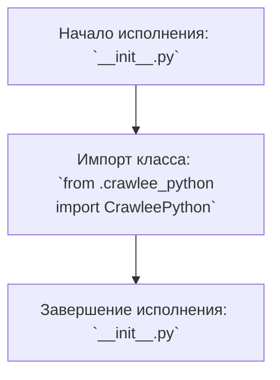
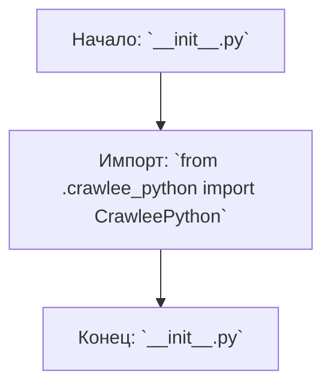

## ИНСТРУКЦИЯ:

Анализируй предоставленный код подробно и объясни его функциональность. Ответ должен включать три раздела:  

1. **<алгоритм>**: Опиши рабочий процесс в виде пошаговой блок-схемы, включая примеры для каждого логического блока, и проиллюстрируй поток данных между функциями, классами или методами.  
2. **<mermaid>**: Напиши код для диаграммы в формате `mermaid`, проанализируй и объясни все зависимости, 
    которые импортируются при создании диаграммы. 
    **ВАЖНО!** Убедитесь, что все имена переменных, используемые в диаграмме `mermaid`, 
    имеют осмысленные и описательные имена. Имена переменных вроде `A`, `B`, `C`, и т.д., не допускаются!  
    
    **Дополнительно**: Если в коде есть импорт `import header`, добавьте блок `mermaid` flowchart, объясняющий `header.py`:\
    ```mermaid
    flowchart TD
        Start --> Header[<code>header.py</code><br> Determine Project Root]
    
        Header --> import[Import Global Settings: <br><code>from src import gs</code>] 
    ```

3. **<объяснение>**: Предоставьте подробные объяснения:  
   - **Импорты**: Их назначение и взаимосвязь с другими пакетами `src.`.  
   - **Классы**: Их роль, атрибуты, методы и взаимодействие с другими компонентами проекта.  
   - **Функции**: Их аргументы, возвращаемые значения, назначение и примеры.  
   - **Переменные**: Их типы и использование.  
   - Выделите потенциальные ошибки или области для улучшения.  

Дополнительно, постройте цепочку взаимосвязей с другими частями проекта (если применимо).  

Это обеспечивает всесторонний и структурированный анализ кода.
## Формат ответа: `.md` (markdown)
**КОНЕЦ ИНСТРУКЦИИ**

## Анализ кода `hypotez/src/webdriver/crawlee_python/__init__.py`

### <алгоритм>

1. **Начало:** Исполнение файла `__init__.py` начинается.
2. **Импорт:** Импортируется класс `CrawleePython` из модуля `crawlee_python.py` в той же директории.
3. **Завершение:** Файл `__init__.py` завершает выполнение.



### <mermaid>



**Объяснение диаграммы `mermaid`:**

- `Start`: Обозначает начало выполнения файла `__init__.py`.
- `ImportCrawleePython`: Представляет операцию импорта класса `CrawleePython` из файла `crawlee_python.py` в той же директории.
- `End`: Обозначает конец выполнения файла `__init__.py`.

### <объяснение>

**Импорты:**

- `from .crawlee_python import CrawleePython`:  Этот оператор импортирует класс `CrawleePython` из модуля `crawlee_python.py`, который находится в той же директории.  Импорт выполняется с использованием относительного пути `.`, что означает "текущая директория". Это необходимо для того, чтобы можно было использовать класс `CrawleePython` в других модулях или пакетах, импортирующих этот пакет `crawlee_python`.

**Классы:**

- `CrawleePython`:  Этот класс предположительно предназначен для реализации логики, связанной с веб-скрапингом или автоматизацией с помощью библиотеки `crawlee`. `__init__.py` делает этот класс доступным для импорта извне пакета `crawlee_python`.

**Функции:**
В этом файле нет непосредственно определенных функций, но импортированный класс `CrawleePython` скорее всего будет содержать методы.

**Переменные:**
В этом файле нет явно объявленных переменных.

**Общее назначение:**

Файл `__init__.py` играет роль точки входа в пакет `crawlee_python`. Он импортирует класс `CrawleePython` из `crawlee_python.py`, делая его доступным для использования за пределами этого пакета. Это стандартная практика в Python для инициализации пакетов и предоставления доступа к основным компонентам пакета.

**Потенциальные улучшения и замечания:**
- В данном коде нет явных ошибок, но чтобы дать более точную оценку, потребуется посмотреть, что именно делает класс `CrawleePython`.
- В будущем, в `__init__.py` можно добавить импорт других необходимых компонентов пакета.

**Взаимосвязь с другими частями проекта:**

`__init__.py` является частью пакета `crawlee_python`, который, в свою очередь, вероятно, является частью более крупного проекта, связанного с веб-скрапингом или автоматизацией. 
Этот пакет является частью `src/webdriver` в структуре проекта, что говорит о том, что он вероятно используется для управления веб-драйвером.
Импортируя `CrawleePython`, другие части проекта могут взаимодействовать с функциями веб-скрапинга, предоставляемыми этим классом.