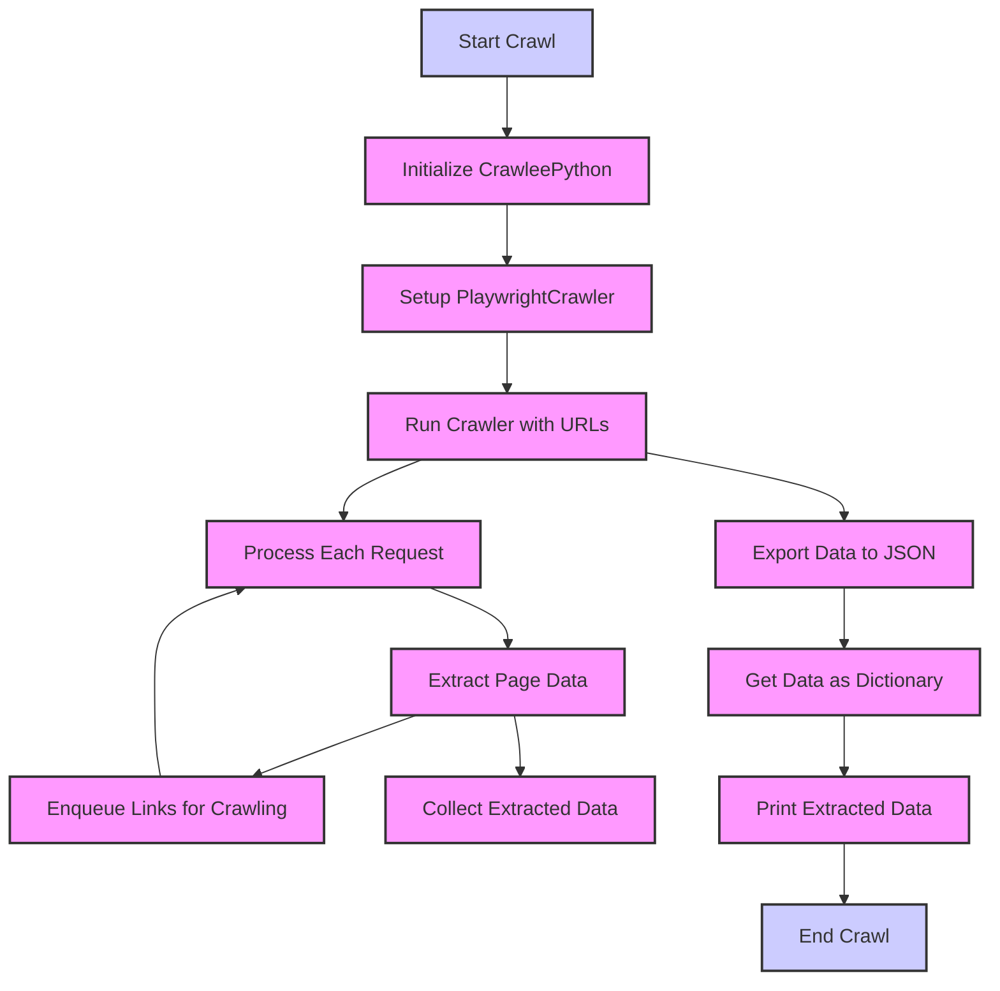

## ИНСТРУКЦИЯ:

Анализируй предоставленный код подробно и объясни его функциональность. Ответ должен включать три раздела:

1.  **<алгоритм>**: Опиши рабочий процесс в виде пошаговой блок-схемы, включая примеры для каждого логического блока, и проиллюстрируй поток данных между функциями, классами или методами.
2.  **<mermaid>**: Напиши код для диаграммы в формате `mermaid`, проанализируй и объясни все зависимости,
    которые импортируются при создании диаграммы.
    **ВАЖНО!** Убедитесь, что все имена переменных, используемые в диаграмме `mermaid`,
    имеют осмысленные и описательные имена. Имена переменных вроде `A`, `B`, `C`, и т.д., не допускаются!

    **Дополнительно**: Если в коде есть импорт `import header`, добавьте блок `mermaid` flowchart, объясняющий `header.py`:
    ```mermaid
    flowchart TD
        Start --> Header[<code>header.py</code><br> Determine Project Root]

        Header --> import[Import Global Settings: <br><code>from src import gs</code>]
    ```

3.  **<объяснение>**: Предоставьте подробные объяснения:
    -   **Импорты**: Их назначение и взаимосвязь с другими пакетами `src.`.
    -   **Классы**: Их роль, атрибуты, методы и взаимодействие с другими компонентами проекта.
    -   **Функции**: Их аргументы, возвращаемые значения, назначение и примеры.
    -   **Переменные**: Их типы и использование.
    -   Выделите потенциальные ошибки или области для улучшения.

Дополнительно, постройте цепочку взаимосвязей с другими частями проекта (если применимо).

Это обеспечивает всесторонний и структурированный анализ кода.
## Формат ответа: `.md` (markdown)
**КОНЕЦ ИНСТРУКЦИИ**

## <алгоритм>
1. **Инициализация `CrawleePython`:**
   - Создается экземпляр класса `CrawleePython` с параметрами: `max_requests` (максимальное количество запросов), `headless` (режим без графического интерфейса), `browser_type` (тип браузера).
   - Пример: `crawler = CrawleePython(max_requests=10, headless=True, browser_type='chromium')`.
   - Создаётся экземпляр `PlaywrightCrawler` с указанными параметрами.

2. **Настройка краулера (`setup_crawler`):**
   - Определяется обработчик запросов по умолчанию.
   - Для каждого запроса:
     - Загружается веб-страница.
     - Выбираются элементы (`posts`, `titles`, `ranks`) с использованием API Playwright.
     - Извлекаются данные из элементов (заголовок, рейтинг, ссылка).
     - Собранные данные сохраняются в список словарей.
   - Этот шаг конфигурирует `PlaywrightCrawler` для извлечения данных с веб-страниц.

3. **Запуск краулера (`run_crawler`):**
   - Краулер запускается со списком начальных URL-адресов.
   - Пример: `crawler.run_crawler(['https://news.ycombinator.com/'])`.
   - `PlaywrightCrawler` начинает обход сайтов, обрабатывая каждый URL с помощью настроенного обработчика.

4. **Экспорт данных (`export_data`):**
   - Извлеченные данные записываются в JSON файл по указанному пути.
   - Пример: `crawler.export_data('output.json')`.

5.  **Получение данных (`get_data`):**
    -   Возвращает извлеченные данные в виде словаря для дальнейшей обработки.
    -   Пример: `data = crawler.get_data()`.

6. **Основной метод запуска (`run`):**
   - Последовательно вызывает `setup_crawler`, `run_crawler`, `export_data`, `get_data`.
   - Выводит извлеченные данные на экран.
   -  Этот метод организует весь процесс, от настройки до извлечения данных.

## <mermaid>


**Объяснение зависимостей:**

-   `Start` : Начало процесса краулинга.
-   `InitializeCrawler`: Создание экземпляра класса `CrawleePython`. Зависит от параметров, передаваемых при создании.
-   `SetupCrawler`: Настройка `PlaywrightCrawler` с обработчиком запросов. Зависит от параметров из `InitializeCrawler`.
-   `RunCrawler`: Запуск `PlaywrightCrawler` с заданными начальными URL. Зависит от настроенного `PlaywrightCrawler` в `SetupCrawler`.
-   `ProcessRequest`: Обработка каждого запроса к веб-странице. Зависит от `PlaywrightCrawler` из `RunCrawler`.
-    `ExtractData`: Извлечение данных из загруженной страницы. Зависит от результатов обработки запроса в `ProcessRequest`
-   `EnqueueLinks`: Добавление новых ссылок в очередь для дальнейшего обхода. Зависит от данных из `ExtractData`
-   `CollectData`: Сбор данных извлеченных на текущей странице, Зависит от результатов `ExtractData`.
-   `ExportData`: Экспорт собранных данных в файл JSON. Зависит от данных, собранных в `CollectData`.
-   `GetData`: Получение данных в виде словаря. Зависит от данных экспортированных в `ExportData`
-   `PrintData`: Вывод данных на экран. Зависит от результатов из `GetData`.
-   `End`: Конец процесса краулинга.

## <объяснение>
**Импорты:**

-   Импортов как таковых, в предоставленном коде нет. Однако в описании упоминается использование `crawlee` и `Playwright`, а также `asyncio`. Эти импорты подразумеваются, как часть библиотеки `crawlee`:
    -   `crawlee`: Библиотека для веб-краулинга и скрейпинга.
        -   `PlaywrightCrawler`: Класс для создания краулеров с использованием Playwright.
    -   `asyncio`: Стандартная библиотека Python для работы с асинхронным вводом-выводом. Это необходимо для асинхронного выполнения задач веб-краулинга.
    -  `json`: Стандартная библиотека Python для работы с данными в формате JSON.

**Классы:**

-   `CrawleePython`:
    -   **Роль**: Класс-обертка для `PlaywrightCrawler`, предоставляющий более высокоуровневый интерфейс для веб-краулинга.
    -   **Атрибуты**:
        -   `max_requests`: Максимальное количество запросов для краулера.
        -   `headless`: Флаг, указывающий на запуск браузера в безголовом режиме.
        -   `browser_type`: Тип браузера, который будет использовать Playwright.
        -    `crawler` - экземпляр `PlaywrightCrawler`.
        -    `data` - хранилище извлечённых данных.
    -   **Методы**:
        -   `__init__`: Конструктор класса, инициализирует атрибуты и создает экземпляр `PlaywrightCrawler`.
        -   `setup_crawler`: Настраивает обработчик запросов по умолчанию. Определяет, как будут обрабатываться страницы и извлекаться данные.
        -   `run_crawler`: Запускает краулер с заданными начальными URL.
        -   `export_data`: Экспортирует собранные данные в JSON-файл.
        -   `get_data`: Возвращает собранные данные.
        -   `run`: Основной метод для запуска процесса краулинга, объединяет вызовы других методов.

**Функции:**

-   `__init__`: Конструктор класса `CrawleePython`.
    -   **Аргументы**:
        -   `max_requests` (int): Максимальное количество запросов.
        -   `headless` (bool): Режим без графического интерфейса.
        -   `browser_type` (str): Тип браузера ('chromium', 'firefox', 'webkit').
    -   **Возвращаемое значение**: Нет.
    -   **Назначение**: Инициализирует объект `CrawleePython` с заданными настройками и создает экземпляр `PlaywrightCrawler`.
    -    **Пример**: `CrawleePython(max_requests=100, headless=True, browser_type="chromium")`
-   `setup_crawler`: Настраивает обработчик запросов.
    -   **Аргументы**: Нет.
    -   **Возвращаемое значение**: Нет.
    -   **Назначение**: Настраивает логику обработки веб-страниц, извлечения данных и добавления новых ссылок в очередь.
    -    **Пример**: `crawler.setup_crawler()`.
-   `run_crawler`: Запускает процесс веб-краулинга.
    -   **Аргументы**:
        -   `start_urls` (list): Список начальных URL-адресов.
    -   **Возвращаемое значение**: Нет.
    -   **Назначение**: Запускает краулер с указанными начальными URL и обрабатывает каждую страницу в соответствии с настройками, заданными в `setup_crawler`.
    -    **Пример**: `crawler.run_crawler(['https://news.ycombinator.com/'])`.
-   `export_data`: Экспортирует извлеченные данные в JSON файл.
    -   **Аргументы**:
        -   `filename` (str): Имя файла для экспорта.
    -   **Возвращаемое значение**: Нет.
    -   **Назначение**: Сохраняет собранные данные в файл JSON для дальнейшего использования или анализа.
    -    **Пример**: `crawler.export_data('output.json')`.
-   `get_data`: Возвращает извлеченные данные.
    -   **Аргументы**: Нет.
    -   **Возвращаемое значение**:
        -   `dict`: Словарь с извлеченными данными.
    -   **Назначение**: Возвращает собранные данные для дальнейшей обработки.
    -    **Пример**: `data = crawler.get_data()`.
-   `run`: Оркестрирует весь процесс краулинга.
    -   **Аргументы**:
        -   `start_urls`: Список начальных URL.
        -   `filename`: Имя файла для сохранения.
    -    **Возвращаемое значение**: Нет.
    -    **Назначение**: Запускает все этапы, начиная с настройки краулера, заканчивая получением данных.
    -    **Пример**: `crawler.run(['https://news.ycombinator.com/'], 'output.json')`.

**Переменные:**

-   `max_requests` (int): Максимальное количество запросов, которые может сделать краулер.
-   `headless` (bool): Флаг для запуска браузера в безголовом режиме (без GUI).
-   `browser_type` (str): Тип браузера для использования (например, 'chromium', 'firefox').
-   `crawler` (PlaywrightCrawler): Экземпляр класса `PlaywrightCrawler`.
-   `data` (list of dicts): Список словарей, содержащих извлеченные данные.

**Потенциальные ошибки и области для улучшения:**

1. **Обработка ошибок:** В текущей реализации отсутствует обработка ошибок. Например, ошибки при загрузке страниц, ошибки выбора элементов на странице и т.д. Необходимо добавить `try-except` блоки для более устойчивой работы.
2.  **Динамические страницы:** Веб-сайты могут быть динамическими, где контент загружается через JavaScript. В таком случае, может потребоваться более продвинутая логика ожидания загрузки элементов на странице.
3. **Логирование:** Для отслеживания работы и возможных ошибок было бы полезно добавить логирование.
4.  **Адаптивность к сайтам:** Текущая реализация предполагает, что структура сайта известна и не меняется. Для универсального решения потребуется сделать код более адаптивным, например, используя динамические селекторы.
5.  **Зависимость от Playwright:** Код напрямую зависит от Playwright, что может усложнить переход на другую библиотеку. Можно рассмотреть абстракцию, чтобы упростить это в будущем.

**Взаимосвязи с другими частями проекта (если применимо):**

-   Этот код является частью модуля веб-скрапинга. Может быть использован в других частях проекта, где требуется автоматизированный сбор данных с веб-сайтов.
-   Данные, извлеченные с помощью этого класса, могут использоваться для анализа, визуализации или хранения в базе данных.
-   Класс может быть интегрирован с другими инструментами автоматизации для более сложных рабочих процессов.

В целом, код представляет собой хорошо структурированный и функциональный класс для веб-скрепинга, но с возможностями для дальнейшего улучшения и расширения.