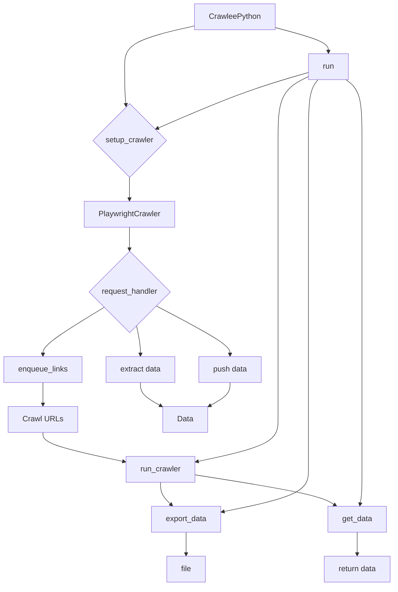

```MD
# <input code>

```python
## \file hypotez/src/webdriver/crawlee_python/crawlee_python.py
# -*- coding: utf-8 -*-\
#! venv/Scripts/python.exe
#! venv/bin/python/python3.12

"""
.. module: src.webdriver.crawlee_python 
	:platform: Windows, Unix
	:synopsis:

"""
MODE = 'dev'


from pathlib import Path
from src import gs
import asyncio
from crawlee.playwright_crawler import PlaywrightCrawler, PlaywrightCrawlingContext
from src.logger import logger

class CrawleePython:
    def __init__(self, max_requests: int = 5, headless: bool = False, browser_type: str = 'firefox'):
        """ Initializes the CrawleeExperiment with the specified parameters """
        self.max_requests = max_requests
        self.headless = headless
        self.browser_type = browser_type
        self.crawler = None

    async def setup_crawler(self):
        """ Sets up the PlaywrightCrawler instance """
        self.crawler = PlaywrightCrawler(
            max_requests_per_crawl=self.max_requests,
            headless=self.headless,
            browser_type=self.browser_type,
        )

        @self.crawler.router.default_handler
        async def request_handler(context: PlaywrightCrawlingContext) -> None:
            context.log.info(f'Processing {context.request.url} ...')

            # Enqueue all links found on the page.
            await context.enqueue_links()

            # Extract data from the page using Playwright API.
            data = {
                'url': context.request.url,
                'title': await context.page.title(),
                'content': (await context.page.content())[:100],
            }

            # Push the extracted data to the default dataset.
            await context.push_data(data)

    async def run_crawler(self, urls: list[str]):
        """ Runs the crawler with the initial list of URLs 

        @param urls: List of URLs to start the crawl
        """
        await self.crawler.run(urls)

    async def export_data(self, file_path: str):
        """ Exports the entire dataset to a JSON file 

        @param file_path: Path to save the exported JSON file
        """
        await self.crawler.export_data(file_path)

    async def get_data(self) -> dict:
        """ Retrieves the extracted data 

        @return: Extracted data as a dictionary
        """
        data = await self.crawler.get_data()
        return data

    async def run(self, urls: list[str]):
        """ Main method to set up, run the crawler, and export data 

        @param urls: List of URLs to start the crawl
        """
        await self.setup_crawler()
        await self.run_crawler(urls)
        await self.export_data(str(Path(gs.path.tmp / 'results.json')))
        data = await self.get_data()
        logger.info(f'Extracted data: {data.items}')


# Example usage
if __name__ == '__main__':
    async def main():
        experiment = CrawleePython(max_requests=5, headless=False, browser_type='firefox')
        await experiment.run(['https://ksp.co.il'])

    asyncio.run(main())
```

# <algorithm>

**Шаг 1:**  Инициализация `CrawleePython`  
  * Принимает `max_requests`, `headless`, и `browser_type` в качестве аргументов.
  * Инициализирует атрибуты `self.max_requests`, `self.headless`, `self.browser_type` и `self.crawler` = None.
**Пример:** `experiment = CrawleePython(max_requests=5, headless=False, browser_type='firefox')`

**Шаг 2:**  `setup_crawler()`  
  * Создает экземпляр `PlaywrightCrawler` с заданными параметрами.
  * Определяет обработчик `request_handler` для обработки каждого запроса.
**Пример:** `await experiment.setup_crawler()`

**Шаг 3:** `request_handler`
* Выводит сообщение о обработке текущего URL.
* Получает ссылки с текущей страницы (`context.enqueue_links()`).
* Извлекает данные с помощью Playwright API (`context.page.title()`, `context.page.content()`).
* Отправляет полученные данные в хранилище (`context.push_data()`).
**Пример:**
* `context.log.info(f'Processing https://example.com...')`
* Извлеченные данные сохраняются в словаре `data`.

**Шаг 4:** `run_crawler()`
  * Запускает `PlaywrightCrawler` с предоставленным списком `urls`.
**Пример:** `await experiment.run_crawler(['https://example.com'])`

**Шаг 5:** `export_data()`
  * Экспортирует данные в JSON файл на `file_path`.
**Пример:**  `await experiment.export_data(str(Path(gs.path.tmp / 'results.json')))`

**Шаг 6:** `get_data()`
  * Возвращает все сохраненные данные в словаре.


**Шаг 7:** `run()`
  * Вызывает `setup_crawler()`.
  * Вызывает `run_crawler()` с переданным списком `urls`.
  * Вызывает `export_data()` с путём к файлу, где будут сохранены результаты.
  * Возвращает данные.
**Пример:** `await experiment.run(['https://example.com'])`

# <mermaid>


* **crawlee.playwright_crawler**:  Пакет, содержащий классы, необходимые для работы с Playwright для веб-скреппинга.
* **src.logger**:  Логгер для записи сообщений об ошибках, информации и т.д.
* **src.gs**:  Вероятно, содержит классы или функции для работы с файловой системой или конфигурацией (судя по использованию `gs.path.tmp`).


# <explanation>

**Импорты:**
* `from pathlib import Path`: Используется для работы с путями к файлам.
* `from src import gs`:  Импортирует модуль `gs` из пакета `src`.  Вероятно, `gs` содержит функции или классы, связанные с хранением или обработкой данных, возможно, файловой системой.
* `import asyncio`: Используется для асинхронного выполнения кода, особенно полезно для работы с веб-запросами.
* `from crawlee.playwright_crawler import PlaywrightCrawler, PlaywrightCrawlingContext`: Импортирует классы для работы с Playwright. `PlaywrightCrawler` отвечает за запуск и обработку веб-запросов, а `PlaywrightCrawlingContext` предоставляет контекст для обработки каждого отдельного запроса.
* `from src.logger import logger`: Импортирует логгер.

**Классы:**
* `CrawleePython`: Этот класс представляет собой основное звено для работы со скрэйпингом. Он инициализирует параметры (количество одновременных запросов, режим браузера, тип браузера) и предоставляет методы для настройки, выполнения и экспорта данных.

**Функции:**
* `__init__`: Инициализирует атрибуты класса, которые определяют поведение процесса скрэйпинга.
* `setup_crawler`: Настраивает `PlaywrightCrawler`, устанавливает колбэк-функцию `request_handler`.
* `request_handler`: Обрабатывает каждый запрос в ходе работы.
* `run_crawler`: Запускает процесс скрэйпинга с предоставленным списком начальных URL-адресов.
* `export_data`: Экспортирует собранные данные в JSON-файл.
* `get_data`: Возвращает собранные данные.
* `run`: Основной метод, объединяющий все предыдущие шаги для запуска процесса.

**Переменные:**
* `MODE`: Не используется в этом коде, но, вероятно, хранит режим работы (например, «dev», «prod»).
* `max_requests`:  Максимальное количество одновременных запросов.
* `headless`: Параметр для запуска браузера без графического интерфейса.
* `browser_type`: Тип браузера для использования.


**Возможные ошибки или области для улучшений:**
* **Обработка ошибок:** Нет обработки возможных исключений при работе с веб-страницами (например, проблемы с подключением, некорректный HTML).
* **Временные ограничения:** Не заданы временные ограничения на выполнение запросов, что может привести к зависанию программы при наличии медленных страниц.
* **Обработка большого объема данных:** Если будет много данных, то `data` может стать очень большим, и обработка `data.items` может стать медленной.
* **Избыточное использование `async`/`await`:** `await self.crawler.run(urls)` ожидает завершения `self.crawler.run()`, то есть не нужно добавлять `await` перед `self.crawler.run(urls)`
* **Проверка на корректность URL-ов:** Необходимо валидировать вводимые URL-ы, чтобы избежать ошибок во время работы.


**Взаимосвязи с другими частями проекта:**
Код зависит от пакета `crawlee` для работы с `PlaywrightCrawler`, и `src.logger` для вывода сообщений в консоль.  Пакет `gs` используется для работы с файловой системой. Это указывает на то, что эти компоненты находятся в рамках одного проекта и имеют определенные связи между собой.