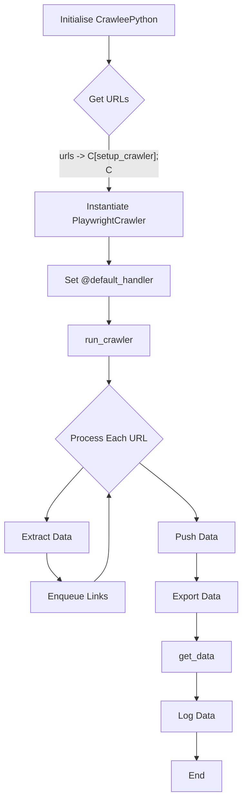
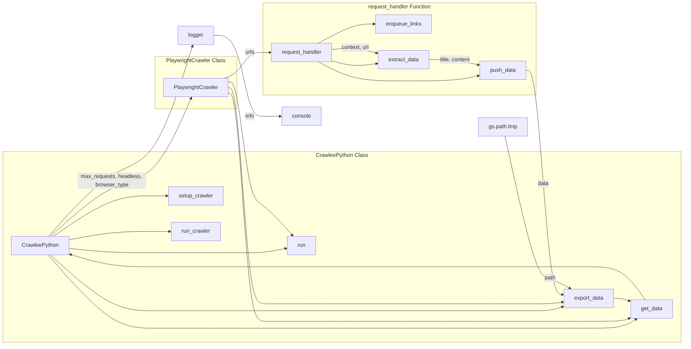

```MD
# <input code>

```python
## \file hypotez/src/webdriver/crawlee_python/crawlee_python.py
# -*- coding: utf-8 -*-
#! venv/Scripts/python.exe
#! venv/bin/python/python3.12

"""
.. module:: src.webdriver.crawlee_python 
	:platform: Windows, Unix
	:synopsis:

"""
MODE = 'dev'


from pathlib import Path
from src import gs
import asyncio
from crawlee.playwright_crawler import PlaywrightCrawler, PlaywrightCrawlingContext
from src.logger.logger import logger

class CrawleePython:
    def __init__(self, max_requests: int = 5, headless: bool = False, browser_type: str = 'firefox'):
        """ Initializes the CrawleeExperiment with the specified parameters """
        self.max_requests = max_requests
        self.headless = headless
        self.browser_type = browser_type
        self.crawler = None

    async def setup_crawler(self):
        """ Sets up the PlaywrightCrawler instance """
        self.crawler = PlaywrightCrawler(
            max_requests_per_crawl=self.max_requests,
            headless=self.headless,
            browser_type=self.browser_type,
        )

        @self.crawler.router.default_handler
        async def request_handler(context: PlaywrightCrawlingContext) -> None:
            context.log.info(f'Processing {context.request.url} ...')

            # Enqueue all links found on the page.
            await context.enqueue_links()

            # Extract data from the page using Playwright API.
            data = {
                'url': context.request.url,
                'title': await context.page.title(),
                'content': (await context.page.content())[:100],
            }

            # Push the extracted data to the default dataset.
            await context.push_data(data)

    async def run_crawler(self, urls: list[str]):
        """ Runs the crawler with the initial list of URLs 

        @param urls: List of URLs to start the crawl
        """
        await self.crawler.run(urls)

    async def export_data(self, file_path: str):
        """ Exports the entire dataset to a JSON file 

        @param file_path: Path to save the exported JSON file
        """
        await self.crawler.export_data(file_path)

    async def get_data(self) -> dict:
        """ Retrieves the extracted data 

        @return: Extracted data as a dictionary
        """
        data = await self.crawler.get_data()
        return data

    async def run(self, urls: list[str]):
        """ Main method to set up, run the crawler, and export data 

        @param urls: List of URLs to start the crawl
        """
        await self.setup_crawler()
        await self.run_crawler(urls)
        await self.export_data(str(Path(gs.path.tmp / 'results.json')))
        data = await self.get_data()
        logger.info(f'Extracted data: {data.items}')


# Example usage
if __name__ == '__main__':
    async def main():
        experiment = CrawleePython(max_requests=5, headless=False, browser_type='firefox')
        await experiment.run(['https://ksp.co.il'])

    asyncio.run(main())
```

# <algorithm>



* **Initialise CrawleePython:** The `CrawleePython` object is created with configuration parameters (max requests, headless mode, browser type).
* **Get URLs:** The input URLs are retrieved.
* **setup_crawler:**  Instantiates a `PlaywrightCrawler` object and sets up a `default_handler` function for handling requests.
* **run_crawler:** The crawler is started with the list of input URLs.
* **Process Each URL:** The code iterates through each URL in the list.
* **Extract Data:**  Fetches the page title and content (truncated).
* **Enqueue Links:**  Finds and adds new links to the queue.
* **Push Data:** Sends the extracted data to the PlaywrightCrawler's dataset.
* **Export Data:** Saves the collected data to a JSON file.
* **get_data:** Retrieves the collected data.
* **Log Data:** Logs the extracted data.


# <mermaid>



**Dependencies:**

* `pathlib`: Used for working with file paths.
* `asyncio`: For asynchronous operations.
* `crawlee.playwright_crawler`:  A custom Playwright-based crawler library (presumably part of the project).
* `src.logger.logger`: A custom logger module (likely part of the project's logging infrastructure).
* `src.gs`: Likely a module providing global settings or data access.


# <explanation>

* **Imports:**
    * `pathlib`: Provides object-oriented way of working with paths.
    * `asyncio`: Enables asynchronous programming.
    * `crawlee.playwright_crawler`: This module is part of the project's crawler system. It likely provides the functionality for controlling the web browser, handling requests, and extracting data using Playwright.
    * `src.logger.logger`:  A custom logger module within the project. It facilitates structured logging, potentially handling log levels and output destinations.
    * `src.gs`: This module (`gs`) likely contains global variables or functions for accessing configuration settings, such as temporary file paths.


* **Classes:**
    * `CrawleePython`: This class orchestrates the web crawling process.
        * `__init__`: Initializes the `CrawleePython` instance with parameters controlling the crawl (number of requests, browser type, headless mode).
        * `setup_crawler`: Configures and initiates the `PlaywrightCrawler` instance.
        * `run_crawler`: Executes the crawl using the `PlaywrightCrawler`.
        * `export_data`: Exports the collected data to a JSON file.
        * `get_data`: Returns the collected data.
        * `run`: The main method that chains the setup, crawling, export, and data retrieval steps.
    * `PlaywrightCrawler`: A separate class (possibly external, not defined here) responsible for the actual crawling logic and interacting with the Playwright library.


* **Functions:**
    * `request_handler`: Handles each URL encountered by the crawler. It extracts data from the page and queues additional links to fetch.
* **Variables:**
   * `MODE`: A constant that likely defines the environment mode (e.g., 'dev', 'prod').
   * `max_requests`, `headless`, `browser_type`: Configuration parameters passed to `CrawleePython`.


* **Possible Errors/Improvements:**
    * Error handling: The code lacks explicit error handling.  Adding `try...except` blocks would catch potential exceptions during web scraping (e.g., network issues, invalid URLs, timeouts) and prevent crashes.
    * Robustness: The content extraction (`(await context.page.content())[:100]`) truncates data to 100 characters. This could be improved by defining a more dynamic and flexible way of data extraction.
    * Logging: The logging is done but isn't well-structured. Consider more detailed logging of events, times, URLs, and statuses for better diagnostics.
    * Asynchronous operations: The use of `asyncio` is good but should be more explicitly managed if the crawler is expected to scale or encounter slow responses.


* **Relationship to other parts of the project:**
   The code depends on the `crawlee` library and the `src` package for functionality related to the logger and global settings. The global settings are likely used to specify the path where the extracted data will be stored.