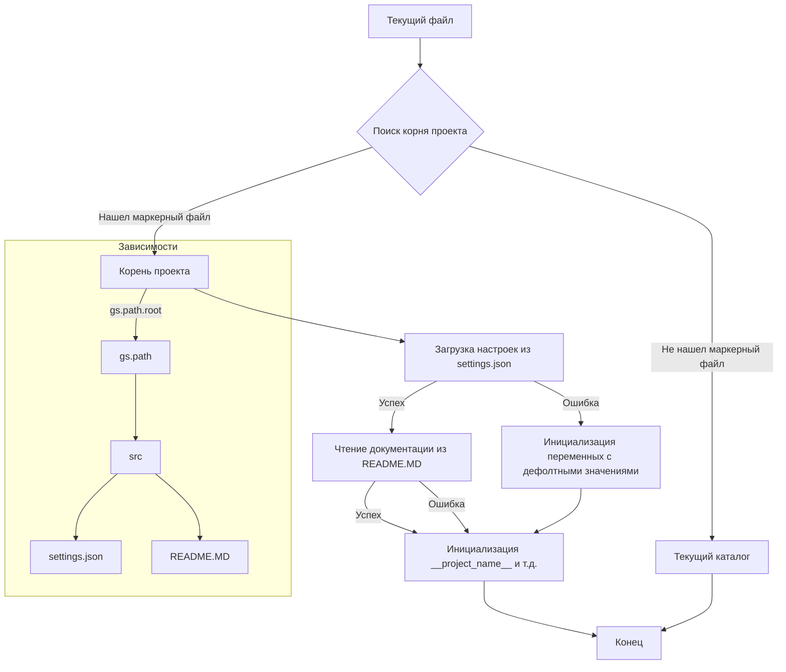

# <input code>

```python
## \file hypotez/src/webdriver/crawlee_python/header.py
# -*- coding: utf-8 -*-\
#! venv/Scripts/python.exe
#! venv/bin/python/python3.12

"""
.. module: src.webdriver.crawlee_python 
	:platform: Windows, Unix
	:synopsis:

"""
MODE = 'dev'


import sys
import json
from packaging.version import Version

from pathlib import Path
def set_project_root(marker_files=('pyproject.toml', 'requirements.txt', '.git')) -> Path:
    """
    Finds the root directory of the project starting from the current file's directory,
    searching upwards and stopping at the first directory containing any of the marker files.

    Args:
        marker_files (tuple): Filenames or directory names to identify the project root.
    
    Returns:
        Path: Path to the root directory if found, otherwise the directory where the script is located.
    """
    __root__:Path
    current_path:Path = Path(__file__).resolve().parent
    __root__ = current_path
    for parent in [current_path] + list(current_path.parents):
        if any((parent / marker).exists() for marker in marker_files):
            __root__ = parent
            break
    if __root__ not in sys.path:
        sys.path.insert(0, str(__root__))
    return __root__


# Get the root directory of the project
__root__ = set_project_root()
"""__root__ (Path): Path to the root directory of the project"""

from src import gs

settings:dict = None
try:
    with open(gs.path.root / 'src' /  'settings.json', 'r') as settings_file:
        settings = json.load(settings_file)
except (FileNotFoundError, json.JSONDecodeError):
    ...

doc_str:str = None
try:
    with open(gs.path.root / 'src' /  'README.MD', 'r') as settings_file:
        doc_str = settings_file.read()
except (FileNotFoundError, json.JSONDecodeError):
    ...


__project_name__ = settings.get("project_name", 'hypotez') if settings  else 'hypotez'
__version__: str = settings.get("version", '')  if settings  else ''
__doc__: str = doc_str if doc_str else ''
__details__: str = ''
__author__: str = settings.get("author", '')  if settings  else ''
__copyright__: str = settings.get("copyrihgnt", '')  if settings  else ''
__cofee__: str = settings.get("cofee", "Treat the developer to a cup of coffee for boosting enthusiasm in development: https://boosty.to/hypo69")  if settings  else "Treat the developer to a cup of coffee for boosting enthusiasm in development: https://boosty.to/hypo69"
```

# <algorithm>

**Алгоритм работы кода:**

1. **Инициализация:** Определяется текущий путь файла (`__file__`).
2. **Поиск корня проекта:**
   - Начинается поиск корня проекта, начиная с текущего каталога.
   - Проверяются родительские каталоги до тех пор, пока не будет найден каталог, содержащий один из файлов маркеров (pyproject.toml, requirements.txt, .git).
   - Если корень проекта найден, добавляется в `sys.path`.
3. **Загрузка настроек:**
   - Читаются настройки из файла `settings.json` в каталоге `src` относительно корня проекта.
   - Используется обработка исключений для предотвращения аварийного завершения при отсутствии файла или ошибках парсинга JSON.
4. **Чтение документации:**
   - Читается файл `README.MD` в каталоге `src` относительно корня проекта.
   - Используется обработка исключений для предотвращения аварийного завершения при отсутствии файла.
5. **Инициализация переменных проекта:**
   - На основе загруженных настроек и полученной документации инициализируются глобальные переменные: `__project_name__`, `__version__`, `__doc__`, `__details__`, `__author__`, `__copyright__`, `__cofee__`. Используются значения по умолчанию, если соответствующие ключи отсутствуют в `settings.json`.


# <mermaid>



**Объяснение диаграммы:**

* **`A[Текущий файл]`**:  Начинается выполнение скрипта.
* **`B{Поиск корня проекта}`**:  Алгоритм поиска корня проекта, описанный в функции `set_project_root`.
* **`C[Корень проекта]`**:  Найден корень проекта.
* **`D[Текущий каталог]`**:  Корень проекта не найден, используется текущий каталог.
* **`E[Загрузка настроек из settings.json]`**:  Загрузка настроек из файла `settings.json`.
* **`F[Чтение документации из README.MD]`**: Чтение файла `README.MD`.
* **`G[Инициализация переменных с дефолтными значениями]`**: Обработка ошибок при загрузке `settings.json` или `README.MD`.
* **`H[Инициализация __project_name__ и т.д.]`**: Инициализация переменных проекта.
* **`I[Конец]`**:  Завершение работы скрипта.
* **`J[gs.path]`, `K[src]`, `L[settings.json]`, `M[README.MD]`**: Подключаемые зависимости: модуль `gs` (вероятно, для работы с путями), директория `src` и файлы `settings.json` и `README.MD`.

# <explanation>

**Импорты:**

* `sys`: Предоставляет доступ к системным переменным, в том числе `sys.path`. Используется для добавления пути к корню проекта в `sys.path`.
* `json`: Для работы с файлами JSON, используется для загрузки настроек из `settings.json`.
* `packaging.version`: Для работы с версиями пакетов, используется для корректной обработки версий (хотя в данном контексте не используется напрямую).
* `pathlib`: Для работы с файловыми путями. Используется для создания и работы с объектами `Path` для манипулирования путями к файлам конфигурации.
* `src.gs`: Модуль `gs` (вероятно, собственная библиотека проекта), вероятно, содержит функции для работы с файловыми путями (например, для получения корня проекта).

**Классы:**

* Нет определенных классов.

**Функции:**

* `set_project_root(marker_files)`: Находит корень проекта.  Принимает кортеж `marker_files` (файлов или каталогов), используемых для идентификации корня проекта. Возвращает объект `Path` к корню проекта.

**Переменные:**

* `MODE`: Строковая переменная, хранящая режим работы.
* `__root__`: Объект `Path`, содержащий путь к корню проекта.
* `settings`: Словарь, содержащий настройки проекта, загруженные из файла `settings.json`.
* `doc_str`: Строковая переменная, хранящая содержимое файла `README.MD`.
* `__project_name__`, `__version__`, `__doc__`, `__details__`, `__author__`, `__copyright__`, `__cofee__`: Глобальные переменные, содержащие информацию о проекте, полученные из `settings.json` или значения по умолчанию.

**Возможные ошибки и улучшения:**

* **Обработка ошибок:** Используются `try...except` блоки для обработки `FileNotFoundError` и `json.JSONDecodeError`, что делает код более устойчивым к ошибкам.
* **Универсальность:**  Можно улучшить функцию `set_project_root`, чтобы она могла работать с разными структурами файлов маркеров (например, распознавать несколько файлов в разных директориях).
* **Docstrings:** Документация для функций (`set_project_root`) могла бы быть более подробной.


**Взаимосвязь с другими частями проекта:**

Функция `set_project_root()` и переменные `__root__`, `settings` тесно связаны с другими модулями проекта, особенно с теми, которые используют `src.gs` для работы с путями проекта и загруженных настроек.  Функция `set_project_root`  необходима для корректного доступа к ресурсам внутри проекта.