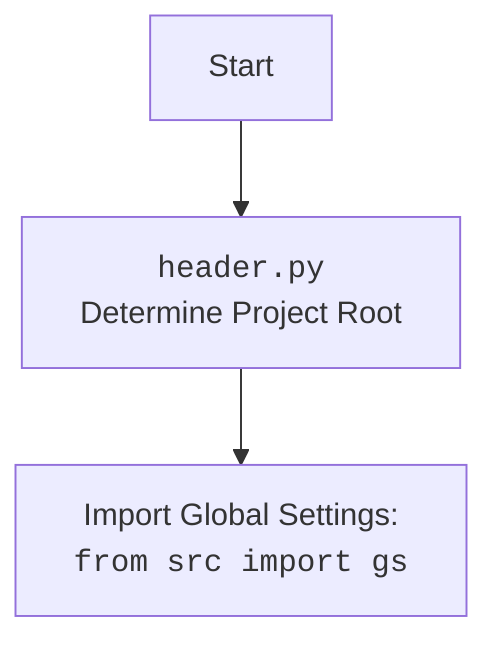

## АНАЛИЗ КОДА `header.py`

### 1. <алгоритм>

1.  **`set_project_root(marker_files)`**:
    *   **Начало**: Функция вызывается с опциональным аргументом `marker_files`, который по умолчанию равен `('__root__', '.git')`.
    *   **Определение текущего пути**: Определяется путь к текущему файлу (`__file__`) и его родительская директория, сохраняется в переменной `current_path`.
        *   **Пример**: Если файл `header.py` находится в `/home/user/project/src/webdriver/crawlee_python/header.py`, то `current_path` будет `/home/user/project/src/webdriver/crawlee_python`.
    *   **Поиск корневой директории**:
        *   Перебираются все родительские директории `current_path`, включая саму `current_path`.
            *   **Пример**: Для пути `/home/user/project/src/webdriver/crawlee_python` будут перебираться: `/home/user/project/src/webdriver/crawlee_python`, `/home/user/project/src/webdriver`, `/home/user/project/src`, `/home/user/project`, `/home/user`, `/home`, `/`.
        *   Для каждой родительской директории проверяется наличие любого файла или каталога из `marker_files`.
        *   Если найдена, то родительская директория становится корневой директорией проекта (`__root__`), цикл прерывается.
            *   **Пример**: Если в `/home/user/project/` есть файл `__root__`, то эта директория будет считаться корневой.
        *   Если не найдена ни одна из `marker_files`, то в качестве корневой директории (`__root__`) будет директория где расположен файл `header.py`.
    *   **Добавление корневой директории в `sys.path`**: Если корневая директория еще не добавлена в `sys.path`, она добавляется в начало списка.
        *   **Пример**: Если `__root__` равен `/home/user/project/`, то `/home/user/project/` будет добавлено в `sys.path`.
    *   **Возврат**: Функция возвращает `__root__` как объект типа `Path`.
2.  **Получение корневой директории:**
    *   Вызывается `set_project_root()` и результат сохраняется в переменной `__root__`.
3.  **Импорт `gs`**: Импортируется модуль `gs` из пакета `src`.
4.  **Чтение `settings.json`**:
    *   Пытается открыть файл `settings.json` из директории `src` относительно корневой директории (`gs.path.root`).
    *   Если файл открывается, то его содержимое (предполагается JSON) загружается в словарь `settings`.
    *   Если файл не найден или JSON не валидный, то устанавливается `settings = None`.
5.  **Чтение `README.MD`**:
    *   Пытается открыть файл `README.MD` из директории `src` относительно корневой директории (`gs.path.root`).
    *   Если файл открывается, то его содержимое читается в строку `doc_str`.
    *   Если файл не найден или JSON не валидный, то устанавливается `doc_str = None`.
6.  **Инициализация глобальных переменных**:
    *   Глобальные переменные инициализируются, используя значения из `settings` словаря, если он доступен. В противном случае устанавливаются значения по умолчанию.
    *   `__project_name__`: Название проекта (по умолчанию `hypotez`).
    *   `__version__`: Версия проекта (по умолчанию `''`).
    *   `__doc__`: Содержимое `README.MD` (по умолчанию `''`).
    *   `__details__`: Детали проекта (по умолчанию `''`).
    *   `__author__`: Автор проекта (по умолчанию `''`).
    *   `__copyright__`: Копирайт (по умолчанию `''`).
    *   `__cofee__`: Сообщение о кофе (по умолчанию сообщение о boosty).

### 2. <mermaid>

```mermaid
flowchart TD
    Start[Start: Find Root, Load Settings, Metadata] --> FindRoot[<code>set_project_root()</code><br>Find Project Root Directory];
    FindRoot --> CheckMarker[Check for Marker Files: <br> '__root__', '.git'];
    CheckMarker -- Marker Found --> SetRoot[Set Project Root]
    CheckMarker -- Marker Not Found --> UseCurrent[Use Current Script Location];
    SetRoot --> AddToPath[Add Root to <code>sys.path</code>]
    UseCurrent --> AddToPath
    AddToPath --> RootPath[<code>__root__</code><br>Store Root Path];
    RootPath --> ImportGS[Import Global Settings: <br><code>from src import gs</code>]
    ImportGS --> LoadSettings[Load <code>settings.json</code>];
    LoadSettings -- Success --> LoadReadme[Load <code>README.MD</code>];
    LoadSettings -- Fail --> LoadReadme
    LoadReadme -- Success --> SetMetadata[Set Metadata Variables: <br>__project_name__, __version__,<br> __doc__, __author__, etc.];
    LoadReadme -- Fail --> SetMetadata
    SetMetadata --> End[End];

    style Start fill:#f9f,stroke:#333,stroke-width:2px
    style End fill:#ccf,stroke:#333,stroke-width:2px
```



### 3. <объяснение>

#### Импорты:

*   **`import sys`**: Модуль `sys` используется для работы с системными параметрами и функциями, такими как добавление пути к модулям в `sys.path`.
*   **`import json`**: Модуль `json` используется для загрузки данных из JSON файлов (в данном случае, `settings.json`).
*   **`from packaging.version import Version`**: Импортирует класс `Version` из модуля `packaging.version`, который может использоваться для сравнения версий. Хотя этот импорт не используется в текущем коде, он может быть нужен в других частях проекта.
*   **`from pathlib import Path`**: Импортирует класс `Path` из модуля `pathlib`, который обеспечивает объектно-ориентированный способ работы с путями к файлам и каталогам.
*   **`from src import gs`**: Импортирует модуль `gs` из пакета `src`. Этот модуль, скорее всего, содержит глобальные настройки или пути проекта, так как используются `gs.path.root` для доступа к корневой директории.

#### Классы:

*   **`Path`**: Класс `Path` используется для представления путей к файлам и директориям. Он предоставляет методы для манипуляции путями, проверки существования файлов/каталогов и т.д.

#### Функции:

*   **`set_project_root(marker_files: tuple) -> Path`**:
    *   **Аргументы**: `marker_files` (tuple):  кортеж, содержащий имена файлов или каталогов, используемых для идентификации корневой директории проекта (по умолчанию `('__root__', '.git')`).
    *   **Возвращаемое значение**: Объект `Path`, представляющий путь к корневой директории проекта.
    *   **Назначение**: Функция ищет корневую директорию проекта, поднимаясь вверх по иерархии каталогов от текущего файла до тех пор, пока не найдет директорию, содержащую один из указанных маркеров. Если маркер не найден, она вернет директорию где расположен файл `header.py`.
    *   **Примеры**:
        *   `set_project_root()`: Поиск корневой директории с использованием маркеров по умолчанию (`__root__` или `.git`).
        *   `set_project_root(marker_files=('config.ini', 'setup.py'))`:  Поиск корневой директории с использованием других маркеров.

#### Переменные:

*   **`__root__`**:
    *   **Тип**: `Path`.
    *   **Использование**:  Путь к корневой директории проекта. Определяется функцией `set_project_root` и используется для получения путей к другим файлам относительно корня.
*   **`settings`**:
    *   **Тип**: `dict` или `None`.
    *   **Использование**: Словарь, содержащий настройки проекта, загруженные из `settings.json`. Может быть `None`, если файл не найден или не удалось загрузить.
*   **`doc_str`**:
    *   **Тип**: `str` или `None`.
    *   **Использование**:  Содержимое файла `README.MD`, если он найден. Может быть `None`, если файл не найден или не удалось прочитать.
*   **`__project_name__`**:
    *   **Тип**: `str`.
    *   **Использование**: Название проекта.
*   **`__version__`**:
    *   **Тип**: `str`.
    *   **Использование**: Версия проекта.
*   **`__doc__`**:
    *   **Тип**: `str`.
    *   **Использование**:  Документация проекта.
*   **`__details__`**:
    *   **Тип**: `str`.
    *   **Использование**: Дополнительные детали проекта.
*   **`__author__`**:
    *   **Тип**: `str`.
    *   **Использование**:  Автор проекта.
*   **`__copyright__`**:
    *   **Тип**: `str`.
    *   **Использование**: Информация о копирайте.
*   **`__cofee__`**:
    *   **Тип**: `str`.
    *   **Использование**:  Сообщение о кофе.

#### Потенциальные ошибки и области для улучшения:

*   **Обработка исключений**: Исключения `FileNotFoundError` и `json.JSONDecodeError` обрабатываются, но не логируются, что затрудняет отладку.
*   **Использование `gs.path.root`**: Зависимость от `gs.path.root` может сделать код менее переносимым, если `gs` не правильно настроен.
*   **Отсутствие валидации**: Данные, загруженные из `settings.json`, не валидируются, что может привести к ошибкам, если файл содержит некорректные данные.

#### Взаимосвязи с другими частями проекта:

*   **`src.gs`**: Этот модуль предоставляет глобальные настройки и пути проекта, включая корневой путь, который используется для поиска файлов настроек и документации.
*   **`settings.json`**: Файл, который содержит настройки проекта, такие как имя, версия, автор и т.д.
*   **`README.MD`**: Файл, который содержит описание проекта и используется для инициализации переменной `__doc__`.
*   **Другие модули `src`**: Скорее всего, другие модули из пакета `src` будут использовать переменные, определенные в этом файле (`__project_name__`, `__version__` и т.д.).

Этот код используется для инициализации основных параметров проекта, таких как корневая директория, настройки и метаданные. Он обеспечивает централизованную точку для доступа к этим данным, что упрощает использование и сопровождение проекта.