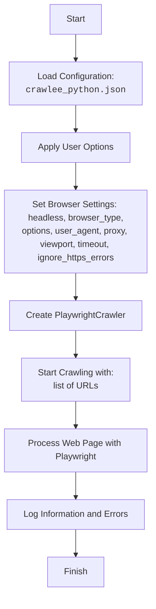

## АНАЛИЗ КОДА: `src/webdriver/crawlee_python/readme.ru.md`

### 1. **<алгоритм>**

1. **Инициализация:**
   - Загрузка конфигурации из `crawlee_python.json`.
   - Применение пользовательских опций, если они предоставлены при создании экземпляра `CrawleePython`.
   - Настройка параметров браузера (тип, headless, viewport, user-agent, proxy, options).

2. **Запуск браузера:**
   - Создание экземпляра `PlaywrightCrawler` с заданными параметрами.
   - Использование предоставленного списка URL для сбора данных.
   - Если указан прокси-сервер, он будет использоваться для всех запросов.

3. **Обработка веб-страниц:**
   - `PlaywrightCrawler` будет посещать каждый URL и выполнять все необходимые операции для сбора данных.
   - Извлечение данных с помощью `Playwright` API (этот шаг не описан в коде, но подразумевается).

4. **Логирование:**
   - Все события (инициализация, ошибки, и т.д.) записываются в лог с использованием `src.logger`.
   - Примеры: `Ошибка при инициализации Crawlee Python`, `Ошибка в файле crawlee_python.json`.

5. **Пример работы (main):**
   - Создаётся экземпляр `CrawleePython` с пользовательскими параметрами.
   - Запускается обход указанного списка URL (`https://www.example.com`).

### 2. **<mermaid>**

**Объяснение зависимостей:**

*   **LoadConfig:** Загружает конфигурацию из JSON-файла (`crawlee_python.json`).
*   **ApplyOptions:** Применяет пользовательские опции к конфигурации.
*   **BrowserSettings:** Устанавливает параметры браузера на основе конфигурации.
*   **CreateCrawler:** Создаёт экземпляр `PlaywrightCrawler` с заданной конфигурацией.
*   **StartCrawling:** Запускает процесс сбора данных, используя предоставленный список URL.
*  **ProcessPage:** обрабатывает каждую веб-страницу с использованием Playwright.
*   **LogInfo:** Записывает информацию и ошибки в лог.

### 3. **<объяснение>**

**Импорты:**

*   **`src.webdriver.crawlee_python`**: Это сам модуль, который описывается в данном документе.
*   **`asyncio`**: Используется для асинхронного выполнения операций, таких как инициализация и запуск краулера.

**Классы:**

*   **`CrawleePython`**: Этот класс инкапсулирует логику для инициализации и запуска `PlaywrightCrawler`.
    *   **Атрибуты:** Атрибуты не определены явно, но подразумеваются конфигурацией из `crawlee_python.json`.
    *   **Методы:**
        *   `__init__`: Инициализирует класс, загружает конфигурацию и применяет пользовательские настройки.
        *   `run`: Асинхронно запускает `PlaywrightCrawler` для заданного списка URL.

**Функции:**

*   **`main()`**: Асинхронная функция, которая создаёт экземпляр `CrawleePython` и запускает его.
    *   **Аргументы:** Нет.
    *   **Возвращает:** Нет.
    *   **Назначение:** Пример использования `CrawleePython`.
*   **`asyncio.run(main())`**: Запускает асинхронную функцию `main`.

**Переменные:**

*   **`crawler`**: Экземпляр класса `CrawleePython`.
*   **`max_requests`**, **`headless`**, **`browser_type`**, **`options`**: Переменные для пользовательской конфигурации, передаваемые при создании экземпляра `CrawleePython`.

**Дополнительные замечания:**

*   Конфигурация хранится в файле `crawlee_python.json`, что делает настройки централизованными и легко изменяемыми.
*   Класс `CrawleePython` обеспечивает удобную обёртку над `PlaywrightCrawler` с возможностью гибкой настройки.
*   Логирование позволяет отслеживать ошибки и отлаживать процесс сбора данных.
*   Поддержка прокси-сервера и других опций браузера позволяет обходить ограничения и кастомизировать браузер под конкретные нужды.
*   Не хватает явного описания того, как обрабатываются и извлекаются данные со страниц, хотя это и подразумевается.

**Цепочка взаимосвязей:**

1.  **`src.webdriver.crawlee_python`** (этот модуль): Использует `PlaywrightCrawler` из библиотеки Crawlee для сбора данных. Зависит от конфигурационного файла `crawlee_python.json`.
2.  **`src.logger`**: Используется для логирования событий.
3.  **`crawlee`**: Библиотека, предоставляющая `PlaywrightCrawler` для автоматизации.
4. **`playwright`**: Библиотека для управления браузером.

**Потенциальные ошибки и улучшения:**

*   Обработка ошибок при загрузке конфигурационного файла: Добавить проверку наличия файла, его валидности и корректности содержимого.
*   Обработка ошибок во время выполнения: Улучшить логирование ошибок и предоставить механизмы для обработки исключений.
*   Расширение конфигурации: Добавить поддержку других опций `PlaywrightCrawler`.
*   Обработка извлеченных данных: Необходимо уточнить механизм обработки и извлечения данных со страниц.
*   Документирование методов класса `CrawleePython`.