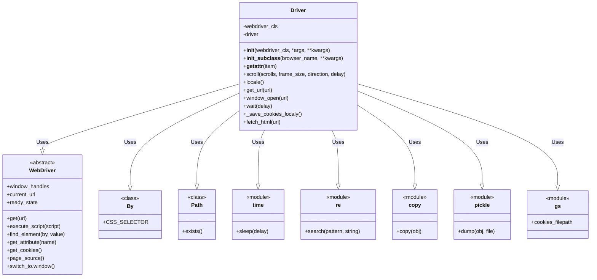
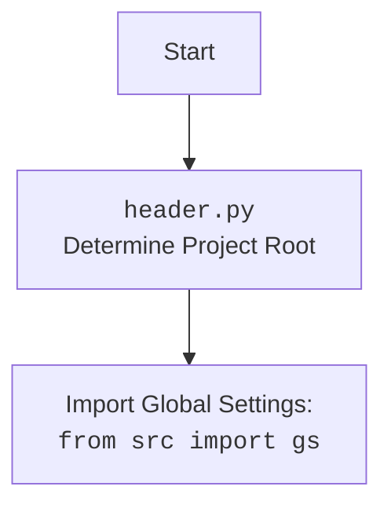

## АНАЛИЗ КОДА: `src/webdriver/driver.md`

### 1. `<алгоритм>`:

**Блок-схема работы `Driver` class:**

```mermaid
graph LR
    A[Начало: Инициализация Driver] --> B{Проверка: `webdriver_cls` валидный?};
    B -- Да --> C[Создание экземпляра WebDriver: `self.driver = webdriver_cls(*args, **kwargs)`];
    B -- Нет --> D[Ошибка: TypeError];
    C --> E[Конец: Инициализация Driver];
    
    E --> F[Вызов метода: `self.scroll(scrolls, frame_size, direction, delay)`];
    F --> G{Направление прокрутки?};
    G -- "вперед" / "вниз" --> H[Прокрутка вперед: `window.scrollBy(0, frame_size)`];
    G -- "назад" / "вверх" --> I[Прокрутка назад: `window.scrollBy(0, -frame_size)`];
    G -- "both" --> J[Прокрутка вперед и назад];
    H --> K[Ожидание: `time.sleep(delay)`];
     I --> K
    J --> L[Прокрутка вперед: `window.scrollBy(0, frame_size)`]
    L --> M[Ожидание: `time.sleep(delay)`]
    M --> N[Прокрутка назад: `window.scrollBy(0, -frame_size)`]
    N --> K
    K --> O{Цикл прокрутки завершен?};
    O -- Да --> P[Успешно: Возвращает True];
    O -- Нет --> H;
    P --> Q[Конец: `self.scroll()`];
    

   
    Q --> R[Вызов: `self.locale`];
    R --> S[Поиск `meta` с языком: `find_element(By.CSS_SELECTOR, "meta[http-equiv='Content-Language']")`];
    S -- Найдено --> T[Получение языка: `get_attribute('content')`];
    S -- Не найдено --> U[Попытка определить язык из JavaScript: `get_page_lang()`];
    T --> V[Конец: `self.locale`, возвращает язык];
     U -- Успешно --> W[Конец: `self.locale`, возвращает язык];
    U -- Не успешно --> X[Конец: `self.locale`, возвращает None];
     V --> Y[Вызов: `self.get_url(url)`]
     W --> Y
     X --> Y
     
     Y --> Z[Копирование текущего URL: `copy.copy(self.current_url)`]
     Z --> AA[Загрузка страницы по URL: `self.driver.get(url)`]
     AA --> AB[Ожидание загрузки страницы]
     AB --> AC{Совпадает ли URL?}
     AC -- Да --> AE[Сохранение cookie: `self._save_cookies_localy()`];
     AC -- Нет --> AD[Сохранение предыдущего URL: `self.previous_url = _previous_url`]
     AD --> AE
     AE --> AF[Возвращает True]
     
    AF --> AG[Конец: `self.get_url()`]
        
    AG --> AH[Вызов: `self.fetch_html(url)`];
    AH --> AI{Начинается с `file://`?};
    AI -- Да --> AJ[Удаление `file://`];
    AJ --> AK{Поиск пути файла: `re.search(r\'[a-zA-Z]:[\\/].*\', cleaned_url)`};
    AK -- Найдено --> AL{Существует ли файл?};
    AL -- Да --> AM[Чтение HTML контента из файла: `open(file_path, 'r', encoding='utf-8')`];
    AL -- Нет --> AN[Ошибка: Файл не найден];
    AM --> AO[Сохранение контента в `self.html_content`];
    AO --> AP[Успешно: Возвращает True];
    AN --> AP;
    AK -- Нет --> AQ[Ошибка: Неверный путь к файлу];
    AQ --> AP;
    
    AI -- Нет --> AR{Начинается с `http://` или `https://`?};
    AR -- Да --> AS[Вызов `self.get_url(url)`];
    AS --> AT[Сохранение контента в `self.html_content`];
    AT --> AP;
    AR -- Нет --> AU[Ошибка: Неподдерживаемый протокол];
    AU --> AP;
    
    AP --> AV[Конец: `self.fetch_html()`];

```

**Примеры для каждого блока:**

1.  **Инициализация `Driver`:**
    *   `webdriver_cls`: `selenium.webdriver.Chrome`
    *   `*args`: `executable_path='/path/to/chromedriver'`
    *   `**kwargs`: `{} `
    
2. **Проверка**: Проверяется является ли `webdriver_cls` валидным классом `WebDriver`.
   
3.  **Создание экземпляра `WebDriver`**:
    *   `self.driver = webdriver_cls(*args, **kwargs)`
    
4.  **Прокрутка**:
    *   `scrolls = 2`, `frame_size = 500`, `direction='both'`, `delay=0.5`
    *   Функция прокрутит страницу 2 раза вниз на 500px, с задержкой в 0.5 секунды, а потом два раза вверх.
    
5. **Определение языка**:
    * Если в HTML есть `<meta http-equiv='Content-Language' content='ru'>` функция вернет `ru`
    * Если нет, то будет вызвана функция `get_page_lang()`, в случае удачи вернет язык, иначе `None`
    
6. **Загрузка страницы**:
    * `url = 'https://example.com'`, функция загрузит страницу, проверит совпадает ли текущий URL с предыдущим и сохранит cookies.
    
7. **Получение HTML**:
    * `url = 'file:///home/user/test.html'`: Функция прочитает файл и запишет контент в `self.html_content`.
    * `url = 'https://example.com'`: Функция загрузит страницу и запишет ее HTML-код в `self.html_content`.
    

### 2. `<mermaid>`:



**Импортированные зависимости:**

1.  **`selenium.webdriver`**:
    *   **`WebDriver`**: Базовый класс для всех веб-драйверов (Chrome, Firefox и т.д.). Используется для создания экземпляра драйвера и управления браузером.
    *   **`By`**: Используется для определения типа локатора при поиске элементов на веб-странице (например, CSS-селектор).
2.  **`pathlib.Path`**: Используется для работы с путями к файлам и их проверки на существование.
3.  **`time`**: Используется для добавления задержки между операциями.
4.  **`re`**: Используется для работы с регулярными выражениями, например, для поиска части пути к файлу.
5.  **`copy`**: Используется для создания копии URL.
6.  **`pickle`**: Используется для сохранения cookies.
7.  **`src.gs`**: Используется для получения пути к файлу cookies.

**mermaid flowchart for `header.py` (если `import header` есть,  его нет):**


### 3. `<объяснение>`:

**Импорты:**

*   `selenium.webdriver`: Предоставляет классы для управления браузерами.
*   `selenium.common.exceptions`: Исключения, специфичные для Selenium.
*   `selenium.webdriver.remote.webdriver`: Модуль с классом WebDriver.
*   `selenium.webdriver.common.by`: Модуль с константами для выбора локаторов элементов.
*   `time`: Модуль для работы со временем, например, для добавления задержек.
*   `typing`: Модуль для определения типов переменных, `Optional`.
*   `pathlib`: Модуль для работы с путями файлов.
*   `re`: Модуль для работы с регулярными выражениями.
*   `copy`: Модуль для копирования данных
*   `pickle`: Модуль для сохранения cookie
*   `src.gs`: Модуль для получения общих настроек

**Класс `Driver`:**

*   **Роль:** Предоставляет унифицированный интерфейс для взаимодействия с веб-драйверами.
*   **Атрибуты:**
    *   `driver`: Экземпляр веб-драйвера.
    *  `html_content` : Содержит HTML код веб страницы после ее загрузки
*   **Методы:**
    *   `__init__(webdriver_cls, *args, **kwargs)`: Инициализирует драйвер, проверяя, что `webdriver_cls` - валидный класс.
    *  `__init_subclass__(cls, *, browser_name=None, **kwargs)`: Автоматически вызывается при создании подкласса от Driver и проверяет, что передан аргумент `browser_name`.
    *   `__getattr__(item)`: Позволяет перенаправлять вызовы атрибутов к внутреннему драйверу, тем самым делая его атрибуты доступными.
    *   `scroll(scrolls, frame_size, direction, delay)`: Прокручивает страницу в заданном направлении на заданное количество пикселей и с задержкой.
    *   `locale`: Определяет язык страницы с помощью `meta` тега и JavaScript.
    *   `get_url(url)`: Переходит по заданному URL и сохраняет cookie.
    *   `window_open(url)`: Открывает новую вкладку в браузере и, если указано, открывает URL.
    *   `wait(delay)`: Делает паузу в работе кода на заданное количество секунд.
    *  `_save_cookies_localy()`: Сохраняет cookies в файл.
    *   `fetch_html(url)`: Получает HTML контент либо из файла, либо с веб-страницы.
*   **Взаимодействие:**
    *   Использует `WebDriver` из `selenium.webdriver` для управления браузером.
    *   Использует `By` из `selenium.webdriver.common.by` для поиска элементов на странице.
    *   Взаимодействует с другими частями проекта для сохранения файлов cookie (через `src.gs`).

**Функции:**

*   `__init__`:
    *   **Аргументы:**
        *   `webdriver_cls`: Класс веб-драйвера (например, `selenium.webdriver.Chrome`).
        *   `*args`: Позиционные аргументы для инициализации драйвера.
        *   `**kwargs`: Именованные аргументы для инициализации драйвера.
    *   **Возвращает:** `None`.
    *   **Назначение:** Инициализация драйвера с проверкой валидности класса.
*   `scroll`:
    *   **Аргументы:**
        *   `scrolls`: Количество прокруток.
        *   `frame_size`: Размер прокрутки в пикселях.
        *   `direction`: Направление прокрутки (`both`, `down`, `up`).
        *   `delay`: Задержка между прокрутками.
    *   **Возвращает:** `True` при успешной прокрутке, `False` в случае ошибки.
    *   **Назначение:** Прокручивает страницу в заданном направлении.
*   `locale`:
    *   **Аргументы:** Нет
    *   **Возвращает:** Язык страницы (строка) или `None`, если язык не удалось определить.
    *   **Назначение:** Пытается определить язык веб-страницы.
*   `get_url`:
    *   **Аргументы:**
        *   `url`: URL для навигации.
    *   **Возвращает:** `True` если навигация успешна, `False` в случае ошибки.
    *   **Назначение:** Переходит по заданному URL.
*  `window_open`:
     *   **Аргументы:**
         *    `url`:  URL для открытия в новой вкладке (опционально).
     *    **Возвращает:** `None`.
     *    **Назначение:** Открывает новое окно и переключается на него.
*  `wait`:
     *   **Аргументы:**
         *    `delay`:  Задержка в секундах.
     *    **Возвращает:** `None`.
     *    **Назначение:** Выполняет задержку.
*   `_save_cookies_localy`:
    *   **Аргументы:** Нет.
    *   **Возвращает:** `None`.
    *   **Назначение:** Сохраняет cookies в файл.
*   `fetch_html`:
    *   **Аргументы:**
        *   `url`: URL или путь к файлу для получения HTML.
    *   **Возвращает:** `True` при успешном получении, `False` в случае ошибки.
    *   **Назначение:** Получает HTML контент либо из файла, либо с веб-страницы.

**Переменные:**

*   `webdriver_cls`: Тип - класс WebDriver, используется как аргумент для инициализации драйвера.
*   `driver`: Экземпляр веб-драйвера, тип - `selenium.webdriver.remote.webdriver.WebDriver`.
*  `scrolls`: Тип - `int`, количество прокруток.
*  `frame_size`: Тип - `int`, размер прокрутки в пикселях.
*  `direction`: Тип - `str`, направление прокрутки.
*  `delay`: Тип - `float`, время задержки.
*  `meta_language`: Тип - `WebElement`, html элемент для определения языка.
*  `url`: Тип - `str`, url адрес.
*  `_previous_url`: Тип - `str`, предыдущий url.
*  `file_path`: Тип - `Path`, путь к файлу.
* `html_content`: Тип - `str`, html код страницы.

**Потенциальные ошибки и области для улучшения:**

*   Обработка ошибок: Код содержит обработку исключений, но можно сделать её более подробной с выводом дополнительной информации о возникших ошибках.
*   Сохранение cookies: В данный момент `_save_cookies_localy` содержит заглушку `return True # <- ~~~~~~~~~~~~~~~~~~~~~~~~~~~~~ debug`. Необходимо реализовать сохранение cookies в файл.
*  Определение языка страницы: Можно добавить больше способов для определения языка, если текущие не срабатывают.
*  `ready_state` имеет неявную проверку, и было бы неплохо явным образом указать что за статус `complete` должен быть.
*  Можно добавить асинхронность для загрузки страниц.
*  Можно использовать `with` менеджер контекста для работы с файлами, например, для чтения HTML файла.

**Цепочка взаимосвязей:**

1.  `Driver` использует классы из `selenium.webdriver` для управления браузером.
2.  `Driver` использует модуль `time` для добавления задержек.
3.  `Driver` использует модуль `pathlib` для работы с путями файлов.
4. `Driver` использует модуль `re` для работы с регулярными выражениями.
5. `Driver` использует модуль `copy` для создания копии данных
6.  `Driver` использует `src.gs` для доступа к настройкам (например, пути к файлу cookies).

Таким образом, класс `Driver` является центральным элементом для работы с веб-драйверами, предоставляя унифицированный интерфейс для навигации, управления cookies, прокрутки страниц, и обработки ошибок. Он взаимодействует с другими модулями проекта, такими как `src.gs`, а также с внешними библиотеками, такими как `selenium`, `time`, `pathlib` и `re`, `copy`, `pickle`.