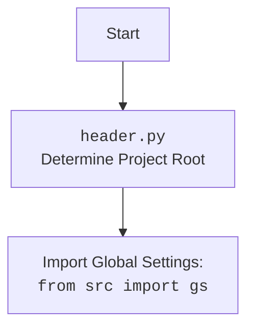

## <алгоритм>

**Класс `Driver`:**

1. **Инициализация (`__init__`)**:
   - Принимает класс веб-драйвера (`webdriver_cls`, например, `Chrome`, `Firefox`) и параметры для его инициализации.
   - Проверяет, что у класса веб-драйвера есть метод `get`.
   - Создает экземпляр веб-драйвера `self.driver`.
   - Пример: `driver = Driver(Chrome, executable_path='/path/to/chromedriver')`

2. **Инициализация подкласса (`__init_subclass__`)**:
   - Проверяет, что при создании подкласса `Driver` указано `browser_name` (например, `Chrome`, `Firefox`).
   - Сохраняет `browser_name` в атрибуте класса.
   - Пример: `class ChromeDriver(Driver, browser_name='Chrome'): ...`

3. **Проксирование атрибутов (`__getattr__`)**:
   - Перехватывает обращение к атрибутам, которых нет в классе `Driver`.
   - Возвращает атрибут из экземпляра веб-драйвера `self.driver`.
   - Пример: `driver.current_url` вызывает `self.driver.current_url`

4.  **Прокрутка (`scroll`)**:
   - Принимает направление (`both`, `down`, `up`), количество прокруток, размер кадра и задержку.
   - Вызывает внутреннюю функцию `carousel` для фактической прокрутки.
   -  Пример:
       - `driver.scroll(scrolls=3, direction='down')`: прокрутка 3 раза вниз.
       - `driver.scroll(scrolls=2, direction='up', frame_size=300, delay=0.5)`: прокрутка 2 раза вверх, кадр 300 пикселей, задержка 0.5 секунды.

5. **Определение локали (`locale`)**:
    - Пытается получить язык страницы из мета-тега `Content-Language`.
    - Если не удалось, пытается получить язык с помощью JavaScript.
    - Возвращает код языка (например, `en`, `ru`), или `None`, если не удалось определить.
    - Пример:
        - `lang = driver.locale`

6. **Переход по URL (`get_url`)**:
    - Сохраняет текущий URL.
    - Переходит по указанному `url` с помощью `self.driver.get(url)`.
    - Ожидает полной загрузки страницы (`ready_state == 'complete'`).
    - Сохраняет куки в файл.
    - Возвращает `True` при успехе, `False` при ошибке.
    - Примеры:
      - `driver.get_url('https://example.com')`
      - При возникновении ошибки, логгирует ошибку и возвращает `False`

7.  **Открытие нового окна (`window_open`)**:
   - Открывает новую вкладку в текущем окне браузера (`window.open()`).
   - Переключается на новую вкладку.
   - Если передан `url`, загружает его в новой вкладке.
   - Пример: `driver.window_open('https://example.com')`

8. **Задержка (`wait`)**:
   - Приостанавливает выполнение на заданное количество секунд.
   - Пример: `driver.wait(1.5)` (задержка 1.5 секунды).

9. **Сохранение куки (`_save_cookies_localy`)**:
   - Сохраняет текущие куки в файл, указанный в `gs.cookies_filepath`.
   - Использует `pickle` для сериализации куки.
   - Пример: `driver._save_cookies_localy()`

10. **Извлечение HTML (`fetch_html`)**:
   - Принимает URL, который может быть путем к локальному файлу или веб-адресом.
   - Если URL начинается с `file://`, читает HTML-контент из файла.
   - Если URL начинается с `http://` или `https://`, использует `get_url` для перехода по адресу и получает `page_source`.
   - Сохраняет HTML-контент в `self.html_content`.
   - Возвращает `True` при успехе, `False` при ошибке, `None` если протокол не поддерживается
   - Пример:
        - `driver.fetch_html('file:///path/to/local/file.html')`
        - `driver.fetch_html('https://example.com')`

**Локальная функция `carousel`:**

-   Используется для прокрутки экрана в рамках `scroll` метода.
-   Принимает направление прокрутки (`down` или `up`), количество прокруток, размер кадра, задержку.
-   Использует `execute_script` для прокрутки с помощью javascript.
-   Возвращает `True` при успехе и `False` при ошибке.

**Поток данных:**

-   При инициализации класса `Driver` создается экземпляр `webdriver`, который хранится в атрибуте `driver`.
-   Методы `scroll`, `locale`, `get_url`, `window_open`, `wait`, `_save_cookies_localy`, и `fetch_html` используют `driver` для взаимодействия с браузером.
-  `get_url` вызывает метод `self.driver.get(url)` для навигации по URL и сохраняет куки.
-   `_save_cookies_localy` сохраняет куки в файл.
-  `fetch_html` получает HTML либо из файла, либо из веб-страницы, используя `get_url`.

## <mermaid>
```mermaid
flowchart TD
    subgraph Driver Class
        A[<code>__init__</code><br>Initialize WebDriver]
        B[<code>__init_subclass__</code><br>Set browser_name]
        C[<code>__getattr__</code><br>Proxy to WebDriver]
        D[<code>scroll</code><br>Scroll the page]
        E[<code>locale</code><br>Determine page language]
        F[<code>get_url</code><br>Navigate to URL]
        G[<code>window_open</code><br>Open a new tab]
        H[<code>wait</code><br>Pause execution]
        I[<code>_save_cookies_localy</code><br>Save Cookies]
        J[<code>fetch_html</code><br>Fetch HTML content]
    end
    
    subgraph Carousel Function
      K[<code>carousel</code><br>Inner Scroll function]
    end
    
    A -->|Create WebDriver instance| B
    A -->|Set WebDriver instance| C
    C -->|Access WebDriver attributes| webdriver[selenium.webdriver.*]
    D -->|Call carousel func| K
    D -->|return True/False| D
    K -->|use execute_script| webdriver[selenium.webdriver.*]
    E -->|find element with meta tag| webdriver[selenium.webdriver.*]
    E -->|Get lang from Javascript| webdriver[selenium.webdriver.*]
    F -->|Use self.driver.get(url)| webdriver[selenium.webdriver.*]
    F -->|save cookies localy| I
    G -->|Use execute_script| webdriver[selenium.webdriver.*]
    G -->|Switch to window| webdriver[selenium.webdriver.*]
    H -->|Pause the thread| time.sleep
    I -->|Save Cookies| pickle.dump
    I -->|get Cookies from driver| webdriver[selenium.webdriver.*]
    J -->|Fetch from Local File| Path.exists
    J -->|call get_url| F
    J -->|get HTML content| webdriver[selenium.webdriver.*]
    
    style A fill:#f9f,stroke:#333,stroke-width:2px
    style B fill:#f9f,stroke:#333,stroke-width:2px
    style C fill:#ccf,stroke:#333,stroke-width:2px
    style D fill:#ccf,stroke:#333,stroke-width:2px
    style E fill:#ccf,stroke:#333,stroke-width:2px
    style F fill:#ccf,stroke:#333,stroke-width:2px
    style G fill:#ccf,stroke:#333,stroke-width:2px
    style H fill:#ccf,stroke:#333,stroke-width:2px
    style I fill:#ccf,stroke:#333,stroke-width:2px
    style J fill:#ccf,stroke:#333,stroke-width:2px
    style K fill:#ccf,stroke:#333,stroke-width:2px
```



**Объяснение зависимостей `mermaid`:**

-   **`Driver Class`**: Основной класс, который предоставляет интерфейс для работы с веб-драйвером.
    -   `__init__`: Метод инициализирует драйвер, принимая класс веб-драйвера (например, `Chrome`, `Firefox`) и аргументы.
    -   `__init_subclass__`: Метод, вызываемый при создании подкласса, устанавливает имя браузера.
    -   `__getattr__`: Метод для проксирования атрибутов к экземпляру `webdriver`.
    -   `scroll`: Метод для прокрутки страницы.
    -   `locale`: Метод для определения языка страницы.
    -   `get_url`: Метод для перехода по URL.
    -    `window_open`: Метод для открытия нового окна или вкладки.
    -   `wait`: Метод для задержки выполнения.
    -   `_save_cookies_localy`: Метод для сохранения куки.
    -  `fetch_html`: Метод для загрузки HTML контента из файла или URL.
-   **`Carousel Function`**: Внутренняя функция для прокрутки страницы.
    - `carousel`: Метод прокрутки, вызываемый из метода `scroll`.
-  `webdriver[selenium.webdriver.*]`: Библиотека `selenium`, используется для управления браузером,
      такие как: навигация по URL, поиск элементов, выполнение JavaScript.
-   `Path.exists`: Используется для проверки существования файла.
-   `time.sleep`: Используется для задержки выполнения.
-   `pickle.dump`: Используется для сериализации куки и сохранения их в файл.

## <объяснение>

### Импорты:

*   **`import copy`**: Используется для создания копии текущего URL перед переходом на новую страницу (метод `get_url`). Это нужно, чтобы сохранить предыдущий URL для дальнейшего использования.
*   **`import pickle`**: Используется для сериализации и десериализации объектов Python. В данном случае, применяется для сохранения куки в файл (`_save_cookies_localy`) и загрузки их из файла.
*   **`import time`**: Используется для добавления задержек в выполнение программы, например, после прокрутки страницы (`scroll`) или ожидания (`wait`).
*   **`import re`**: Используется для работы с регулярными выражениями, например, для извлечения пути к файлу из URL (`fetch_html`).
*   **`from pathlib import Path`**: Используется для работы с путями к файлам и каталогам в операционной системе. Применяется в `fetch_html` для проверки существования файла.
*   **`from typing import Optional`**: Используется для определения типов переменных и возвращаемых значений, указывая, что значение может быть `None`.
*  **`from selenium.webdriver.common.by import By`**: Импортирует класс `By` из `selenium`, используется для определения стратегии поиска элементов (например, CSS селектор, ID, и т.д.). Применяется при поиске элемента на странице.
*   **`from selenium.common.exceptions import ...`**: Импортирует специфические исключения из `selenium`, которые возникают при работе с веб-драйвером. Например, `InvalidArgumentException` возникает, если передан некорректный URL, а `ElementClickInterceptedException` - когда элемент перекрыт другим элементом.
*   **`import header`**: Импортирует модуль `header` из проекта, который используется для определения корневой директории проекта и инициализации глобальных настроек.
*  **`from src import gs`**: Импортирует глобальные настройки `gs` из пакета `src`.
*  **`from src.logger.logger import logger`**: Импортирует объект логгера для записи сообщений, предупреждений и ошибок.
*  **`from src.logger.exceptions import ExecuteLocatorException, WebDriverException`**: Импортирует пользовательские исключения, определенные в модуле `exceptions` пакета `src.logger`.

### Классы:

*   **`Driver`**:
    *   **Роль**: Обеспечивает унифицированный интерфейс для взаимодействия с веб-драйверами Selenium. Позволяет переключаться между различными браузерами (Chrome, Firefox, Edge) без изменения остальной части кода.
    *   **Атрибуты**:
        *   `driver`: Экземпляр веб-драйвера.
        *   `browser_name`: Имя браузера, используется для подклассов.
    *   **Методы**:
        *   `__init__`: Конструктор, инициализирует драйвер.
        *   `__init_subclass__`: Инициализирует подкласс `Driver`.
        *   `__getattr__`: Перенаправляет вызовы атрибутов к экземпляру `self.driver`.
        *   `scroll`: Прокручивает страницу.
        *   `locale`: Определяет язык страницы.
        *   `get_url`: Переходит по URL.
        *   `window_open`: Открывает новое окно или вкладку.
        *    `wait`: Задержка выполнения.
        *   `_save_cookies_localy`: Сохраняет куки.
        *   `fetch_html`: Извлекает HTML контент.

### Функции:

*   **`__init__(self, webdriver_cls, *args, **kwargs)`**:
    *   **Аргументы**:
        *   `webdriver_cls`: Класс веб-драйвера (например, `Chrome`, `Firefox`).
        *   `*args`: Позиционные аргументы для конструктора веб-драйвера.
        *   `**kwargs`: Именованные аргументы для конструктора веб-драйвера.
    *   **Возвращаемое значение**: Нет.
    *   **Назначение**: Инициализирует экземпляр класса `Driver`.
    *   **Пример**: `driver = Driver(Chrome, executable_path='/path/to/chromedriver')`.
*  **`__init_subclass__(cls, *, browser_name=None, **kwargs)`**:
      *   **Аргументы**:
           *   `browser_name` (str): Имя браузера.
          *    `**kwargs`: Дополнительные аргументы.
      *  **Возвращаемое значение**: Нет.
       * **Назначение**: Автоматически вызывается при создании подкласса `Driver`, проверяет наличие аргумента `browser_name`.
        *  **Пример**: `class ChromeDriver(Driver, browser_name='Chrome'): ...`
*   **`__getattr__(self, item)`**:
    *   **Аргументы**:
        *   `item`: Имя атрибута.
    *   **Возвращаемое значение**: Значение атрибута из экземпляра `self.driver`.
    *   **Назначение**: Позволяет обращаться к атрибутам веб-драйвера напрямую через экземпляр класса `Driver`.
    *   **Пример**: `driver.current_url`
*   **`scroll(self, scrolls: int = 1, frame_size: int = 600, direction: str = 'both', delay: float = .3) -> bool`**:
    *   **Аргументы**:
        *   `scrolls`: Количество прокруток (по умолчанию 1).
        *   `frame_size`: Размер прокрутки в пикселях (по умолчанию 600).
        *   `direction`: Направление прокрутки (`both`, `down`, `up`) (по умолчанию `both`).
        *   `delay`: Задержка между прокрутками (по умолчанию 0.3).
    *   **Возвращаемое значение**: `True` при успехе, `False` при ошибке.
    *   **Назначение**: Прокручивает страницу в указанном направлении.
    *   **Пример**: `driver.scroll(scrolls=2, direction='down', delay=0.5)`.
*   **`locale(self) -> Optional[str]`**:
    *   **Аргументы**: Нет.
    *   **Возвращаемое значение**: Код языка (например, `en`, `ru`), или `None`, если язык не определен.
    *   **Назначение**: Определяет язык страницы.
    *   **Пример**: `lang = driver.locale`.
*   **`get_url(self, url: str) -> bool`**:
    *   **Аргументы**:
        *   `url`: URL для перехода.
    *   **Возвращаемое значение**: `True`, если переход успешен, `False` в противном случае.
    *   **Назначение**: Переходит по указанному URL и сохраняет куки.
    *    **Пример**: `driver.get_url('https://example.com')`
*   **`window_open(self, url: Optional[str] = None) -> None`**:
    *   **Аргументы**:
         *   `url`:  URL для открытия в новой вкладке (необязательно).
    *   **Возвращаемое значение**: None.
    *   **Назначение**: Открывает новую вкладку в текущем окне браузера.
    *   **Пример**: `driver.window_open('https://example.com')`.
*   **`wait(self, delay: float = .3) -> None`**:
    *   **Аргументы**:
        *   `delay`: Задержка в секундах (по умолчанию 0.3).
    *   **Возвращаемое значение**: Нет.
    *   **Назначение**: Приостанавливает выполнение программы на заданное время.
    *   **Пример**: `driver.wait(1)`.
*   **`_save_cookies_localy(self) -> None`**:
    *   **Аргументы**: Нет.
    *   **Возвращаемое значение**: Нет.
    *   **Назначение**: Сохраняет текущие куки в файл.
    *   **Пример**: `driver._save_cookies_localy()`.
*   **`fetch_html(self, url: str) -> Optional[bool]`**:
    *   **Аргументы**:
        *   `url`: URL (локальный файл или веб-адрес) для извлечения HTML-контента.
    *   **Возвращаемое значение**: `True`, если контент успешно получен, `False` при ошибке, `None` если протокол не поддерживается
    *   **Назначение**: Извлекает HTML-контент из файла или веб-страницы.
    *   **Пример**: `driver.fetch_html('https://example.com')`.
*   **`carousel(direction: str = '', scrolls: int = 1, frame_size: int = 600, delay: float = .3) -> bool`**:
      *   **Аргументы**:
          *   `direction`: Направление прокрутки (`''` для вниз, `'-'` для вверх).
          *   `scrolls`: Количество прокруток.
          *   `frame_size`: Размер кадра прокрутки.
          *   `delay`: Задержка между прокрутками.
      *  **Возвращаемое значение**: `True` при успехе и `False` при ошибке.
      * **Назначение**: Локальный метод для прокрутки экрана.

### Переменные:

*   `self.driver`: Экземпляр веб-драйвера (например, `Chrome`, `Firefox`).
*   `self.previous_url`: Предыдущий URL, сохраненный перед переходом.
*   `self.html_content`: Сохраненный HTML контент.
*   `gs.cookies_filepath`: Путь к файлу для сохранения куки.
*   `scrolls`: Количество прокруток (тип `int`).
*   `frame_size`: Размер кадра прокрутки в пикселях (тип `int`).
*   `direction`: Направление прокрутки (тип `str`).
*  `delay`: Задержка в секундах (тип `float`).
* `url`: URL адрес, тип `str`
* `webdriver_cls`: Класс веб-драйвера, тип `type`.
* `browser_name`: Имя браузера, тип `str`.

### Потенциальные ошибки и области для улучшения:

*   **Обработка исключений**: В некоторых местах используется общий `except Exception as ex`, что может затруднить отладку. Лучше использовать более конкретные типы исключений.
*   **`_save_cookies_localy`**: В текущем виде, метод не сохраняет куки (закомментировано `pickle.dump`). Необходимо раскомментировать код и удостовериться что куки сохраняются.
*   **Логирование**:  Логирование ошибок можно сделать более подробным, добавляя контекст, например, URL, с которым возникла проблема.
*  **`wait`**:  Метод `wait` реализован с помощью `time.sleep`, можно было бы реализовать ожидание с использованием `WebDriverWait`, это более эффективно.
*  **`fetch_html`**:  Нужна более детальная проверка URL и валидация HTML контента, чтобы избежать ошибок в дальнейшем.

### Взаимосвязи с другими частями проекта:

*   Модуль `header` используется для определения корневой директории проекта и инициализации глобальных настроек, которые затем используются для определения пути к файлу куки (`gs.cookies_filepath`).
*   Объект `logger` из `src.logger.logger` используется для логгирования ошибок и сообщений.
*  Глобальные настройки `gs` из пакета `src`, используются для получения `cookies_filepath`.
*   Используются пользовательские исключения `ExecuteLocatorException`, `WebDriverException` из `src.logger.exceptions` для обработки ошибок.
*   Используется `selenium` для управления веб драйвером и взаимодействия с браузером.

Этот анализ обеспечивает полное представление о функциональности, архитектуре и зависимостях кода `driver.py`.