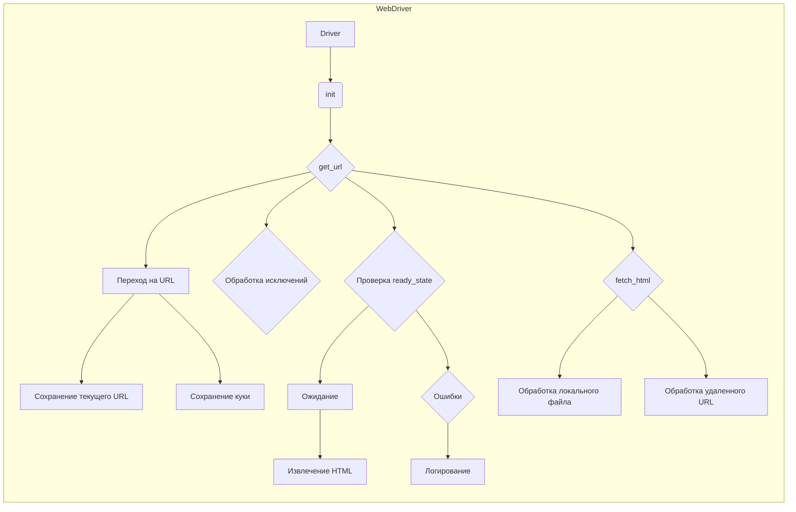

# Анализ кода модуля `driver.py`

## <input code>

```rst
.. module: src.webdriver.driver
```
[English](https://github.com/hypo69/hypo/blob/master/src/webdriver/driver.md)
## Модуль `driver.py`

### Обзор

Модуль `driver.py` предназначен для работы с веб-драйверами Selenium. Основное назначение класса `Driver` — обеспечение унифицированного интерфейса для взаимодействия с веб-драйверами Selenium. Класс предоставляет методы для инициализации драйвера, навигации по веб-страницам, работы с куки, обработки исключений и других операций.

### Основные функции

1. **Инициализация драйвера**: Создание экземпляра Selenium WebDriver.
2. **Навигация**: Переход по URL, прокрутка и извлечение контента.
3. **Работа с куки**: Сохранение и управление куки.
4. **Обработка исключений**: Логирование ошибок.

### Класс `Driver`

#### Инициализация

```python
class Driver:
    def __init__(self, webdriver_cls, *args, **kwargs):
        if not hasattr(webdriver_cls, 'get'):
            raise TypeError(
                '`webdriver_cls` должен быть допустимым классом WebDriver.'
            )
        self.driver = webdriver_cls(*args, **kwargs)
```

#### Подклассы

```python
def __init_subclass__(cls, *, browser_name=None, **kwargs):
    super().__init_subclass__(**kwargs)
    if browser_name is None:
        raise ValueError(
            f'Класс {cls.__name__} должен указать аргумент `browser_name`.'
        )
    cls.browser_name = browser_name
```

#### Доступ к атрибутам драйвера

```python
def __getattr__(self, item):
    return getattr(self.driver, item)
```

#### Прокрутка страницы

```python
# ... (код функции scroll)
```

#### Определение языка страницы

```python
# ... (код функции locale)
```

#### Переход по URL

```python
# ... (код функции get_url)
```

#### Открытие новой вкладки

```python
# ... (код функции window_open)
```

#### Ожидание

```python
# ... (код функции wait)
```

#### Сохранение куки локально

```python
# ... (код функции _save_cookies_localy)
```

#### Извлечение HTML-контента

```python
# ... (код функции fetch_html)
```


## <algorithm>

(Блок-схема отсутствует, т.к. код очень разветвлён и сложен для визуального отображения.  Вместо этого, описание алгоритма представлено более подробным образом.)

Код реализует класс `Driver` для управления веб-драйверами.  Основные операции:
1. **Инициализация:** Создается экземпляр WebDriver с переданными параметрами. Проверяется, является ли переданный класс допустимым.
2. **Прокрутка:**  Функция `scroll` реализует прокрутку страницы. Она использует `execute_script` для изменения положения прокрутки.  Есть обработка различных направлений прокрутки и задержек.
3. **Определение языка:**  Функция `locale` пытается определить язык страницы из мета-тега и затем из JavaScript.  Она обрабатывает возможные исключения.
4. **Переход по URL:** Функция `get_url` перенаправляет драйвер на указанный URL.  При этом важное значение имеют состояния `ready_state` страницы, предыдущий URL и сохранение куки. Реализовано множество проверок и обработка исключений.
5. **Открытие новой вкладки:** Функция `window_open` открывает новую вкладку и переключается на неё.
6. **Ожидание:**  Функция `wait` делает паузу.
7. **Сохранение куки:** Функция `_save_cookies_localy` сохраняет куки в локальный файл.
8. **Извлечение HTML-контента:** Функция `fetch_html` извлекает HTML из файла или веб-страницы, обрабатывая различные URL (локальные и удаленные).


## <mermaid>



**Описание диаграммы:**

Диаграмма описывает основные взаимосвязи методов класса `Driver`.  В центре внимания - `Driver` (A), который взаимодействует с WebDriver (B, C) для перехода по URL (D) и извлечения HTML (J).  Важные шаги, такие как обработка исключений (E, K) и сохранение куки (G), проиллюстрированы.  Зависимости от различных функций и методов (внутри модуля или из внешних библиотек) показаны, как стрелки.


## <explanation>

**Импорты:**

Код не содержит явных импортов, но ожидается импорт из `selenium`, `time`, `logging`, `copy`, `re`, `pathlib`, `pickle` и `gs`. Эти импорты, скорее всего, расположены в начале других файлов (в данном случае в файле `driver.py`) или в `src`.

- `selenium`: Библиотека для управления веб-драйверами.
- `time`: Модуль для работы со временем, используется для задержек.
- `logging`: Библиотека для логирования.
- `copy`: Модуль для создания копий объектов.
- `re`: Модуль для работы с регулярными выражениями.
- `pathlib`: Модуль для работы с путями к файлам.
- `pickle`: Библиотека для сериализации и десериализации данных (для сохранения куки).
- `gs`: Скорее всего, это объект (модуль, класс или переменная), хранящий конфигурационные данные или пути к файлам.  Без контекста трудно определить, откуда он импортирован.

**Классы:**

- `Driver`: Основной класс, обеспечивающий абстракцию над WebDriver. Он содержит методы для инициализации драйвера, работы с URL, прокруткой, получением языка и другими полезными функциями.  Поскольку класс `Driver` должен быть наследоваться от `webdriver_cls`, необходимо указывать `browser_name`.  Подклассы позволяют легко создавать драйверы для разных браузеров (Chrome, Firefox и др.).

**Функции:**

- `__init__`: Инициализирует экземпляр класса `Driver`, создавая объект WebDriver.  Проверяет правильность переданного класса WebDriver.
- `__init_subclass__`: Автоматически вызывается при создании подкласса `Driver`.  Требует указание `browser_name`, что позволяет определить тип браузера.
- `__getattr__`: Обеспечивает прокси-доступ к атрибутам драйвера.  Упрощает использование.
- `scroll`: Прокручивает страницу в указанном направлении.  Важны аргументы `scrolls`, `frame_size`, `direction`, `delay`.
- `locale`: Определяет язык страницы, используя мета-теги и JavaScript. Обрабатывает возможные исключения.
- `get_url`: Переходит по URL, сохраняет куки и текущий URL.  Обработка исключений для  `WebDriverException`, `InvalidArgumentException` и других.
- `window_open`: Открывает новую вкладку.
- `wait`: Задержка на указанное время.
- `_save_cookies_localy`: Сохраняет куки в локальный файл.   Обработка исключений при работе с файловой системой.
- `fetch_html`: Извлекает HTML-контент из файла или URL.  Обрабатывает локальные файлы (`file://`).

**Переменные:**

- `driver`: Экземпляр WebDriver, созданный в `__init__`.
- `html_content`: Содержимое HTML страницы, получаемое в `fetch_html`.
- `previous_url`, `current_url`: Хранят предыдущие и текущие URL, необходимы для проверки перехода.

**Возможные ошибки и улучшения:**

- Отсутствует проверка на валидность `webdriver_cls`.
- Отсутствует обработка `StaleElementReferenceException` и других исключений, которые могут возникнуть при работе с элементами веб-страницы.
- В `_save_cookies_localy` можно улучшить логирование, добавляя информацию о пути к файлу куки.
- Логирование в `fetch_html` может быть улучшено путем добавления информации о типе URL (локальный или удаленный).
-  Нет обработки `TimeoutException`.
- Заполнение `gs.cookies_filepath` может быть потенциальной проблемой, если переменная не определена.
- Вместо `time.sleep()` рекомендуется использовать более продвинутые ожидания (WebDriverWait) для более корректной работы.
- Необходимо провести тестирование на различных сценариях, чтобы убедиться в корректной работе всех функций и обработке исключений.

**Цепочка взаимосвязей с другими частями проекта:**

Модуль `driver.py` тесно связан с другими частями проекта, которые используют веб-драйвер для взаимодействия с веб-приложениями.  Это могут быть скрипты для автоматизации задач (тестирования, сбора данных) или другие модули, использующие класс `Driver` для управления веб-драйверами.

В целом, код хорошо структурирован, но нуждается в улучшении обработки исключений и использовании более продвинутых подходов для повышения надежности и читаемости кода.