## АНАЛИЗ КОДА: `src/webdriver/edge/README.MD`

### 1. <алгоритм>

#### Общая схема работы модуля `src.webdriver.edge`:
1. **Чтение конфигурации:** Модуль начинает с чтения настроек из файла `edge.json`.
   - **Пример:** Загружает значения `options`, `profiles`, `executable_path` и `headers`.
   - **Данные:** `edge.json` -> JSON-объект.
2. **Инициализация WebDriver:** Создает экземпляр Edge WebDriver, используя:
   -   Конфигурационные опции из `edge.json` (например, `--disable-dev-shm-usage`).
   -   Пользовательский `user-agent` (если предоставлен, в противном случае берется из `edge.json`).
   -   Пользовательские параметры (например, `"--headless"`).
   -   Путь к исполняемому файлу `msedgedriver` (из `edge.json`).
   - **Данные:** JSON-объект, user-agent (строка), custom_options (список строк) -> экземпляр `Edge`.
3. **Управление экземпляром:** Реализует Singleton pattern, гарантируя, что WebDriver существует в единственном экземпляре:
   -  Если экземпляр уже существует, используется существующий экземпляр.
   -  Если экземпляра нет, создаётся новый.
4. **Работа с браузером:** Использование WebDriver для автоматизированных действий:
   - **Пример:** Загрузка URL через `browser.get("https://www.example.com")`.
   - **Данные:** URL (строка) -> страница в браузере.
5. **Завершение работы:** Закрытие браузера через `browser.quit()`.

```mermaid
flowchart TD
    subgraph src.webdriver.edge
        Start[Начало] --> ReadConfig[Чтение `edge.json`]
        ReadConfig -- JSON-объект --> InitWebDriver[Инициализация WebDriver]
        InitWebDriver --> SingletonCheck[Проверка Singleton]
        SingletonCheck -- Есть экземпляр --> ReuseInstance[Использовать существующий экземпляр]
        SingletonCheck -- Нет экземпляра --> CreateInstance[Создать новый экземпляр]
        ReuseInstance --> BrowserActions[Действия браузера]
        CreateInstance --> BrowserActions
        BrowserActions --> CloseBrowser[Закрыть браузер]
        CloseBrowser --> End[Конец]
    end

    style Start fill:#f9f,stroke:#333,stroke-width:2px
    style End fill:#f9f,stroke:#333,stroke-width:2px
    style ReadConfig fill:#ccf,stroke:#333,stroke-width:2px
    style InitWebDriver fill:#ccf,stroke:#333,stroke-width:2px
    style SingletonCheck fill:#ccf,stroke:#333,stroke-width:2px
    style ReuseInstance fill:#ccf,stroke:#333,stroke-width:2px
    style CreateInstance fill:#ccf,stroke:#333,stroke-width:2px
    style BrowserActions fill:#ccf,stroke:#333,stroke-width:2px
    style CloseBrowser fill:#ccf,stroke:#333,stroke-width:2px
```

### 2. <mermaid>

#### **Объяснение `mermaid` диаграммы:**

-   Диаграмма показывает основные шаги работы модуля `src.webdriver.edge`.
-   `Start` и `End`: Начало и конец работы.
-   `ReadConfig`: Читает конфигурацию из файла `edge.json`. 
-   `InitWebDriver`: Инициализирует WebDriver с опциями из конфигурации, пользовательскими настройками.
-   `SingletonCheck`: Проверяет наличие существующего экземпляра, реализуя паттерн "Singleton".
-   `ReuseInstance`: Использует существующий экземпляр WebDriver.
-   `CreateInstance`: Создает новый экземпляр WebDriver.
-   `BrowserActions`: Выполнение действий в браузере (например, открытие страницы).
-   `CloseBrowser`: Закрытие браузера.
-   Стилизация блоков для наглядности.

### 3. <объяснение>

**Импорты:**

- В коде, представленном в файле `README.MD`, не показаны импорты Python, но предполагается, что класс `Edge`  из `src.webdriver.edge` использует следующие библиотеки:
    -   `selenium`: Для управления браузером.
    -   `fake_useragent`: Для генерации поддельного User-Agent.
    -  `src.logger`: Для ведения журнала событий и ошибок.
    -  `src.config`:  Для доступа к настройкам приложения, где хранится путь к файлу `edge.json`.
     **Взаимосвязь с `src`:** 
    - `src.logger` предоставляет механизм логирования.
    - `src.config` обеспечивает доступ к файлам конфигурации.

**Классы:**

-   **`Edge`**: (не описан в README.MD, но предполагается его существование в `src/webdriver/edge/__init__.py` или подобном файле)
    -   **Роль**: Представляет собой обертку над Edge WebDriver, который настраивается из файла `edge.json`,
        обеспечивает централизованное управление и расширенную функциональность.
    -   **Атрибуты**:
        -  `_instance`: Статический атрибут для реализации Singleton pattern.
        -  `driver`:  Экземпляр `selenium.webdriver.edge.webdriver.WebDriver`.
        -   `config` : Словарь, содержащий настройки из `edge.json`.
    -   **Методы**:
        -   `__init__(self, user_agent=None, options=None)`: Инициализирует WebDriver, применяет Singleton pattern, настраивает профиль, устанавливает user-agent и дополнительные опции.
        -   `get(self, url)`: Открывает указанный URL в браузере.
        -   `quit(self)`: Закрывает браузер.
        -   (Возможно, другие методы для взаимодействия с браузером)
    -   **Взаимодействие:**
        -   Использует `selenium` для управления Edge.
        -   Использует `fake_useragent` (если необходимо) для генерации `User-Agent`.
        -   Использует `src.logger` для логирования ошибок.
        -   Загружает конфигурацию из `src.config`.
        -   Реализует шаблон Singleton, гарантируя единственный экземпляр браузера.

**Функции:**

-   (Не описаны в README.MD, но предполагаются методы внутри класса `Edge`):
    -   `__init__`:
        -   **Аргументы**:
            -   `user_agent` (str, optional): Пользовательский user-agent.
            -   `options` (list, optional): Список дополнительных опций для Edge.
        -   **Возвращаемое значение**: Экземпляр класса `Edge` (или существующий экземпляр, если Singleton).
        -   **Назначение**: Создает новый или возвращает существующий экземпляр WebDriver, настраивает его согласно настройкам в `edge.json` и переданным аргументам.
    -    `get`:
        -   **Аргументы**:
            - `url` (str): URL веб-страницы, которую необходимо открыть.
         -   **Возвращаемое значение**: `None`.
         -  **Назначение**: Открывает заданный URL в браузере.
   -    `quit`:
        -    **Аргументы**: `None`.
         -   **Возвращаемое значение**: `None`.
         -  **Назначение**: Закрывает окно браузера и завершает сессию WebDriver.

**Переменные:**

-   **`config`**: Словарь, хранящий конфигурацию из файла `edge.json`. Загружается в начале работы класса Edge.
-   **`options`**: Список строк, содержащий дополнительные параметры запуска Edge, такие как `--disable-dev-shm-usage` и `--remote-debugging-port=0`.
-   **`profiles`**: Словарь, содержащий пути к папкам профилей браузера.
-   **`executable_path`**: Словарь, содержащий путь к исполняемому файлу `msedgedriver.exe`.
-   **`headers`**: Словарь, содержащий HTTP заголовки для запросов браузера.
-    **`_instance`**: Статическая переменная в классе `Edge` для реализации Singleton. Хранит единственный экземпляр класса.
-    **`driver`**: Экземпляр `selenium.webdriver.edge.webdriver.WebDriver`.

**Потенциальные ошибки и области для улучшения:**

-   **Отсутствие проверки существования файла конфигурации `edge.json`**: Если файл отсутствует, программа может сломаться. Необходимо добавить проверку наличия файла и обработку этой ситуации.
-   **Отсутствие обработки исключений при инициализации WebDriver**: Ошибки инициализации WebDriver должны быть перехвачены и обработаны для более стабильной работы.
-   **Отсутствие валидации данных в `edge.json`**: Необходимо добавить проверку на правильность структуры и типов данных в файле `edge.json`.
-   **Недостаточная обработка ошибок при работе с браузером**: Следует добавить проверку ошибок при выполнении таких действий, как открытие URL или закрытие браузера.
- **Расширенная настройка WebDriver**: Возможность добавления большего количества настроек, включая прокси, сертификаты и т.д.
-   **Абсолютные пути в конфигурации**: Использование абсолютных путей может вызвать проблемы при переносе кода. Лучше использовать относительные пути или переменные окружения.

**Цепочка взаимосвязей с другими частями проекта:**

1. **`src.config`**:
   - Обеспечивает загрузку конфигурации из `edge.json`.
   - Предоставляет доступ к общим настройкам проекта.
2.  **`src.logger`**:
    -  Обеспечивает логирование ошибок и других событий во время работы модуля.
    - Помогает при отладке и мониторинге.
3.  **`selenium`**:
    -  Основная библиотека для управления браузером Edge.
    -  Используется для автоматизации действий пользователя.
4.  **`fake_useragent`**:
    -  Используется для генерации случайных пользовательских агентов (опционально).
    -  Увеличивает анонимность браузера.