# Анализ кода `README.MD` модуля Edge WebDriver

## <алгоритм>

1.  **Начало**: Пользователь знакомится с модулем Edge WebDriver через `README.MD`.
2.  **Описание модуля**: Чтение общей информации о модуле, включая его назначение (предоставление кастомной реализации Edge WebDriver с использованием Selenium), ключевые особенности (централизованная конфигурация, поддержка нескольких профилей, логирование и обработка ошибок, передача пользовательских опций), требования к среде (Python, Selenium, Fake User Agent, Edge WebDriver binary).
3.  **Установка зависимостей**: Инструкции по установке необходимых Python библиотек (`selenium`, `fake_useragent`) с помощью `pip` и указания пути к `msedgedriver`.
4.  **Конфигурация**:
    *   Объяснение структуры конфигурационного файла `edge.json`.
    *   Примеры полей:
        *   `options`: Массив опций командной строки для Edge (например, `--disable-dev-shm-usage`, `--remote-debugging-port=0`).
        *   `profiles`: Пути к пользовательским данным Edge (OS-specific и внутренний путь).
        *   `executable_path`: Путь к исполняемому файлу `msedgedriver.exe`.
        *   `headers`: HTTP заголовки для запросов браузера (User-Agent, Accept, Accept-Charset, Accept-Encoding, Accept-Language, Connection).
5.  **Использование модуля**:
    *   Пример кода Python для импорта и инициализации `Edge` WebDriver.
    *   Демонстрация открытия веб-страницы и закрытия браузера.
    *   Упоминание Singleton паттерна: создание только одного экземпляра WebDriver и переиспользование его.
6.  **Логирование и отладка**: Информация о логировании ошибок и предупреждений с использованием `logger` из `src.logger`.
    *   Примеры сообщений ошибок: ошибка при инициализации WebDriver, ошибки конфигурации.
7.  **Лицензия**: Указание на лицензию MIT.

```mermaid
graph LR
    A[Начало] --> B(Описание модуля);
    B --> C{Установка зависимостей};
    C --> D[Конфигурация];
    D --> E(Пример `edge.json`);
    E --> F[Настройки опций];
    F --> G[Настройки профилей];
    G --> H[Настройки пути к исполняемому файлу];
    H --> I[Настройки пользовательских заголовков];
     I -->J{Использование модуля};
    J --> K[Инициализация Edge WebDriver];
    K --> L[Открытие веб-сайта];
    L --> M[Закрытие браузера];
    M --> N{Singleton паттерн};
    N --> O[Логирование];
    O --> P[Обработка ошибок];
    P --> Q[Лицензия];
     Q --> R[Конец];

  style A fill:#f9f,stroke:#333,stroke-width:2px
    style R fill:#f9f,stroke:#333,stroke-width:2px
    style B fill:#ccf,stroke:#333,stroke-width:2px
     style E fill:#ccf,stroke:#333,stroke-width:2px
    style J fill:#ccf,stroke:#333,stroke-width:2px
    style O fill:#ccf,stroke:#333,stroke-width:2px
    style Q fill:#ccf,stroke:#333,stroke-width:2px

    linkStyle 0,1,2,3,4,5,6,7,8,9,10,11,12,13,14,15,16 stroke:#333,stroke-width:2px;
```

## <mermaid>

**Описание зависимостей:**

*   **Начало**: Точка входа, с которой начинается анализ.
*   **Описание модуля**: Объясняет общие цели и функциональность модуля.
*   **Установка зависимостей**: Указывает на необходимость установки библиотек `selenium`, `fake_useragent` и `msedgedriver`.
*   **Конфигурация**: Описывает структуру и назначение конфигурационного файла `edge.json`.
*   **Пример `edge.json`**: Приводит пример структуры файла конфигурации.
*   **Настройки опций**: Описывает использование настроек опций командной строки Edge.
*   **Настройки профилей**: Объясняет настройку пользовательских профилей браузера Edge.
*   **Настройки пути к исполняемому файлу**: Указывает на путь к бинарному файлу драйвера.
*   **Настройки пользовательских заголовков**: Объясняет, как настраиваются пользовательские HTTP-заголовки.
*   **Использование модуля**: Демонстрирует применение класса `Edge`.
*   **Инициализация Edge WebDriver**: Описывает процесс создания и настройки экземпляра Edge WebDriver.
*   **Открытие веб-сайта**: Показывает пример использования метода `get()` для открытия веб-страницы.
*   **Закрытие браузера**: Демонстрирует использование метода `quit()` для завершения работы браузера.
*   **Singleton паттерн**: Поясняет применение паттерна одиночка для управления экземпляром драйвера.
*   **Логирование**: Описывает использование логирования для отслеживания работы драйвера и выявления ошибок.
*   **Обработка ошибок**: Указывает на наличие логики обработки ошибок и предупреждений.
*   **Лицензия**: Указывает на тип лицензии, используемой в проекте.
*   **Конец**: Завершающая точка анализа.

## <объяснение>

### Импорты

*   Импорты не указаны явно в этом файле `README.MD`, но предполагается, что в коде `src/webdriver/edge/`, импортируются:
    *   `selenium` : Для управления браузером Edge.
    *  `fake_useragent` : Для генерации поддельных `User-Agent` строк.
    * `src.logger`: Для логирования событий, ошибок и предупреждений.

### Классы

*   **`Edge`**:
    *   **Роль**: Главный класс, представляющий Edge WebDriver. Он инкапсулирует логику инициализации и управления браузером.
    *   **Атрибуты**:
        *   Атрибуты, заданные в `edge.json` (например, `options`, `profiles`, `executable_path`, `headers`).
        *   Экземпляр WebDriver, созданный с использованием Selenium.
        *   Логгер из `src.logger`.
    *   **Методы**:
        *   `__init__()`: Конструктор, который загружает конфигурацию из `edge.json`, настраивает параметры браузера, и инициализирует WebDriver.
        *   `get()`: Открывает веб-страницу по заданному URL.
        *   `quit()`: Закрывает браузер и завершает сессию WebDriver.
    *   **Взаимодействие**: Взаимодействует с Selenium для управления браузером Edge. Использует `src.logger` для ведения логов.

### Функции

*   В `README.MD` функции не описаны. Предполагается наличие таких методов, как `__init__`, `get`, `quit` в классе `Edge`.

### Переменные

*   **`options`**: Список опций командной строки для Edge.
*   **`profiles`**: Словарь путей к пользовательским данным Edge.
*   **`executable_path`**: Словарь путей к исполняемому файлу `msedgedriver.exe`.
*   **`headers`**: Словарь пользовательских HTTP-заголовков.
*   **`user_agent`**: Строка user-agent, устанавливается для браузера.
*   **`browser`**: Объект WebDriver, экземпляр класса `Edge`.

### Потенциальные ошибки и области для улучшения

1.  **Отсутствие обработки исключений при загрузке `edge.json`**: Не указано, как обрабатываются ошибки при загрузке или чтении JSON файла. Необходимо добавить обработку исключений для таких случаев.
2.  **Жесткие пути к файлам**: Жестко заданные пути, как `%LOCALAPPDATA%\\\\Microsoft\\\\Edge\\\\User Data\\\\Default`, могут вызвать проблемы на других операционных системах или конфигурациях. Нужно сделать пути более гибкими.
3.  **Отсутствие проверки на наличие `msedgedriver.exe`**: Не предусмотрена проверка наличия драйвера по указанному пути и обработка случая, когда его нет.
4.  **Зависимость от версии `msedgedriver`**: `msedgedriver` должен совпадать по версии с установленным браузером.
5. **Обработка singleton паттерна**: В файле не показано как именно реализован singleton, стоит добавить реализацию.
6. **Не указано как передавать параметры**: Не показано, как передавать кастомные параметры драйверу, например передать `user-agent` для каждой сессии, или как добавлять cookies.

### Цепочка взаимосвязей с другими частями проекта

1.  **`src.logger`**: Модуль `Edge` использует `logger` из `src.logger` для ведения логов, что позволяет интегрировать его в систему логирования проекта.
2.  **Файл `edge.json`**: Этот файл содержит конфигурации, которые используются классом `Edge` для настройки WebDriver.
3.  **Selenium**: `Edge` зависит от библиотеки Selenium для управления браузером Edge.
4. **`fake_useragent`**: Класс `Edge` может использовать `fake_useragent` для генерации или установки user-agent, делая его часть экосистемы WebDriver.