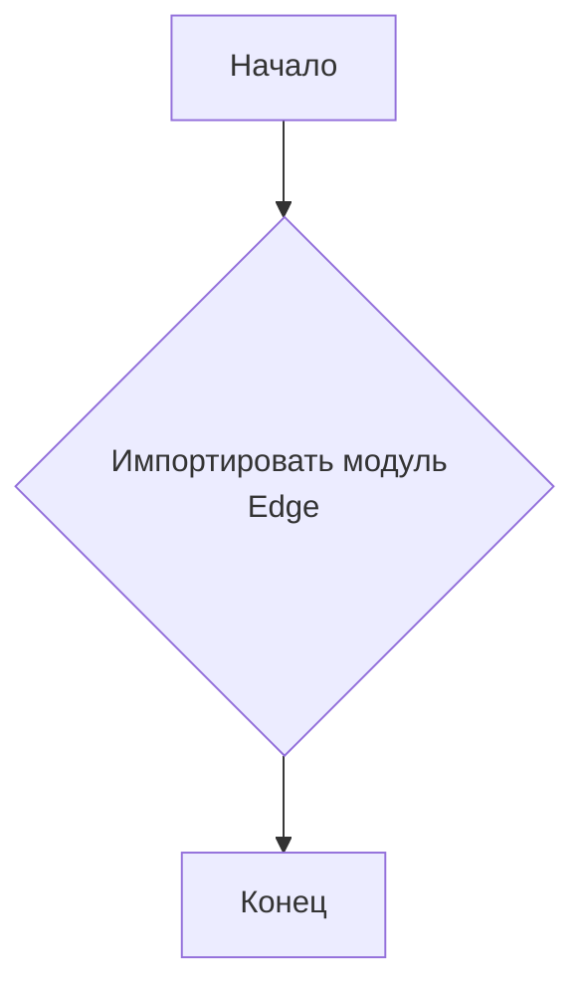
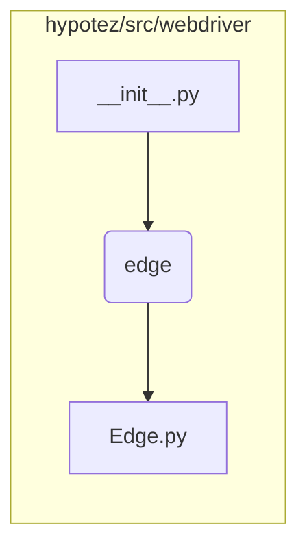

# <input code>

```python
## \file hypotez/src/webdriver/edge/__init__.py
# -*- coding: utf-8 -*-\
#! venv/Scripts/python.exe
#! venv/bin/python/python3.12

"""
.. module: src.webdriver.edge 
	:platform: Windows, Unix
	:synopsis:

"""
MODE = 'dev'

from .edge import Edge
```

# <algorithm>



**Описание алгоритма:**

Этот файл `__init__.py` является инициализатором для пакета `webdriver/edge`. Он просто импортирует модуль `Edge`, расположенный в подпапке `edge` того же уровня.  Никаких дополнительных действий или вычислений здесь не происходит.

# <mermaid>



**Объяснение диаграммы:**

Диаграмма показывает иерархию модулей. `__init__.py` в папке `webdriver` импортирует `edge`. `edge` – это папка, в которой находится `Edge.py`.  Это типичный способ организации Python-кода.


# <explanation>

**Импорты:**

- `from .edge import Edge`:  Эта строка импортирует класс `Edge` из модуля `edge.py`, расположенного в подпапке `edge`.  Символ `.` перед именем папки указывает, что модуль `edge` находится в той же папке, что и текущий файл `__init__.py`.   Это стандартный способ организации модулей в Python.


**Классы:**

- `Edge`:  Этот класс скорее всего определен в файле `hypotez/src/webdriver/edge/edge.py`.  Он не определен в `__init__.py` и является "подлежащим импорту" – его функциональность описана в другом месте.  Без доступа к `edge.py` сложно сказать о его роле и функциях.


**Функции:**

Нет функций в этом файле.


**Переменные:**

- `MODE = 'dev'`:  Это константа, хранящая строку 'dev'. Скорее всего, используется для обозначения режима работы (например, разработки). Это локальная переменная, специфичная для данного файла.


**Возможные ошибки или улучшения:**

- Отсутствие документации:  Хотя есть комментарии в формате Sphinx, они могут быть расширены, чтобы более точно описывать класс `Edge` и его атрибуты.
- Отсутствие примеров использования: Неясно, как используется класс `Edge`. Примеры использования класса (или функций) в этом файле или в документации к нему могут помочь разобраться в логике.
- Непонятная роль:  Без доступа к `Edge.py` сложно оценить корректность и эффективность реализации.

**Взаимосвязи с другими частями проекта:**

Этот файл устанавливает импорт между файлами, расположенными внутри структуры каталогов проекта. Класс `Edge` (который импортируется) скорее всего используется в других частях проекта, которые управляют веб-драйверами для взаимодействия с браузером Edge.