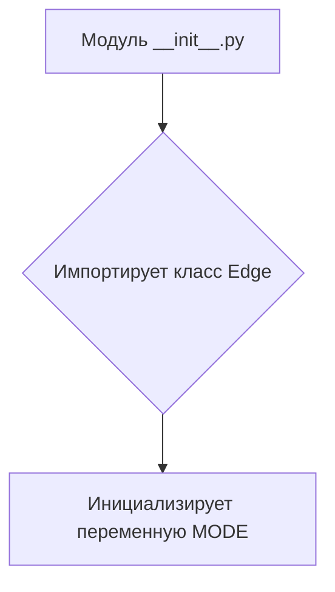
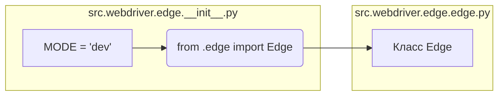

```MD
# Анализ кода hypotez/src/webdriver/edge/__init__.py

## <input code>

```python
## \file hypotez/src/webdriver/edge/__init__.py
# -*- coding: utf-8 -*-
#! venv/Scripts/python.exe
#! venv/bin/python/python3.12

"""
.. module: src.webdriver.edge 
	:platform: Windows, Unix
	:synopsis:

"""
MODE = 'dev'

from .edge import Edge
```

## <algorithm>



**Пример:**

Модуль `__init__.py` импортирует класс `Edge` из подмодуля `edge.py`.  Внутри `__init__.py` устанавливается значение переменной `MODE` в строку 'dev'.

## <mermaid>



**Объяснение диаграммы:**

Диаграмма показывает, что файл `__init__.py` содержит одну строку, которая инициализирует переменную `MODE` и импортирует класс `Edge` из модуля `edge.py`. Модуль `edge.py` (представленный в подмодуле) содержит, как предполагается, класс `Edge`. Связь между ними - импорт.


## <explanation>

**Импорты:**

- `from .edge import Edge`:  Этот импорт подключает класс `Edge` из файла `edge.py` внутри того же каталога (`webdriver/edge`).  Символ `.` в начале пути импорта означает, что поиск файла `edge.py` происходит относительно текущего каталога (`__init__.py`).  Этот импорт позволяет использовать класс `Edge` в файлах, которые импортируют данный `__init__.py`.

**Классы:**

- `Edge`:  Этот класс неявно определен в файле `edge.py` и импортируется в `__init__.py` для использования в других частях проекта. Без доступа к файлу `edge.py` невозможно точно описать его атрибуты и методы.


**Функции:**

- Нет явных функций в данном `__init__.py`.

**Переменные:**

- `MODE = 'dev'`:  Строковая переменная, хранящая режим работы (в данном случае 'dev'). Вероятно, используется для конфигурации поведения программы.


**Возможные ошибки или улучшения:**

- Недостаточно информации. Необходимо рассмотреть файл `edge.py` для более полного анализа.
- Отсутствие документации для класса `Edge`.


**Цепочка взаимосвязей:**

Файл `hypotez/src/webdriver/edge/__init__.py` является частью иерархической структуры пакета `hypotez`.  Он служит интерфейсом для доступа к классу `Edge`, который, скорее всего, отвечает за взаимодействие с веб-драйвером Edge. Другие части проекта, такие как  функции/классы/модули, которые взаимодействуют с веб-драйвером (например, `hypotez/src/utils/webdriver`), скорее всего, импортируют `Edge` через этот `__init__.py` модуль.  Для понимания полной взаимосвязи необходим анализ других файлов проекта.