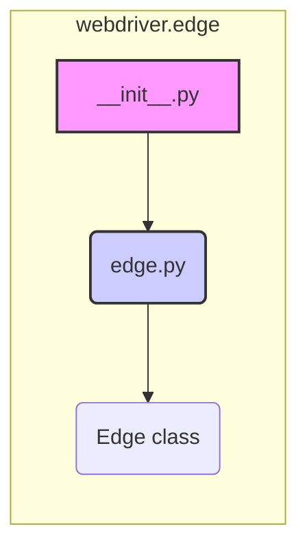

## Анализ кода `hypotez/src/webdriver/edge/__init__.py`

### <алгоритм>

1.  **Инициализация**:
    *   Устанавливается переменная `MODE` в значение `'dev'`. Это может использоваться для определения режима работы программы (например, разработка или продакшн).
    *   Импортируется модуль `Edge` из файла `edge.py` в текущем каталоге.

2. **Пример**:
    *  Переменная `MODE` определена как 'dev', что может использоваться для настройки логирования или поведения драйвера в режиме разработки.
    *  Импорт `from .edge import Edge` позволяет использовать класс `Edge` в других модулях.

### <mermaid>



**Описание диаграммы:**

*   `__init__.py`:  Представляет файл `__init__.py`, который является точкой входа для пакета `webdriver.edge`.
*   `edge.py`:  Представляет модуль `edge.py`, в котором определен класс `Edge`.
*   `Edge class`: Представляет класс `Edge`, который импортируется из `edge.py`.

**Импортированные зависимости:**

*   Диаграмма показывает зависимость модуля `__init__.py` от модуля `edge.py`, т.к. используется оператор импорта  `from .edge import Edge`.

### <объяснение>

#### Импорты:

*   `from .edge import Edge`: Этот импорт делает класс `Edge`, определенный в файле `edge.py`, доступным в пакете `webdriver.edge`. Точка (`.`) перед `edge` означает, что импорт происходит из текущего пакета. Это позволяет другим частям проекта использовать класс `Edge` для управления браузером Edge.

#### Классы:

*   В данном файле нет определения классов, но импортируется класс `Edge` из файла `edge.py`. Этот класс, вероятно, содержит логику для взаимодействия с браузером Microsoft Edge через webdriver.

#### Функции:

*   В данном файле нет определения функций.

#### Переменные:

*   ``: Это переменная, которая устанавливает режим работы пакета. В данном случае она установлена в `'dev'`, что может указывать на то, что пакет сейчас находится в режиме разработки. Это значение может использоваться для условной компиляции, логирования, или других целей.

**Потенциальные ошибки и области для улучшения:**

*   **Отсутствие комментариев**: Код не содержит комментариев, что затрудняет его понимание.
*   **Магические строки**: Жестко заданное значение `'dev'` для переменной `MODE` может быть заменено на конфигурационный файл или переменную окружения для гибкости в разных условиях.
*   **Ограниченная функциональность**: Файл пока имеет простую структуру. Скорее всего, основная логика будет в `edge.py`.

**Взаимосвязь с другими частями проекта:**

*   Пакет `webdriver.edge` является частью большей системы, предназначенной для автоматизации браузеров, скорее всего в рамках проекта `hypotez`.
*   Этот модуль является частью драйверов для конкретного браузера (Microsoft Edge).
*   Класс `Edge` (импортируется из `edge.py`) будет использоваться другими модулями, например, для написания тестов или для автоматизации задач в браузере Edge.

**Пример использования (предположительно):**

```python
# Пример использования в другом модуле, например, в src/test.py
from hypotez.src.webdriver.edge import Edge

driver = Edge()
# Дальнейшие действия с драйвером
```
В данном примере, мы импортируем класс `Edge` из пакета `hypotez.src.webdriver.edge` и создаем экземпляр этого класса.