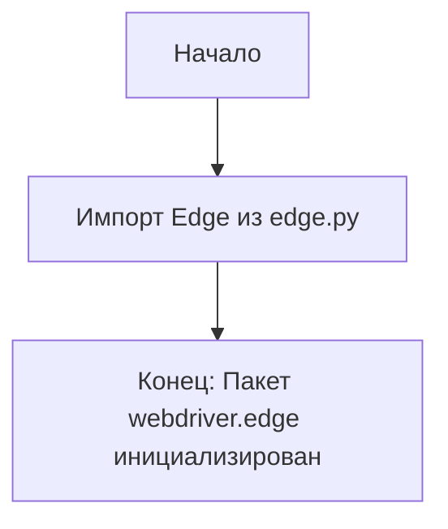

## Анализ кода `hypotez/src/webdriver/edge/__init__.py`

### 1. <алгоритм>

**Описание:**
Файл `__init__.py` в пакете `src.webdriver.edge` служит для инициализации пакета и делает модуль `edge.py` доступным для импорта извне пакета.

**Блок-схема:**

1. **Начало:** Запуск интерпретатора Python.
2. **Импорт:** Выполняется импорт `from .edge import Edge`. Это означает, что из текущего пакета `src.webdriver.edge` импортируется модуль `edge.py`, и из него импортируется имя `Edge`.
3. **Завершение:** Пакет `src.webdriver.edge` инициализирован, и класс `Edge` доступен для использования в других частях проекта.

**Пример:**
```python
# В другом файле, например, src/main.py
from src.webdriver.edge import Edge

# Теперь можно использовать класс Edge
driver = Edge()
```

### 2. <mermaid>



**Объяснение `mermaid`:**

- `Start`: Обозначает начало процесса.
- `ImportEdge`:  Представляет операцию импорта класса `Edge` из файла `edge.py`.
- `End`: Обозначает завершение инициализации пакета `webdriver.edge`.

### 3. <объяснение>

**Импорты:**
   - `from .edge import Edge`:
      -  `from .edge`: Импортирует модуль `edge.py`, который находится в той же директории (внутри пакета `src.webdriver.edge`). Точка `.` указывает на текущий пакет.
      - `import Edge`: Импортирует класс `Edge` из модуля `edge.py`. Это позволяет использовать класс `Edge` напрямую через `src.webdriver.edge.Edge` (например, `from src.webdriver.edge import Edge`).

**Классы:**
  -  В этом файле нет определения классов. Здесь происходит импорт класса `Edge`, определенного в файле `edge.py`. Класс `Edge`, скорее всего, предоставляет функциональность для управления браузером Microsoft Edge.

**Функции:**
 - В этом файле нет определения функций. Это файл инициализации пакета.

**Переменные:**
  - В этом файле нет определения переменных.

**Потенциальные ошибки и области для улучшения:**

  - Код сам по себе прост и не имеет явных ошибок, но без контекста о содержимом `edge.py` сложно сказать, есть ли там потенциальные проблемы.
  - Можно добавить документацию в виде docstring для самого модуля.

**Цепочка взаимосвязей:**
- Пакет `src.webdriver.edge` служит для организации кода, связанного с управлением браузером Edge.
- Модуль `edge.py` (не представленный здесь) должен содержать фактическую реализацию взаимодействия с браузером Edge (например, с использованием WebDriver).
-  Другие части проекта, например, `src.main.py`, могут импортировать класс `Edge` из `src.webdriver.edge` для автоматизации тестов или выполнения других задач в браузере Edge.