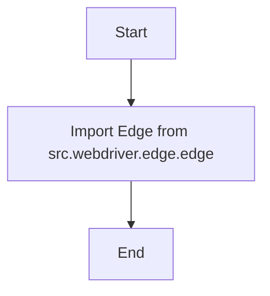

### **Анализ кода `hypotez/src/webdriver/edge/__init__.py`**

#### **1. Алгоритм**

1.  **Импорт модуля `Edge`**: Импортирует класс `Edge` из модуля `src.webdriver.edge.edge`.
    *   Пример: `from .edge import Edge`

#### **2. Mermaid**

**Объяснение `mermaid`**:
- `ImportEdge`: Этот шаг импортирует класс `Edge` из модуля `src.webdriver.edge.edge`. Это делается для того, чтобы сделать класс `Edge` доступным для использования в текущем модуле (`__init__.py`).

#### **3. Объяснение**

*   **Импорты**:
    *   `from .edge import Edge`: Импортирует класс `Edge` из модуля `edge.py`, находящегося в той же директории (`src.webdriver.edge`). Это позволяет использовать класс `Edge` в других частях проекта, где импортирован модуль `src.webdriver.edge`.
*   **Классы**:
    *   Класс `Edge` (из модуля `edge.py`) вероятно, содержит логику для управления браузером Edge через WebDriver. Это может включать методы для запуска браузера, навигации по страницам, взаимодействия с элементами и т.д.
*   **Функции**:
    *   В данном файле функции отсутствуют, но класс `Edge` из `edge.py` может содержать различные методы для работы с браузером Edge.

**Потенциальные области для улучшения**:

*   **Документация**: Модуль содержит docstring, но было бы полезно добавить примеры использования класса `Edge`.
*   **Обработка ошибок**: В `edge.py` можно добавить обработку исключений для повышения надежности.