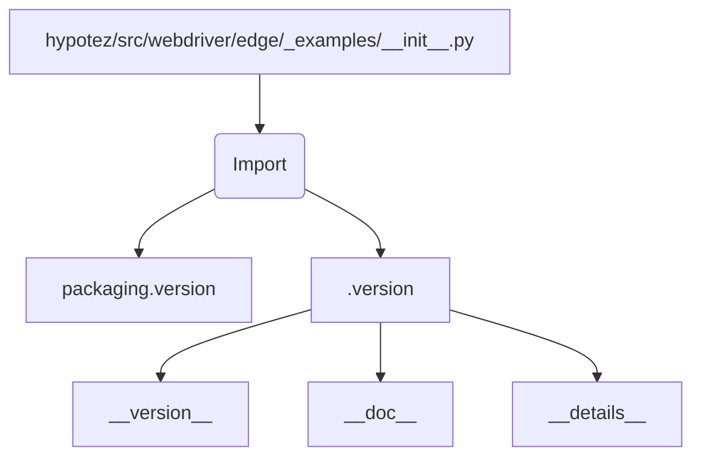

```MD
# Анализ кода hypotez/src/webdriver/edge/_examples/__init__.py

1. **<input code>**:

```python
## \file hypotez/src/webdriver/edge/_examples/__init__.py
# -*- coding: utf-8 -*-\
#! venv/Scripts/python.exe
#! venv/bin/python/python3.12

"""
.. module: src.webdriver.edge._examples 
	:platform: Windows, Unix
	:synopsis:

"""
MODE = 'dev'

"""
	:platform: Windows, Unix
	:synopsis:

"""


"""
	:platform: Windows, Unix
	:synopsis:

"""


"""
  :platform: Windows, Unix

"""
"""
  :platform: Windows, Unix
  :platform: Windows, Unix
  :synopsis:
"""MODE = 'dev'
  
""" module: src.webdriver.edge._examples """


from packaging.version import Version
from .version import __version__, __doc__, __details__
```

2. **<algorithm>**:

Этот файл `__init__.py` — это модуль инициализации.  Он, скорее всего, служит для организации и импорта других модулей внутри папки `_examples` в подпапке `webdriver/edge` проекта `hypotez`.  Алгоритм заключается в основном в импорте и, возможно, определении констант.  Поскольку код очень короткий и содержит комментарии, без данных о других частях кода нет возможности описать точный алгоритм.

3. **<mermaid>**:



**Описание диаграммы:**

Модуль `hypotez/src/webdriver/edge/_examples/__init__.py` импортирует из модуля `packaging.version` класс `Version` и из подмодуля `_version` модули `__version__`, `__doc__` и `__details__`.

4. **<explanation>**:

* **Импорты**:
    * `from packaging.version import Version`: Импортирует класс `Version` из пакета `packaging.version`.  Этот пакет, вероятно, используется для работы с версиями программного обеспечения.
    * `from .version import __version__, __doc__, __details__`: Импортирует переменные `__version__`, `__doc__` и `__details__` из файла `version.py` в том же каталоге (`_examples`).  Это, скорее всего, метаданные о версии модуля, документация и детали.  Связь с другими частями проекта: `version.py` определяет эти метаданные, необходимые для работы `__init__.py` и, возможно, для других модулей в проекте.


* **Классы**: Нет определений классов в данном файле.
* **Функции**: Нет определений функций в данном файле.
* **Переменные**:
    * `MODE = 'dev'`: Переменная, скорее всего, определяет режим работы (например, разработка (`dev`), производство (`prod`)).  Она глобальная и, вероятно, используется в других модулях проекта.


* **Возможные ошибки или области для улучшений**:
    * Код содержит множество пустых строк и многократные комментарии, которые могут быть объединены или упрощены.
    * Необходима информация о том, для чего служат `__version__`, `__doc__` и `__details__` (в частности, в `version.py`), чтобы оценить полноту и корректность метаданных.
    * Лучше было бы использовать единый стиль документации (например, Sphinx), а не встраивать `.rst` стиле документации в `__init__.py`.


* **Цепочка взаимосвязей с другими частями проекта**:
    * Файл `version.py` определяет переменные `__version__`, `__doc__`, и `__details__`.
    * Файл `__init__.py` использует эти переменные.  Возможные другие взаимосвязи с другими модулями (`webdriver/edge` или даже другими частями проекта) не могут быть определены без доступа к остальной части проекта.  Без контекста невозможно точно определить роль `MODE = 'dev'`.