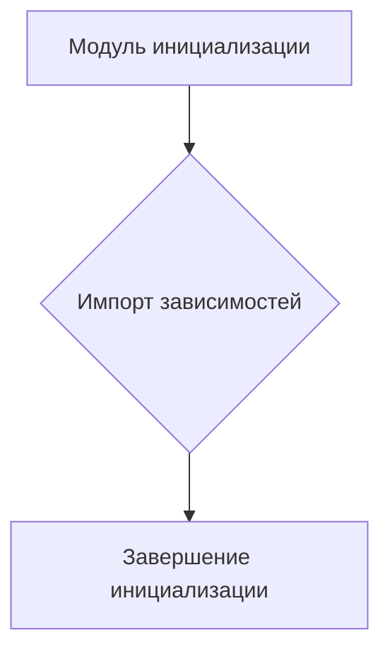
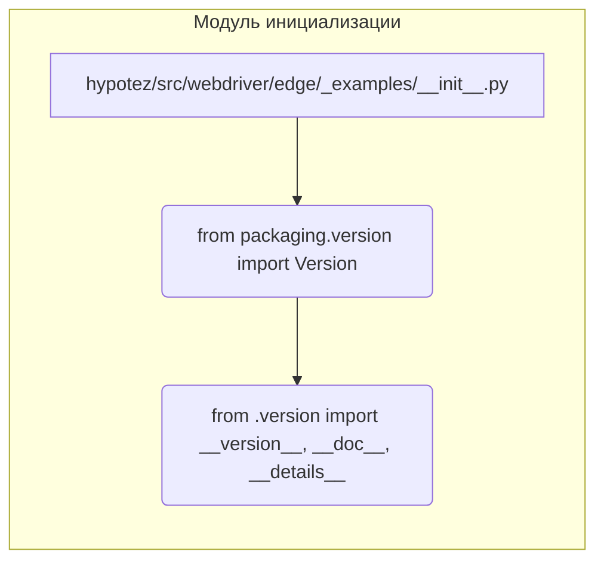

# <input code>

```python
## \file hypotez/src/webdriver/edge/_examples/__init__.py
# -*- coding: utf-8 -*-\
#! venv/Scripts/python.exe
#! venv/bin/python/python3.12

"""
.. module: src.webdriver.edge._examples 
	:platform: Windows, Unix
	:synopsis:

"""
MODE = 'dev'

"""
	:platform: Windows, Unix
	:synopsis:

"""


"""
	:platform: Windows, Unix
	:synopsis:

"""


"""
  :platform: Windows, Unix

"""
"""
  :platform: Windows, Unix
  :platform: Windows, Unix
  :synopsis:
"""MODE = 'dev'
  
""" module: src.webdriver.edge._examples """


from packaging.version import Version
from .version import __version__, __doc__, __details__
```

# <algorithm>

Этот код представляет собой файл инициализации модуля `src.webdriver.edge._examples`.  Алгоритм работы - это инициализация самого модуля.  Нет каких-либо вычислений или действий с данными.  Данные не перемещаются между функциями или классами.

**Блок-схема:**



**Пример:**

Код просто импортирует модули из папки `./version.py`.  Никакой обработки или логики нет.


# <mermaid>



# <explanation>

**Импорты:**

- `from packaging.version import Version`: Импортирует класс `Version` из пакета `packaging`. Этот пакет используется для работы с версиями пакетов,  и, вероятно, нужен для работы с версиями в других частях проекта.  Связь с `src` - косвенная, через стороннюю библиотеку.
- `from .version import __version__, __doc__, __details__`: Импортирует переменные `__version__`, `__doc__` и `__details__` из модуля `version.py` в той же папке (`_examples`). Это, скорее всего, метаданные о версии и документации модуля `src.webdriver.edge._examples`.  Это прямой импорт из `src`.

**Классы:**

Нет объявлений классов в данном файле.

**Функции:**

Нет определённых функций.

**Переменные:**

- `MODE = 'dev'`: Переменная, которая, вероятно, устанавливает режим работы (например, `dev` - режим разработки, `prod` - производство).  Это константа и  может использоваться другими частями проекта для определения режима работы.


**Возможные ошибки и улучшения:**

- **Недостаток документации:**  Комментарии (`"""Docstrings"""`) в начале файла и внутри  неполные и не очень информативны,  их стоит дополнить. Не указано назначение  переменной `MODE`, и что представляют собой импортируемые переменные (`__version__`, `__doc__`, `__details__`).
- **Несоответствие кода и документации:** Файл содержит устаревшие конструкции вроде `#! venv/Scripts/python.exe` и `#! venv/bin/python/python3.12`. Они не используются и мешают чтению.
- **Непонятное назначение нескольких одинаковых строк `MODE = 'dev'`:**  Такое дублирование затрудняет понимание и может быть ошибкой.


**Цепочка взаимосвязей:**

Модуль `_examples/__init__.py` зависит от `version.py` (в той же папке), который, в свою очередь, зависит от `packaging`-а. Это зависимость необходима для работы с версиями пакетов.  Далее, `_examples/__init__.py` может быть импортирован другими модулями в `src.webdriver.edge`, предоставляя им доступ к метаданным о версии и документации. Вероятно, есть  и другие файлы и классы, которые используют эти данные.
```
packaging -> _examples/version.py -> _examples/__init__.py -> (возможные импортеры в  src.webdriver.edge)