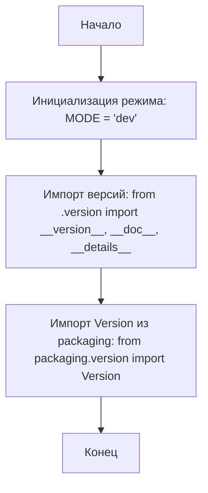
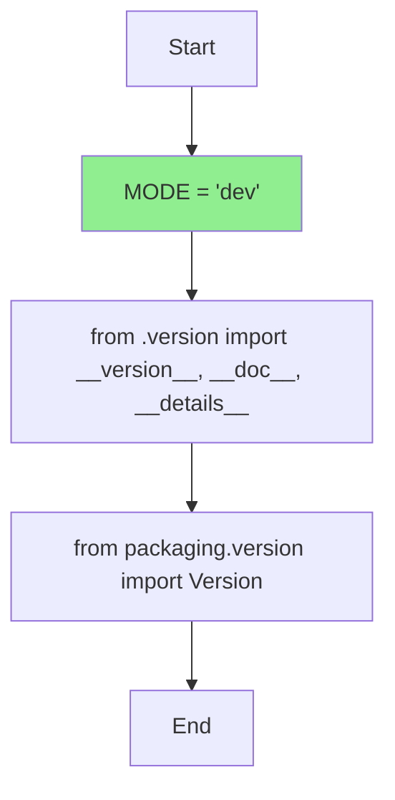

## АНАЛИЗ КОДА: `hypotez/src/webdriver/edge/_examples/__init__.py`

### 1. <алгоритм>

**Блок-схема:**

**Примеры:**

- `InitializeMode`:  Присваивает глобальной переменной `MODE` строковое значение `'dev'`. Это может влиять на поведение модуля, например, при включении отладочных сообщений.
- `ImportVersion`:  Импортирует из модуля `version.py` переменные `__version__` (строка с номером версии), `__doc__` (строка с документацией) и `__details__` (строка с дополнительными деталями). Эти переменные обычно используются для управления версиями и документирования кода.
- `ImportPackagingVersion`: Импортирует класс `Version` из библиотеки `packaging`, который помогает корректно работать с версиями программного обеспечения.

**Поток данных:**

1. Программа начинается.
2. Переменной `MODE` присваивается значение `'dev'`.
3. Импортируются переменные, связанные с версией, из локального модуля `version.py`.
4. Импортируется класс для работы с версиями из библиотеки `packaging`.
5. Завершение работы модуля.

### 2. <mermaid>

**Описание зависимостей:**

- `Start`: Начало выполнения модуля.
- `SetMode`: Присваивание значения `'dev'` переменной `MODE`. Эта переменная может использоваться для определения режима работы модуля (например, development или production).
- `ImportLocalVersion`: Импорт переменных `__version__`, `__doc__` и `__details__` из локального модуля `version.py`. Эти переменные обычно используются для хранения информации о версии модуля и его документации.
- `ImportVersionClass`: Импорт класса `Version` из библиотеки `packaging`. Этот класс используется для удобной работы с версиями программного обеспечения, например, для их сравнения.
- `End`: Завершение выполнения модуля.

### 3. <объяснение>

**Импорты:**

-   `from packaging.version import Version`:
    -   **Назначение**: Импортирует класс `Version` из библиотеки `packaging`.
    -   **Взаимосвязь**: `packaging` - это сторонняя библиотека, предназначенная для стандартизованной работы с версиями пакетов. В рамках проекта используется для управления версиями, их сравнения и пр.
-   `from .version import __version__, __doc__, __details__`:
    -   **Назначение**: Импортирует переменные `__version__` (текущая версия модуля), `__doc__` (документация модуля) и `__details__` (детали модуля) из файла `version.py`, находящегося в том же каталоге.
    -   **Взаимосвязь**: Это часть управления версиями внутри проекта, `version.py` хранит конкретные значения этих переменных.

**Переменные:**

-   `MODE = 'dev'`:
    -   **Тип**: Строка (str).
    -   **Использование**: Определяет режим работы модуля. Значение `'dev'` может означать, что модуль находится в режиме разработки, что может влиять на отладочные сообщения, логирование и прочее.

**Потенциальные ошибки и области для улучшения:**

-   **Неиспользуемые docstrings:** В коде есть множество пустых docstrings, которые не несут никакой смысловой нагрузки. Их следует либо заполнить, либо удалить.
-   **Отсутствие явной цели модуля:** Комментарии `module: src.webdriver.edge._examples` говорят, что это модуль `src.webdriver.edge._examples`, но не поясняется его назначение. Необходимо добавить описание.
-   **Непонятное использование MODE:**  Не указано, где и как используется переменная `MODE`, что снижает читаемость кода. Необходимо добавить больше контекста или сделать более явным, как это значение влияет на работу модуля.
-   **Недостаточно комментариев:** Код не содержит комментариев, описывающих его основную цель и логику работы.

**Цепочка взаимосвязей:**

-   `src.webdriver.edge._examples`: Этот модуль находится внутри пакета `src.webdriver.edge`, который, вероятно, является частью проекта, связанного с автоматизацией веб-браузера Edge.
-   `version.py`: Этот локальный модуль управляет версионированием.
-   `packaging`: Сторонняя библиотека, используемая для управления версиями.

В целом, файл `__init__.py` в пакете `src.webdriver.edge._examples` в основном занимается импортом необходимых переменных, классов и установкой начального режима (`MODE`). Требуется более четкое определение целей модуля и использование импортированных переменных.