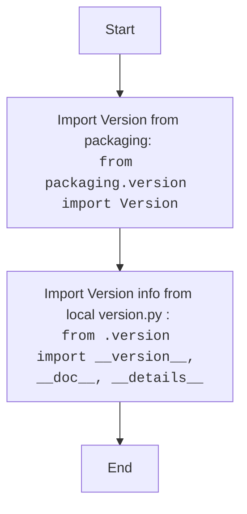

## ИНСТРУКЦИЯ:

Анализируй предоставленный код подробно и объясни его функциональность. Ответ должен включать три раздела:  

1. **<алгоритм>**: Опиши рабочий процесс в виде пошаговой блок-схемы, включая примеры для каждого логического блока, и проиллюстрируй поток данных между функциями, классами или методами.  
2. **<mermaid>**: Напиши код для диаграммы в формате `mermaid`, проанализируй и объясни все зависимости, 
    которые импортируются при создании диаграммы. 
    **ВАЖНО!** Убедитесь, что все имена переменных, используемые в диаграмме `mermaid`, 
    имеют осмысленные и описательные имена. Имена переменных вроде `A`, `B`, `C`, и т.д., не допускаются!  
    
    **Дополнительно**: Если в коде есть импорт `import header`, добавьте блок `mermaid` flowchart, объясняющий `header.py`:\
    ```mermaid
    flowchart TD
        Start --> Header[<code>header.py</code><br> Determine Project Root]
    
        Header --> import[Import Global Settings: <br><code>from src import gs</code>] 
    ```

3. **<объяснение>**: Предоставьте подробные объяснения:  
   - **Импорты**: Их назначение и взаимосвязь с другими пакетами `src.`.  
   - **Классы**: Их роль, атрибуты, методы и взаимодействие с другими компонентами проекта.  
   - **Функции**: Их аргументы, возвращаемые значения, назначение и примеры.  
   - **Переменные**: Их типы и использование.  
   - Выделите потенциальные ошибки или области для улучшения.  

Дополнительно, постройте цепочку взаимосвязей с другими частями проекта (если применимо).  

Это обеспечивает всесторонний и структурированный анализ кода.
## Формат ответа: `.md` (markdown)
**КОНЕЦ ИНСТРУКЦИИ**

## <алгоритм>

1.  **Импорт `Version` из `packaging.version`:**
    *   Пример: `from packaging.version import Version`
    *   Действие: Импортирует класс `Version` из библиотеки `packaging`, который предназначен для сравнения и работы с версиями пакетов.
2.  **Импорт переменных из `.version`:**
    *   Пример: `from .version import __version__, __doc__, __details__`
    *   Действие: Импортирует переменные `__version__`, `__doc__` и `__details__` из файла `version.py` в той же директории. Эти переменные содержат информацию о версии, документацию и детали модуля.

## <mermaid>



## <объяснение>

**Импорты:**

*   `from packaging.version import Version`:
    *   **Назначение**: Импортирует класс `Version` из библиотеки `packaging`. Эта библиотека предназначена для работы с версиями программных пакетов. Класс `Version` позволяет сравнивать версии, проверять их совместимость и т.д.
    *   **Взаимосвязь с `src`**: Данный импорт является внешним, так как `packaging` – это сторонняя библиотека, и не является частью `src`.

*   `from .version import __version__, __doc__, __details__`:
    *   **Назначение**: Импортирует три переменные:
        *   `__version__` - строка, представляющая версию текущего пакета (например, '1.0.0').
        *   `__doc__` - строка, содержащая документацию для текущего пакета (как правило, это docstring модуля).
        *   `__details__` -  строка, содержащая подробную информацию о пакете (может включать описание, авторов и т.д.).
    *   **Взаимосвязь с `src`**: Этот импорт является внутренним и предполагает наличие файла `version.py` в той же директории (`hypotez/src/webdriver/edge/_examples/`). Этот файл должен определять данные переменные, представляя метаданные модуля.

**Классы:**

*   В данном коде нет классов.

**Функции:**

*   В данном коде нет функций.

**Переменные:**

*   `__version__`: Строковая переменная, представляющая версию текущего модуля. Используется для отслеживания версий и при обновлении.
*   `__doc__`: Строковая переменная, содержащая документацию модуля. Используется для генерации документации и понимания функциональности модуля.
*   `__details__`: Строковая переменная, содержащая подробности о модуле. Позволяет предоставлять больше информации о модуле пользователю.

**Потенциальные ошибки и области для улучшения:**

*   **Отсутствие явного использования импортированных переменных**: Хотя переменные импортированы, в коде нет никакого использования этих переменных. Это может быть оправданно, если это только модуль инициализации, но в дальнейшем в других модулях эти переменные должны быть где-то использованы. 
*   **Отсутствие обработки ошибок**: В коде не предусмотрено никаких обработок исключений или проверок на наличие файлов или правильность их формата. При отсутствии `version.py` или некорректном формате данных может возникнуть ошибка.

**Цепочка взаимосвязей с другими частями проекта:**

*   `packaging` -> это внешняя библиотека, используется для версионирования, может быть использована для сравнения версий пакетов.
*   `src.webdriver.edge._examples.version` -> Это внутренний файл, который содержит метаданные для модуля `_examples`
*   Другие модули `src.webdriver.edge` или `src.webdriver` могут использовать `__version__`, `__doc__`, `__details__` для  логирования, документации, или проверок версий.

Данный код является базовым модулем инициализации и устанавливает метаданные для `_examples`. Без контекста и явного использования данных переменных трудно более детально проанализировать его роль в проекте.