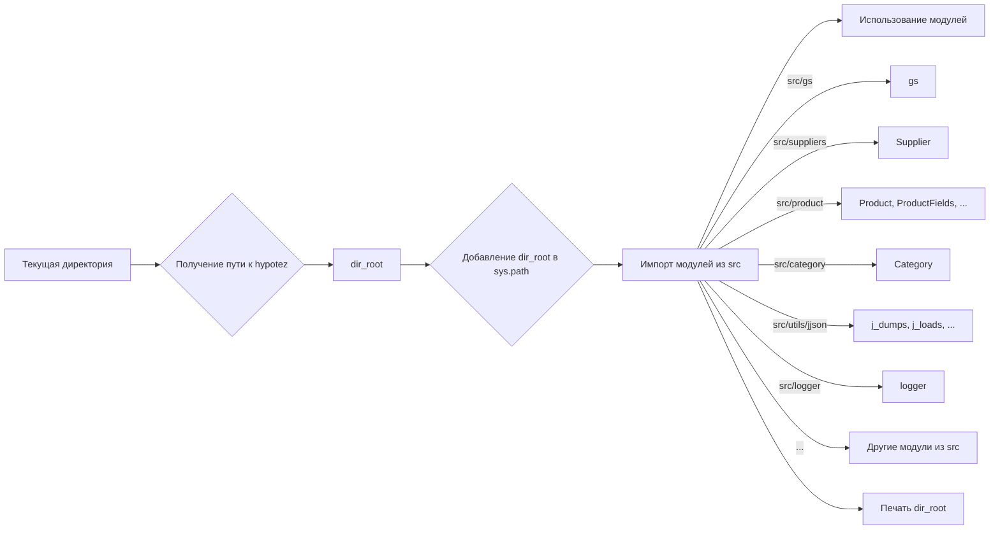

# <input code>

```python
## \file hypotez/src/webdriver/edge/_examples/header.py
# -*- coding: utf-8 -*-\n#! venv/Scripts/python.exe
#! venv/bin/python/python3.12

"""
.. module: src.webdriver.edge._examples 
	:platform: Windows, Unix
	:synopsis:

"""
MODE = 'dev'

"""
	:platform: Windows, Unix
	:synopsis:

"""


"""
	:platform: Windows, Unix
	:synopsis:

"""


"""
  :platform: Windows, Unix

"""
"""
  :platform: Windows, Unix
  :platform: Windows, Unix
  :synopsis:
"""MODE = 'dev'
  
""" module: src.webdriver.edge._examples """


import sys
import os
from pathlib import Path

dir_root : Path = Path (os.getcwd()[:os.getcwd().rfind('hypotez')+11])
sys.path.append (str (dir_root) )  # Добавляю корневую папку в sys.path
dir_src = Path (dir_root, 'src')
sys.path.append (str (dir_root) ) 
...

print(dir_root)
# ----------------
from pathlib import Path
import json
import re
# ----------------

from src import gs
from src.suppliers import Supplier
from src.product import Product, ProductFields, ProductFieldsLocators
from src.category import Category
from src.utils.jjson import j_dumps, j_loads,   pprint, save_text_file
from src.logger import logger
, StringNormalizer, ProductFieldsValidator
...
```

# <algorithm>

Кода в предоставленном примере недостаточно для построения полной блок-схемы.  Не хватает дальнейшего кода после комментария `...`.  Но можно проанализировать уже имеющийся фрагмент.

Алгоритм:

1. **Определение корневого каталога проекта:** Получение пути к корневой папке проекта `hypotez` из текущей директории.
2. **Добавление корневого каталога в `sys.path`:** Добавление пути к корневой папке в список поиска модулей Python. Это необходимо для импорта модулей из других подпапок проекта.
3. **Импорт необходимых библиотек:** Импорт модулей `sys`, `os`, `pathlib`, `json`, `re` и др., необходимых для работы.
4. **Импорт модулей из пакета `src`:** Импорт модулей `gs`, `Supplier`, `Product`, `ProductFields`, `ProductFieldsLocators`, `Category`, `j_dumps`, `j_loads`, `pprint`, `save_text_file`, `logger`, `StringNormalizer`, `ProductFieldsValidator` из пакета `src`.
5. **Печать корневого каталога:** Вывод пути к корневой папке проекта в консоль.

Пример: Если текущая директория `/home/user/projects/hypotez/webdriver/edge/_examples`, то `dir_root` будет содержать `/home/user/projects/hypotez`.


# <mermaid>



**Объяснение зависимостей:**

- Диаграмма показывает, что код импортирует модули из различных подпапок `src`, таким образом, устанавливая зависимость от них.
- `sys.path.append` критически важен для поиска модулей, расположенных вне стандартного пути поиска.
- `dir_root` является переменной, хранящей путь к корневой директории проекта, которая используется для импорта модулей из других папок.


# <explanation>

**Импорты:**

- `sys`, `os`, `pathlib`: Стандартные библиотеки Python для работы с системой, файловой системой и путями.
- `json`, `re`: Библиотеки для работы с JSON-данными и регулярными выражениями соответственно.
- `gs`, `Supplier`, `Product`, `ProductFields`, `ProductFieldsLocators`, `Category`, `j_dumps`, `j_loads`, `pprint`, `save_text_file`, `logger`, `StringNormalizer`, `ProductFieldsValidator`:  Это импорты модулей, вероятно, из собственного проекта.  `src` - это, скорее всего, пакет проекта, содержащий общие функции и классы для работы с данными.  Связь между ними устанавливается через импорты.


**Классы:**

- Представлены классы `Supplier`, `Product`, `ProductFields`, `ProductFieldsLocators`, `Category`. Они, вероятно, определяют структуры данных для работы с поставщиками, товарами, полями товаров и категориями в проекте.  Подробные сведения о работе с ними зависят от структуры проекта `src`.

**Функции:**

- Невозможно определить функции без дальнейшего кода.

**Переменные:**

- `dir_root`: Путь к корневой директории проекта.  Тип `Path` из `pathlib`.


**Возможные ошибки и улучшения:**

- Код, обозначенный `...`, показывает, что код не завершен.  Необходимо добавить недостающие части кода, чтобы полностью понять логику программы.
-  Проверка корректности пути `dir_root` перед использованием (например, проверка существования директории).
-  Более подробные комментарии в коде (документация) для пояснения назначения переменных, функций и классов.

**Цепочка взаимосвязей с другими частями проекта:**

Код явно показывает зависимость от пакетов внутри проекта `hypotez/src`, определяя структуры данных и импортируя классы и функции для их обработки.  Без дальнейшего кода невозможно сказать о точном назначении этой части кода в рамках всей системы.