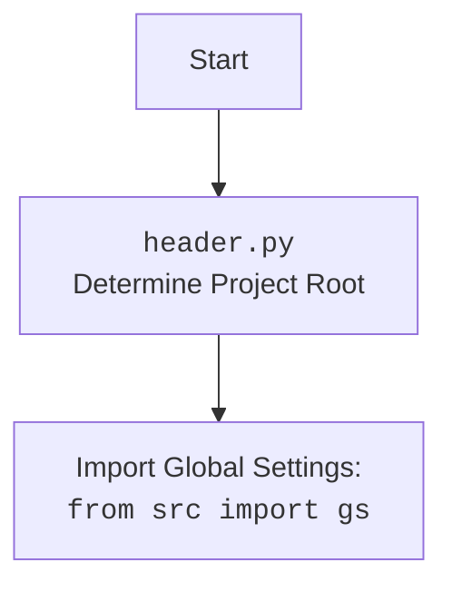

## <алгоритм>

1.  **Определение корня проекта**:
    *   Получаем текущую рабочую директорию с помощью `os.getcwd()`.
    *   Ищем индекс последнего вхождения подстроки 'hypotez' в текущей директории.
    *   Извлекаем строку, заканчивающуюся на 'hypotez', с помощью среза, добавив `+11`, чтобы учесть длину 'hypotez'.
    *   Создаём объект `Path` из полученной строки, который представляет корень проекта.
        *   Пример: Если `os.getcwd()` возвращает `/home/user/projects/hypotez/src/webdriver/edge/_examples`, то `dir_root` будет `/home/user/projects/hypotez`.
2.  **Добавление корня проекта в `sys.path`**:
    *   Преобразуем объект `Path` `dir_root` в строку с помощью `str()`.
    *   Добавляем строку представляющую корень проекта в `sys.path`, чтобы модули из корня можно было импортировать.
        *   Пример: `sys.path.append('/home/user/projects/hypotez')`
3.  **Определение директории `src`**:
    *   Создаём объект `Path`, представляющий директорию `src`, внутри корня проекта.
        *   Пример: если `dir_root` равен `/home/user/projects/hypotez`, то `dir_src` будет `/home/user/projects/hypotez/src`.
    *   Добавляем корень проекта в `sys.path`, чтобы модули из корня можно было импортировать (этот шаг повторяется, возможно, по ошибке).
        *   Пример: `sys.path.append('/home/user/projects/hypotez')`
4.  **Вывод корня проекта**:
    *   Выводим значение `dir_root` в консоль для отладки.
        *   Пример: `print('/home/user/projects/hypotez')`
5.  **Импорт дополнительных библиотек**:
    *   Импортируем `Path` из `pathlib` (возможно, лишний раз).
    *   Импортируем `json` для работы с JSON.
    *   Импортируем `re` для работы с регулярными выражениями.
6.  **Импорт модулей из проекта**:
    *   Импортируем глобальные настройки `gs` из `src`.
    *   Импортируем класс `Supplier` из `src.suppliers`.
    *   Импортируем класс `Product`, перечисление `ProductFields` и `ProductFieldsLocators` из `src.product`.
    *   Импортируем класс `Category` из `src.category`.
    *   Импортируем функции `j_dumps`, `j_loads`, `pprint`, `save_text_file` из `src.utils.jjson`.
    *   Импортируем `logger`, `StringNormalizer` и `ProductFieldsValidator` из `src.logger.logger`.

## <mermaid>

```mermaid
flowchart TD
    Start[Start] --> DetermineRoot[Determine Project Root: <br><code>dir_root = Path(os.getcwd()[:os.getcwd().rfind('hypotez')+11])</code>];
    DetermineRoot --> AddRootToPath[Add Project Root to <code>sys.path</code>: <br> <code>sys.path.append(str(dir_root))</code>];
    AddRootToPath --> DefineSrcDir[Define <code>src</code> Directory Path: <br> <code>dir_src = Path(dir_root, 'src')</code>];
    DefineSrcDir --> AddRootToPathAgain[Add Project Root to <code>sys.path</code>: <br> <code>sys.path.append(str(dir_root))</code>]
    AddRootToPathAgain --> PrintRoot[Print Project Root: <br><code>print(dir_root)</code>];
    PrintRoot --> ImportLibs[Import Libraries: <br> <code>import json, re, Path</code>];
    ImportLibs --> ImportProjectModules[Import Project Modules];
    ImportProjectModules --> End[End]
    ImportProjectModules -- "from src import gs" --> GlobalSettings[<code>gs</code> Global Settings]
    ImportProjectModules -- "from src.suppliers import Supplier" --> SupplierClass[<code>Supplier</code> Class]
    ImportProjectModules -- "from src.product import Product, ProductFields, ProductFieldsLocators" --> ProductClasses[<code>Product</code>, <code>ProductFields</code>, <code>ProductFieldsLocators</code>]
    ImportProjectModules -- "from src.category import Category" --> CategoryClass[<code>Category</code> Class]
    ImportProjectModules -- "from src.utils.jjson import j_dumps, j_loads, pprint, save_text_file" --> JSONUtils[<code>j_dumps</code>, <code>j_loads</code>, <code>pprint</code>, <code>save_text_file</code>]
    ImportProjectModules -- "from src.logger.logger import logger, StringNormalizer, ProductFieldsValidator" --> LoggerUtils[<code>logger</code>, <code>StringNormalizer</code>, <code>ProductFieldsValidator</code>]
```



## <объяснение>

**Импорты:**

*   `sys`: Модуль `sys` предоставляет доступ к некоторым переменным и функциям, взаимодействующим с интерпретатором Python. Здесь используется `sys.path.append` для добавления пути к директории проекта, чтобы Python мог находить модули.
*   `os`: Модуль `os` предоставляет функции для взаимодействия с операционной системой. Здесь используется `os.getcwd()` для получения текущей рабочей директории и `os.getcwd().rfind()` для поиска индекса подстроки.
*   `pathlib.Path`: Модуль `pathlib` предоставляет способ создания объектов, представляющих пути к файлам и директориям, упрощая работу с путями.
*  `json`: Модуль `json` предоставляет возможность работать с данными в формате JSON, который часто используется для обмена данными.
*  `re`: Модуль `re` предоставляет функциональность для работы с регулярными выражениями, которые используются для поиска и замены текстовых шаблонов.
*   `src`: Это импорт из пакета `src`, что означает, что скрипт использует внутренние модули проекта, в том числе:
    *   `gs` (предположительно `global settings`): Глобальные настройки проекта.
    *   `Supplier`: Класс для работы с поставщиками.
    *   `Product`, `ProductFields`, `ProductFieldsLocators`: Классы и перечисления для работы с продуктами.
    *   `Category`: Класс для работы с категориями.
    *   `j_dumps`, `j_loads`, `pprint`, `save_text_file` из `src.utils.jjson`: Функции для работы с JSON и файлами.
    *   `logger`, `StringNormalizer`, `ProductFieldsValidator` из `src.logger.logger`: Функции для логирования, нормализации строк и валидации полей продукта.

**Переменные:**

*   `dir_root`: Переменная типа `pathlib.Path`, которая хранит абсолютный путь к корню проекта. Этот путь вычисляется динамически на основе текущей рабочей директории.
*   `dir_src`: Переменная типа `pathlib.Path`, которая хранит путь к директории `src` внутри проекта.

**Функции:**

*   `os.getcwd()`: Функция модуля `os`, которая возвращает строку, представляющую текущую рабочую директорию.
*   `str()`: Функция, которая преобразует объект в строку.
*   `sys.path.append()`: Метод модуля `sys`, который добавляет путь к списку путей поиска модулей.
*   `print()`: Стандартная функция вывода в консоль.

**Объяснение функциональности:**

Данный скрипт устанавливает путь к корню проекта и добавляет его в `sys.path`, чтобы Python мог импортировать модули из этого проекта.
Сначала, скрипт определяет корень проекта, находя индекс подстроки 'hypotez' в текущей рабочей директории и извлекая путь, заканчивающийся на 'hypotez'. Затем, добавляет корень проекта в `sys.path`.  После этого определяется директория `src`. Также  происходит импорт различных модулей проекта, таких как `Supplier`, `Product`, `Category`, а также модулей для работы с JSON и логированием.

**Потенциальные ошибки и области для улучшения:**

*   **Дублирование добавления пути**: `sys.path.append(str(dir_root))` вызывается дважды, что является избыточным.
*   **Относительность поиска `hypotez`**: Поиск 'hypotez' в пути может привести к ошибкам, если название проекта отличается или если директория 'hypotez' находится в пути несколько раз.
*   **Жёстко заданное `+11`**: Использование `+11` для обрезки пути является неявным.
*   **Возможное отсутствие директории `src`**:  Код предполагает наличие директории src в корне проекта.

**Взаимосвязи с другими частями проекта:**

Этот скрипт является частью настроечной логики, которая используется во всем проекте. Он обеспечивает возможность импортировать модули проекта из разных мест. Данный скрипт устанавливает пути для импорта внутренних модулей проекта, таких как `gs`, `Supplier`, `Product`, `Category`, а также модулей для работы с JSON (`j_dumps`, `j_loads`, `pprint`, `save_text_file`) и логированием (`logger`). Это означает, что другие скрипты в проекте будут зависеть от результатов выполнения данного скрипта, так как он предоставляет пути для импорта других модулей.