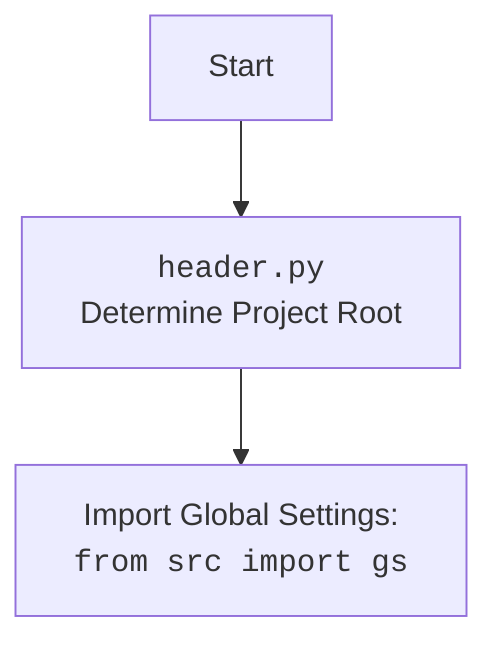

## АНАЛИЗ КОДА: `hypotez/src/webdriver/edge/_examples/header.py`

### <алгоритм>

1. **Определение режима (`MODE`)**:
   - Устанавливается переменная `MODE` в значение `'dev'`.
   - Пример: `MODE = 'dev'`
   - *Поток данных*: Значение `MODE` может использоваться другими частями скрипта для определения режима работы (например, разработка или продакшен).

2. **Импорт модулей**:
   - Импортируются стандартные модули `sys`, `os`, `pathlib.Path`, `json`, `re`.
   - Пример: `import sys`, `import os`, `from pathlib import Path`
   - *Поток данных*: Эти модули предоставляют базовые функции для работы с файловой системой, системными вызовами, JSON и регулярными выражениями.

3. **Определение корневой директории (`dir_root`)**:
   - Определяется абсолютный путь к корневой директории проекта `hypotez` через `os.getcwd()` и `rfind('hypotez')`.
   - Пример: `dir_root : Path = Path (os.getcwd()[:os.getcwd().rfind('hypotez')+11])`
   - *Поток данных*: `os.getcwd()` получает текущую рабочую директорию, затем `rfind()` находит индекс начала подстроки 'hypotez', после чего вырезается строка до конца 'hypotez', добавляется +11 символов (длина подстроки) для  определения корневой директории проекта.

4. **Добавление корневой директории в `sys.path`**:
   - Корневая директория добавляется в `sys.path`, чтобы импорт модулей `src` работал корректно.
   - Пример: `sys.path.append (str (dir_root) )`
    - *Поток данных*:  Путь `dir_root` преобразуется в строку `str(dir_root)` и добавляется в список `sys.path`  для поиска модулей.

5. **Определение директории `src`**:
    - Создается путь `dir_src` к директории `src`.
    - Пример: `dir_src = Path (dir_root, 'src')`
    - *Поток данных*: Используя объект `Path`, к `dir_root` добавляется 'src', получая путь `src`

6. **Добавление корневой директории в `sys.path` (повторно)**:
    - Корневая директория добавляется в `sys.path` второй раз
   - Пример: `sys.path.append (str (dir_root) )`
   - *Поток данных*:  Путь `dir_root` преобразуется в строку `str(dir_root)` и добавляется в список `sys.path`.

7. **Печать корневой директории**:
   - Выводится значение `dir_root`.
   - Пример: `print(dir_root)`
   - *Поток данных*: Значение пути `dir_root` выводится в консоль

8. **Импорт дополнительных модулей**:
    - Импортируются модули из `src`: `gs`, `Supplier`, `Product`, `ProductFields`, `ProductFieldsLocators`, `Category`, `j_dumps`, `j_loads`, `pprint`, `save_text_file`, `logger` , `StringNormalizer`, `ProductFieldsValidator`.
    - Пример: `from src import gs`, `from src.suppliers import Supplier`
    - *Поток данных*:  Эти модули предоставляют функциональность для работы с настройками, поставщиками, продуктами, категориями, JSON, логированием.

### <mermaid>

```mermaid
flowchart TD
    Start --> Find_Working_Directory[Get Current Working Directory: <code>os.getcwd()</code>];
    Find_Working_Directory --> Find_Project_Root[Find 'hypotez' Index];
    Find_Project_Root --> Extract_Project_Root[Extract Root Directory Path: <code>dir_root</code>];
    Extract_Project_Root --> Add_Root_To_SysPath[Add Project Root To <code>sys.path</code>];
    Add_Root_To_SysPath --> Define_Src_Directory[Define Source Directory: <code>dir_src</code>];
    Define_Src_Directory --> Add_Root_To_SysPath_Again[Add Project Root To <code>sys.path</code> again];
    Add_Root_To_SysPath_Again --> Print_Project_Root[Print Project Root Directory: <code>print(dir_root)</code>];
    Print_Project_Root --> Import_Modules[Import Modules from <code>src</code>];
    Import_Modules --> End;
    
    classDef code fill:#f9f,stroke:#333,stroke-width:2px
    class Find_Working_Directory, Find_Project_Root, Extract_Project_Root, Add_Root_To_SysPath, Define_Src_Directory, Add_Root_To_SysPath_Again, Print_Project_Root, Import_Modules code
```


### <объяснение>

#### Импорты

*   **`import sys`**: Модуль `sys` предоставляет доступ к некоторым переменным и функциям, взаимодействующим с интерпретатором Python. Используется для добавления пути к корневой директории проекта в `sys.path`.
*   **`import os`**: Модуль `os` предоставляет функции для взаимодействия с операционной системой, например, для получения текущей рабочей директории (`os.getcwd()`).
*   **`from pathlib import Path`**: Модуль `pathlib` предоставляет классы для работы с путями в файловой системе в объектно-ориентированном стиле. Класс `Path` используется для создания и манипулирования путями.
*    **`import json`**: Модуль `json` предоставляет функции для работы с данными в формате JSON.
*   **`import re`**: Модуль `re` предоставляет операции с регулярными выражениями.
*   **`from src import gs`**: Импортирует модуль `gs` из пакета `src`. Вероятно, `gs` содержит глобальные настройки проекта.
*   **`from src.suppliers import Supplier`**: Импортирует класс `Supplier` из модуля `suppliers` внутри пакета `src`. Вероятно, представляет сущность поставщика.
*   **`from src.product import Product, ProductFields, ProductFieldsLocators`**: Импортирует классы `Product`, `ProductFields`, и `ProductFieldsLocators` из модуля `product` внутри пакета `src`. Вероятно, представляют сущность продукта, поля продукта и их локаторы.
*   **`from src.category import Category`**: Импортирует класс `Category` из модуля `category` внутри пакета `src`. Вероятно, представляет сущность категории.
*   **`from src.utils.jjson import j_dumps, j_loads, pprint, save_text_file`**: Импортирует функции `j_dumps`, `j_loads`, `pprint`, и `save_text_file` из модуля `jjson` внутри пакета `src.utils`. Вероятно, это утилиты для работы с JSON.
*   **`from src.logger.logger import logger, StringNormalizer, ProductFieldsValidator`**: Импортирует объект `logger` и классы `StringNormalizer`, `ProductFieldsValidator` из модуля `logger` внутри пакета `src.logger`. Это, вероятно, инструменты для логирования и валидации данных.

#### Переменные

*   **`MODE`**: Строковая переменная, хранящая режим работы скрипта. По умолчанию установлено значение `'dev'`, что может указывать на режим разработки.
*   **`dir_root`**: Переменная типа `pathlib.Path`, хранящая абсолютный путь к корневой директории проекта `hypotez`. Используется для добавления в `sys.path` и для определения директории `src`.
*   **`dir_src`**: Переменная типа `pathlib.Path`, хранящая абсолютный путь к директории `src` проекта `hypotez`.

#### Функции

*   В данном коде нет явных пользовательских функций. Используются только импортированные функции и методы из стандартных модулей Python и пакетов проекта `src`.

#### Пояснения

1. **Определение корневой директории**: Код использует `os.getcwd()` для получения текущей рабочей директории, а затем `rfind('hypotez')` для нахождения позиции строки "hypotez". Это позволяет динамически определять корневую директорию проекта, даже если скрипт запускается из разных поддиректорий.
2. **Работа с путями**: Использование `pathlib.Path` обеспечивает кроссплатформенность при работе с путями, что делает код более надежным для разных операционных систем.
3. **`sys.path`**: Добавление корневой директории в `sys.path` позволяет импортировать модули из пакета `src` без необходимости указывать полные пути, что упрощает структуру проекта и делает импорт более явным.
4.  **Повторное добавление `dir_root` в `sys.path`**:  Повторное добавление корневой директории в `sys.path` не имеет особого смысла, так как она уже добавлена ранее. Возможно, это избыточная операция.
5. **Импорты из `src`**: Импортирование большого количества модулей и классов из `src` показывает, что этот скрипт является частью более крупного проекта и использует его функциональность.
6. **Логирование и валидация**: Присутствие импортов для логирования (`logger`) и валидации (`StringNormalizer`, `ProductFieldsValidator`) указывает на то, что этот код, вероятно, участвует в обработке данных и требует отслеживания ошибок и валидации.

#### Потенциальные ошибки и улучшения

1.  **Избыточное добавление `sys.path`**:  Повторное добавление корневой директории в `sys.path` является избыточным и может быть удалено.
2.  **Зависимости**: Код зависит от точного расположения директории `hypotez` в пути. Если расположение изменится, код может не работать правильно.
3. **Объявление MODE**:  Объявление переменной `MODE` несколько раз в начале файла. Необходимо объявить ее один раз.
4. **Неполный код**:  Файл содержит многоточия `...`, которые указывают на неполноту кода.

#### Взаимосвязь с другими частями проекта

Этот скрипт, вероятно, является частью процесса настройки среды или инициализации для других частей проекта. Он подготавливает окружение для других скриптов, делая доступными глобальные настройки, утилиты, классы сущностей. Его основная роль — предоставить необходимые зависимости для работы других частей проекта `hypotez`