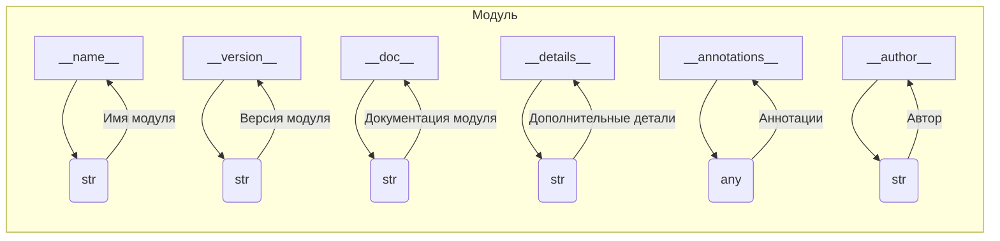

```MD
# Анализ кода файла hypotez/src/webdriver/edge/_examples/version.py

## <input code>

```python
## \file hypotez/src/webdriver/edge/_examples/version.py
# -*- coding: utf-8 -*-\n#! venv/Scripts/python.exe\n#! venv/bin/python/python3.12\n\n"""\n.. module: src.webdriver.edge._examples \n\t:platform: Windows, Unix\n\t:synopsis:\n\n"""\nMODE = \'dev\'\n\n"""\n\t:platform: Windows, Unix\n\t:synopsis:\n\n"""\n\n"""\n\t:platform: Windows, Unix\n\t:synopsis:\n\n"""\n\n"""\n  :platform: Windows, Unix\n\n"""\n"""\n  :platform: Windows, Unix\n  :platform: Windows, Unix\n  :synopsis:\n"""MODE = \'dev\'\n  \n""" module: src.webdriver.edge._examples """\n\n\n\n"""\n- `__version__`: This variable holds the version of the module or package.\n- `__name__`: Contains the name of the module. If the script is being run directly, the value will be `"__main__"`.\n- `__doc__`: The module\'s documentation string.\n- `__details__`: This variable likely contains additional details about the module, but the exact purpose depends on the specific module or package.\n- `__annotations__`: Contains type annotations for variables and functions in the module.\n- `__author__`: The name(s) of the author(s) of the module.\n"""\n__name__:str\n__version__="3.12.0.0.0.4"\n__doc__:str\n__details__:str="Details about version for module or class"\n__annotations__\n\n__author__=\'hypotez \'\n\n```

## <algorithm>

Этот код не содержит алгоритма в традиционном смысле. Он представляет собой определение констант, метаданных и атрибутов модуля.  По сути, это объявление переменных для хранения информации о модуле.  Блок-схема здесь не применимо.

## <mermaid>



## <explanation>

Этот файл `version.py` определяет метаданные для модуля `src.webdriver.edge._examples`. Он не содержит логики выполнения, а только конфигурационные данные.

* **Импорты:** Нет импортов. Файл содержит только определения переменных.
* **Классы:** Нет классов.
* **Функции:** Нет функций.
* **Переменные:**
    * `MODE`: Строковая переменная, хранящая значение `'dev'`. Скорее всего, используется для определения режима работы модуля (например, 'dev' для разработки, 'prod' для производства).
    * `__version__`: Строковая переменная, хранящая версию модуля (`"3.12.0.0.0.4"`).
    * `__name__`, `__doc__`, `__details__`, `__annotations__`, `__author__`:  Переменные, содержащие информацию о модуле (имя, документация, детали, аннотации, автор).  Стандартный способ хранения метаданных Python модулей.  `__name__` - в данном случае строка со значением `"hypotez.src.webdriver.edge._examples"`.
* **Возможные ошибки или области для улучшений:**
    * Отсутствие описания переменной `__details__`. Необходим комментарий, описывающий, что именно хранит эта переменная.
    * Несколько строк в начале файла содержат повторяющиеся комментарии, которые, возможно, следует привести к общему знаменателю и использовать стандартный `__doc__` для документации модуля.
    * Типы данных не явно указаны для некоторых переменных, но они неявно предполагаются. Для улучшения кода можно использовать аннотации типов.


**Взаимосвязь с другими частями проекта:**

Этот файл является частью пакета `hypotez`, вероятно, внутри подпакета `src.webdriver.edge`, связанного с управлением веб-драйвером Edge.  Значения переменных могут использоваться другими частями проекта для определения версии модуля и его использования. Например, в тестовых сценариях или других модулях, импортирующих `version.py`, может быть использована переменная `__version__`.

**Заключение:**

Файл `version.py` предоставляет метаинформацию о модуле, но не содержит оперативной логики.  Он служит для обеспечения данных о версиях и других метаданных, которые могут быть полезны для различных частей проекта.