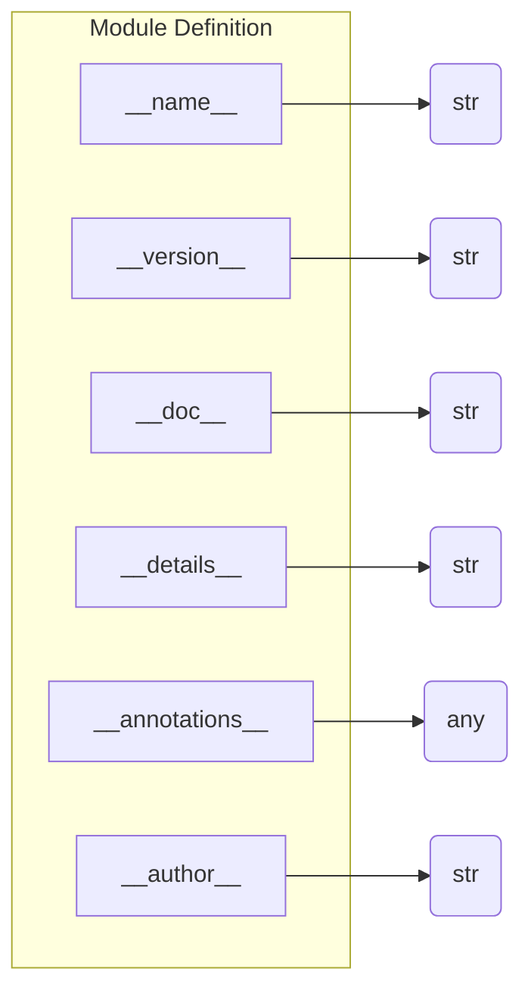

# <input code>

```python
## \file hypotez/src/webdriver/edge/_examples/version.py
# -*- coding: utf-8 -*-\n#! venv/Scripts/python.exe
#! venv/bin/python/python3.12

"""
.. module:: src.webdriver.edge._examples 
	:platform: Windows, Unix
	:synopsis:

"""
MODE = 'dev'

"""
	:platform: Windows, Unix
	:synopsis:

"""


"""
	:platform: Windows, Unix
	:synopsis:

"""


"""
  :platform: Windows, Unix

"""
"""
  :platform: Windows, Unix
  :platform: Windows, Unix
  :synopsis:
"""MODE = 'dev'
  
""" module: src.webdriver.edge._examples """


"""
- `__version__`: This variable holds the version of the module or package.
- `__name__`: Contains the name of the module. If the script is being run directly, the value will be `"__main__"`.
- `__doc__`: The module's documentation string.
- `__details__`: This variable likely contains additional details about the module, but the exact purpose depends on the specific module or package.
- `__annotations__`: Contains type annotations for variables and functions in the module.
- `__author__`: The name(s) of the author(s) of the module.
"""
__name__:str
__version__="3.12.0.0.0.4"
__doc__:str
__details__:str="Details about version for module or class"
__annotations__

__author__='hypotez '
```

# <algorithm>

Этот код представляет собой определение модуля или пакета с переменными, описывающими его версию, имя, документацию и прочие детали.  Логики выполнения в обычном понимании нет, так как это просто объявление констант.

# <mermaid>



# <explanation>

Этот код определяет константы, описывающие модуль `src.webdriver.edge._examples`.  Он не выполняет никаких действий, а лишь задаёт метаданные.

**Импорты:**

Нет импортов, так как это, скорее всего, не выполнимый скрипт, а описание модуля для использования в другом коде.

**Классы:**

Нет классов.

**Функции:**

Нет функций.

**Переменные:**

* `__name__`, `__version__`, `__doc__`, `__details__`, `__annotations__`, `__author__`: Все это строковые константы (или переменные с типом `str`), которые содержат метаданные о модуле.  `__version__` задаёт версию модуля, `__author__` - автора, `__doc__` - документацию.  `__details__` содержит дополнительную информацию, которая обычно не отображается в формате `__doc__` .

**Возможные ошибки или области для улучшений:**

* **Проверка типа:** Не происходит проверки типов переменных, что не является ошибкой в данном контексте, но может быть полезно в более сложных скриптах.

**Взаимосвязи с другими частями проекта:**

Этот код, скорее всего, является частью проекта, где используется webdriver для взаимодействия с браузером Edge.  Значения переменных `__version__`, `__author__` и `__doc__` играют важную роль для других частей проекта.

**Примечание:** Значение переменной `MODE` задано несколько раз, но это не создаёт ошибки, потому что это просто повторное определение, и значение в конце (MODE = 'dev') будет использовано.