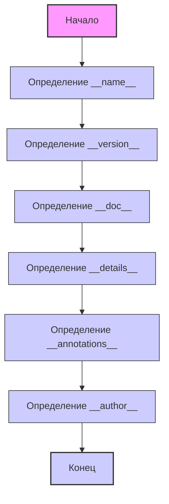

## ИНСТРУКЦИЯ:

Анализируй предоставленный код подробно и объясни его функциональность. Ответ должен включать три раздела:

1.  **<алгоритм>**: Опиши рабочий процесс в виде пошаговой блок-схемы, включая примеры для каждого логического блока, и проиллюстрируй поток данных между функциями, классами или методами.
2.  **<mermaid>**: Напиши код для диаграммы в формате `mermaid`, проанализируй и объясни все зависимости,
    которые импортируются при создании диаграммы.
    **ВАЖНО!** Убедитесь, что все имена переменных, используемые в диаграмме `mermaid`,
    имеют осмысленные и описательные имена. Имена переменных вроде `A`, `B`, `C`, и т.д., не допускаются!

    **Дополнительно**: Если в коде есть импорт `import header`, добавьте блок `mermaid` flowchart, объясняющий `header.py`:
    ```mermaid
    flowchart TD
        Start --> Header[<code>header.py</code><br> Determine Project Root]

        Header --> import[Import Global Settings: <br><code>from src import gs</code>]
    ```

3.  **<объяснение>**: Предоставьте подробные объяснения:
    -   **Импорты**: Их назначение и взаимосвязь с другими пакетами `src.`.
    -   **Классы**: Их роль, атрибуты, методы и взаимодействие с другими компонентами проекта.
    -   **Функции**: Их аргументы, возвращаемые значения, назначение и примеры.
    -   **Переменные**: Их типы и использование.
    -   Выделите потенциальные ошибки или области для улучшения.

Дополнительно, постройте цепочку взаимосвязей с другими частями проекта (если применимо).

Это обеспечивает всесторонний и структурированный анализ кода.
## Формат ответа: `.md` (markdown)
**КОНЕЦ ИНСТРУКЦИИ**

## <алгоритм>



**Пример:**

1.  **Start:** Начало выполнения скрипта `version.py`.
2.  **DefineModuleName:** Переменной `__name__` присваивается строковое значение (например, `__main__`, если скрипт запущен напрямую, или имя модуля).
    *   Пример: `__name__ = "__main__"` или `__name__ = "src.webdriver.edge._examples.version"`.
3.  **DefineVersion:** Переменной `__version__` присваивается строка, представляющая версию, например, "3.12.0.0.0.4".
    *   Пример: `__version__ = "3.12.0.0.0.4"`.
4.  **DefineDoc:** Переменной `__doc__` присваивается строка документации модуля (в данном случае пустая строка, но обычно содержит описание модуля).
    *   Пример: `__doc__ = "Документация модуля version.py"` (если бы она была).
5.  **DefineDetails:** Переменной `__details__` присваивается строка с деталями о версии модуля.
    *   Пример: `__details__ = "Details about version for module or class"`.
6.  **DefineAnnotations:** Переменной `__annotations__` присваивается пустой объект, используемый для хранения аннотаций типов.
    *   Пример: `__annotations__ = {}`.
7.  **DefineAuthor:** Переменной `__author__` присваивается строка, представляющая автора модуля.
    *   Пример: `__author__ = 'hypotez'`.
8.  **End:** Завершение работы скрипта (в данном случае - простое присвоение значений).

## <mermaid>
```mermaid
flowchart TD
    Start[Начало] --> DefineModuleName[<code>__name__</code>: str]
    DefineModuleName --> DefineVersion[<code>__version__</code>: str = "3.12.0.0.0.4"]
    DefineVersion --> DefineDoc[<code>__doc__</code>: str]
    DefineDoc --> DefineDetails[<code>__details__</code>: str = "Details about version for module or class"]
    DefineDetails --> DefineAnnotations[<code>__annotations__</code>]
    DefineAnnotations --> DefineAuthor[<code>__author__</code>: str = 'hypotez ']
     DefineAuthor --> End[Конец]
    
    style Start fill:#f9f,stroke:#333,stroke-width:2px
    style End fill:#ccf,stroke:#333,stroke-width:2px

    classDef var fill:#ccf,stroke:#333,stroke-width:1px;
    class DefineModuleName,DefineVersion,DefineDoc,DefineDetails,DefineAnnotations,DefineAuthor var;
```

**Зависимости:**
- В данном коде нет явных импортов, поэтому нет зависимостей от других модулей. Код определяет переменные, которые используются для хранения информации о модуле.

## <объяснение>

**Импорты:**

-   В данном коде нет импортов. Это означает, что скрипт не зависит от каких-либо внешних модулей или библиотек. Это довольно простой файл, который содержит только определения переменных.

**Классы:**

-   В данном коде нет классов.

**Функции:**

-   В данном коде нет функций.

**Переменные:**

-   `__name__`:
    -   Тип: `str` (строка).
    -   Назначение: Встроенная переменная, которая хранит имя текущего модуля. Если скрипт запускается напрямую, значение будет `__main__`. В противном случае значение будет именем модуля, в котором находится код.
    -   Использование: Обычно используется для определения, запущен ли скрипт как основной файл или импортирован как модуль.
-   `__version__`:
    -   Тип: `str` (строка).
    -   Назначение: Хранит строку с версией текущего модуля или пакета.
    -   Использование: Используется для контроля версий, отображения информации о версии модуля.
-   `__doc__`:
    -   Тип: `str` (строка).
    -   Назначение: Встроенная переменная, которая хранит строку документации модуля.
    -   Использование: Предоставляет описание модуля, доступное через `help()` или атрибут `__doc__` объекта модуля.
-   `__details__`:
    -   Тип: `str` (строка).
    -   Назначение: Хранит дополнительные детали о версии модуля или класса.
    -   Использование: Предоставляет более подробную информацию о модуле.
-   `__annotations__`:
    -   Тип: Пустой объект dict
    -   Назначение: Хранит аннотации типов для переменных и функций в модуле.
    -   Использование: Используется для статического анализа кода, для проверки типов, может быть использована для IDE
-   `__author__`:
    -   Тип: `str` (строка).
    -   Назначение: Хранит имя или имена авторов модуля.
    -   Использование: Используется для указания авторства, может быть полезна для информации о авторстве проекта

**Потенциальные ошибки или области для улучшения:**

1.  **Отсутствие документации:** Переменная `__doc__` не имеет значения, в то время как она предназначена для хранения документации модуля. Было бы хорошо добавить в эту переменную подробное описание модуля.
2.  **Использование `__annotations__`:** В коде есть объявление переменной `__annotations__`, однако она никак не используется.
3.  **Дублирование комментариев:** Присутствуют дублирующиеся комментарии, например, `"""\n\t:platform: Windows, Unix\n\t:synopsis:\n\n"""`

**Цепочка взаимосвязей с другими частями проекта:**

-   Этот файл, по сути, является файлом метаданных для модуля `src.webdriver.edge._examples`, но не взаимодействует напрямую с другими частями проекта. Значение переменных, определенных в этом файле, может быть использовано в других частях проекта, например, для логирования, показа информации о версии, и т.п.

В целом, этот файл является простым, но важным, поскольку предоставляет информацию о версии и метаданных модуля.