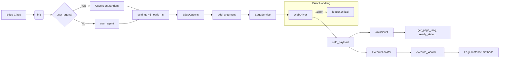

# <input code>

```python
## \file hypotez/src/webdriver/edge/edge.py
# -*- coding: utf-8 -*-\
#! venv/Scripts/python.exe
#! venv/bin/python/python3.12

"""
.. module:: src.webdriver.edge
   :platform: Windows, Unix
   :synopsis: Custom Edge WebDriver class with simplified configuration using fake_useragent.

"""

MODE = 'dev'

import os
from pathlib import Path
from typing import Optional, List
from selenium.webdriver import Edge as WebDriver
from selenium.webdriver.edge.service import Service as EdgeService
from selenium.webdriver.edge.options import Options as EdgeOptions
from selenium.common.exceptions import WebDriverException
from src.webdriver.executor import ExecuteLocator
from src.webdriver.js import JavaScript
from fake_useragent import UserAgent
from src import gs
from src.logger import logger
from src.utils.jjson import j_loads_ns


class Edge(WebDriver):
    """
    Custom Edge WebDriver class for enhanced functionality.

    Attributes:
        driver_name (str): Name of the WebDriver used, defaults to 'edge'.
    """
    driver_name: str = 'edge'

    def __init__(self, user_agent: Optional[dict] = None, *args, **kwargs) -> None:
        """
        Initializes the Edge WebDriver with the specified user agent and options.

        :param user_agent: Dictionary to specify the user agent. If `None`, a random user agent is generated.
        """
        self.user_agent = user_agent or UserAgent().random
        settings = j_loads_ns(Path(gs.path.src / 'webdriver' / 'edge' / 'edge.json'))

        options = EdgeOptions()
        options.add_argument(f'user-agent={self.user_agent}')

        try:
            logger.info('Starting Edge WebDriver')
            edgedriver_path = settings.executable_path.default  # Ensure this is correctly defined in your JSON file
            service = EdgeService(executable_path=str(edgedriver_path))
            super().__init__(options=options, service=service)
            self._payload()
        except WebDriverException as ex:
            logger.critical('Edge WebDriver failed to start:', ex)
            ...
            return
        except Exception as ex:
            logger.critical('Edge WebDriver crashed. General error:', ex)
            ...
            return


    def _payload(self) -> None:
        """
        Load executors for locators and JavaScript scenarios.
        """
        ...
        j = JavaScript(self)
        self.get_page_lang = j.get_page_lang
        self.ready_state = j.ready_state
        self.get_referrer = j.ready_state
        self.unhide_DOM_element = j.unhide_DOM_element
        self.window_focus = j.window_focus

        execute_locator = ExecuteLocator(self)
        self.execute_locator = execute_locator.execute_locator
        self.get_webelement_as_screenshot = execute_locator.get_webelement_as_screenshot
        self.get_webelement_by_locator = execute_locator.get_webelement_by_locator
        self.get_attribute_by_locator = execute_locator.get_attribute_by_locator
        self.send_message = self.send_key_to_webelement = execute_locator.send_message


    def set_options(self, opts: Optional[List[str]] = None) -> EdgeOptions:
        """
        Create and configure launch options for the Edge WebDriver.

        :param opts: A list of options to add to the Edge WebDriver. Defaults to `None`.
        :return: Configured `EdgeOptions` object.
        """
        options = EdgeOptions()
        if opts:
            for opt in opts:
                options.add_argument(opt)
        return options
```

# <algorithm>

1. **Initialization (`__init__`)**:
   - Takes an optional `user_agent` dictionary. If not provided, a random user agent is generated using `fake_useragent`.
   - Loads configuration from `edge.json` using `j_loads_ns`.
   - Creates `EdgeOptions` object and adds the user agent as an argument.
   - Initializes `EdgeService` using the executable path from the config.
   - Initializes the `WebDriver` object using the options and service.
   - Calls `_payload` to load executors.

2. **Error Handling**:
   - Includes `try...except` blocks to catch potential `WebDriverException` during WebDriver initialization and general exceptions.  Logs errors using `logger`.

3. **`_payload`**:
   - Creates an instance of `JavaScript` to access JavaScript methods.
   - Assigns `JavaScript` methods to the `Edge` instance for later use.
   - Creates an `ExecuteLocator` instance.
   - Delegates locator and other methods from `ExecuteLocator` instance to the `Edge` instance for use.

# <mermaid>




# <explanation>

**Импорты**:

- `os`, `pathlib`: Стандартные библиотеки для работы с операционной системой и файлами.
- `typing`: Для указания типов данных.
- `selenium.webdriver.*`: Библиотека для работы с веб-драйверами.
- `selenium.webdriver.edge.*`:  Модули для работы с Edge WebDriver.
- `selenium.common.exceptions`: Классы исключений для selenium.
- `src.webdriver.executor`, `src.webdriver.js`, `fake_useragent`, `src.logger`, `src.utils.jjson`, `src.gs`:  Это импорты из внутренних пакетов проекта (`src`). Подробные пояснения о каждом компоненте потребуют доступа к коду из других файлов (например, в `src/webdriver/executor.py` или `src/logger.py`).  Из примера видно, что `gs` скорее всего содержит глобальные настройки проекта.
- `from src import gs`: Импортирует модуль `gs` из пакета `src`. Вероятно, `gs` предоставляет глобальные настройки или конфигурацию для проекта.


**Классы**:

- `Edge(WebDriver)`: Наследуется от класса `WebDriver` из `selenium`.  Представляет собой кастомный класс для работы с Edge WebDriver. Добавляет функции для работы с JavaScript и локаторами.  Атрибут `driver_name` задает имя используемого вебдрайвера.

**Функции**:

- `__init__(user_agent: Optional[dict] = None, *args, **kwargs)`: Инициализирует экземпляр класса `Edge`. Принимает необязательный параметр `user_agent` для указания user-agent (использует `fake_useragent` по умолчанию). Загружает настройки из `edge.json` и запускает webdriver.
- `_payload()`: Загружает исполнители для локаторов и JavaScript.  Загружает методы из `ExecuteLocator` и `JavaScript` в текущий экземпляр.
- `set_options(opts: Optional[List[str]] = None)`: Создает и настраивает опции запуска для `Edge WebDriver`. Принимает список дополнительных опций и добавляет их к `EdgeOptions`.

**Переменные**:

- `MODE`: Вероятно, глобальная переменная, определяющая режим работы (например, 'dev', 'prod').
- `edgedriver_path`: Путь к исполняемому файлу Edge WebDriver. Загружается из `edge.json`.

**Возможные ошибки и улучшения**:

- Обработка ошибок: Обработка исключений в `__init__` улучшена, но проверка `settings.executable_path.default` на корректность перед использованием (наличие и корректность значения) была бы желательной.
- Дополнительные параметры: Возможно, целесообразно добавить дополнительные параметры в конструктор `__init__` (например, для задания url страницы или параметров браузера).
- Документация: Документация для `_payload` могла бы быть более подробной.  Необходимо пояснить, как происходит загрузка методов.
- Использование: Неясно, как вызываются методы класса `Edge` из других частей проекта.


**Взаимосвязи с другими частями проекта**:

- `gs`: Вероятно, `gs` (global settings) содержит конфигурационные данные, необходимые для работы WebDriver (например, путь к `edge.json`).
- `src.logger`: Используется для записи сообщений об ошибках и информационных сообщений.
- `src.utils.jjson`: Вероятно, содержит функции для работы с JSON-данными, используемые для парсинга `edge.json`.
- `src.webdriver.executor`, `src.webdriver.js`: Обеспечивают функциональность для работы с веб-элементами и JavaScript-кодом в браузере, управляемом WebDriver.  Без доступа к коду `ExecuteLocator` и `JavaScript` точные детали их работы неизвестны.

**Важно**: Для более глубокого анализа необходим код файлов `src/webdriver/executor.py`, `src/webdriver/js.py`, и `hypotez/src/webdriver/edge/edge.json`.  Без этого анализа невозможно полностью понять, как `Edge` класс взаимодействует с другими частями проекта и его полную функциональность.