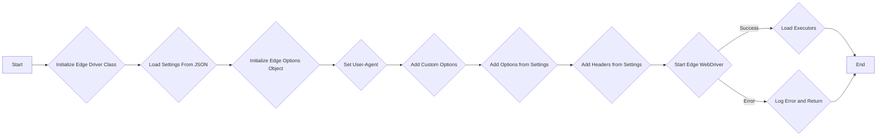
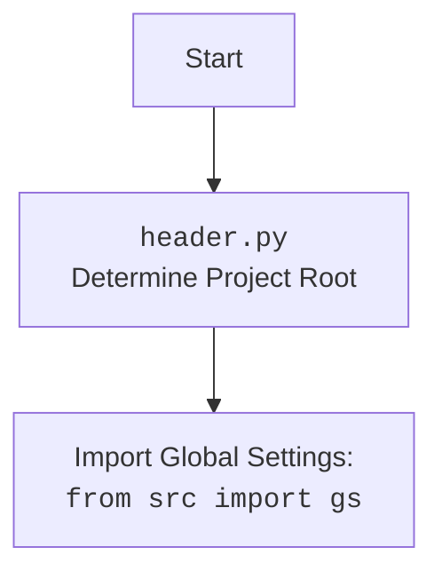

## АНАЛИЗ КОДА: `hypotez/src/webdriver/edge/edge.py`

### 1. <алгоритм>

**Блок-схема:**



**Примеры для каждого логического блока:**

1.  **Начало (`Start`)**: Начало выполнения скрипта `edge.py`.
2.  **Инициализация класса Edge (`Initialize Edge Driver Class`)**: Вызывается конструктор класса `Edge`, где `user_agent` и `options` могут быть переданы как аргументы, например, `driver = Edge(user_agent="custom_user_agent", options=["--headless"])`.
3.  **Загрузка настроек из JSON (`Load Settings From JSON`)**: Загружается файл `edge.json` для получения настроек. Например, `settings = j_loads_ns(Path(gs.path.src, 'webdriver', 'edge', 'edge.json'))`
4.  **Инициализация объекта EdgeOptions (`Initialize Edge Options Object`)**: Создается объект `EdgeOptions` для установки опций браузера: `options_obj = EdgeOptions()`.
5.  **Установка User-Agent (`Set User-Agent`)**:  Устанавливается User-Agent. Если `user_agent` не передан, то используется случайный User-Agent,  `options_obj.add_argument(f'user-agent={self.user_agent}')`
6.  **Добавление пользовательских опций (`Add Custom Options`)**: Если `options` переданы в конструктор, они добавляются к `options_obj`. Например, если передано `options=["--headless", "--disable-gpu"]` через цикл `for option in options: options_obj.add_argument(option)` они добавляются к объекту `options_obj`.
7.   **Добавление опций из настроек (`Add Options from Settings`)**: Опции из файла настроек `edge.json` добавляются к `options_obj`. Например: `for option in settings.options: options_obj.add_argument(option)`.
8.  **Добавление заголовков из настроек (`Add Headers from Settings`)**: Заголовки из `edge.json` добавляются как аргументы. Например: `for key, value in vars(settings.headers).items(): options_obj.add_argument(f'--{key}={value}')`
9.  **Запуск Edge WebDriver (`Start Edge WebDriver`)**: Создается экземпляр `EdgeService`, и `WebDriver` запускается с заданными опциями.  Пример: `service = EdgeService(executable_path=str(edgedriver_path)); super().__init__(options=options_obj, service=service)`
10. **Загрузка исполнителей (`Load Executors`)**: Загружаются и устанавливаются методы для работы с элементами через `JavaScript` и `ExecuteLocator`.
11. **Конец (`End`)**: Завершение работы скрипта `edge.py`.
12. **Логирование ошибки и возврат (`Log Error and Return`)**: При возникновении исключения в блоке `try...except`, происходит логирование ошибки и возврат.

### 2. <mermaid>

```mermaid
flowchart TD
    Start --> EdgeClass[<code>Edge</code> Class<br>Initialize WebDriver];
    EdgeClass --> LoadSettings[Load Settings from <br><code>edge.json</code>];
    LoadSettings --> EdgeOptionsObj[Create <code>EdgeOptions</code> Object];
    EdgeOptionsObj --> SetUserAgent[Set User Agent];
    SetUserAgent --> AddCustomOptions{Add Custom Options};
    AddCustomOptions -- yes --> LoopCustomOptions[Loop Through Custom Options];
    LoopCustomOptions --> AddCustomOption[Add Option to <code>EdgeOptions</code>];
    AddCustomOption --> AddCustomOptions;
    AddCustomOptions -- no --> AddSettingsOptions{Add Options from Settings};
    AddSettingsOptions -- yes --> LoopSettingsOptions[Loop Through Settings Options];
    LoopSettingsOptions --> AddSettingsOption[Add Option to <code>EdgeOptions</code>];
    AddSettingsOption --> AddSettingsOptions;
    AddSettingsOptions -- no --> AddSettingsHeaders{Add Headers from Settings};
    AddSettingsHeaders -- yes --> LoopSettingsHeaders[Loop Through Settings Headers];
    LoopSettingsHeaders --> AddSettingsHeader[Add Header to <code>EdgeOptions</code>];
    AddSettingsHeader --> AddSettingsHeaders;
     AddSettingsHeaders -- no --> StartWebDriver[Start <code>Edge</code> WebDriver <br><code>super().__init__(...)</code>];
    StartWebDriver -- Success --> LoadExecutors[Load Executors <br> JavaScript and ExecuteLocator];
    LoadExecutors --> End[End];
    StartWebDriver -- Error --> LogError[Log Error and Return];
    LogError --> End;


    style Start fill:#f9f,stroke:#333,stroke-width:2px
    style End fill:#ccf,stroke:#333,stroke-width:2px
```

**Зависимости импорта и их пояснение:**

*   `import os`: Используется для работы с операционной системой, хотя в данном коде напрямую не используется.
*   `from pathlib import Path`: Используется для работы с путями к файлам, например, для загрузки `edge.json`.
*   `from typing import Optional, List`: Используется для аннотации типов, делает код более читаемым и помогает отлавливать ошибки на этапе разработки.
*   `from selenium.webdriver import Edge as WebDriver`: Импортирует основной класс `Edge` из `selenium` для управления браузером Edge.
*   `from selenium.webdriver.edge.service import Service as EdgeService`: Импортирует класс `Service` для управления процессом драйвера Edge.
*   `from selenium.webdriver.edge.options import Options as EdgeOptions`: Импортирует класс `Options` для настройки параметров запуска Edge.
*   `from selenium.common.exceptions import WebDriverException`:  Импортирует исключение, связанное с ошибками при работе с WebDriver.
*   `from src.webdriver.executor import ExecuteLocator`: Импортирует класс для выполнения локаторов на элементах страницы.
*   `from src.webdriver.js import JavaScript`: Импортирует класс для выполнения JavaScript кода.
*   `from fake_useragent import UserAgent`: Импортирует класс для генерации случайных User-Agent.
*   `from src import gs`: Импортирует глобальные настройки из пакета `src`.
*   `from src.logger.logger import logger`: Импортирует логгер для записи событий и ошибок.
*   `from src.utils.jjson import j_loads_ns`: Импортирует функцию для загрузки JSON файлов с использованием пространств имен.



### 3. <объяснение>

**Импорты:**

*   `os`, `pathlib`: Используются для работы с файловой системой и путями, хотя в данном конкретном файле `os` не используется напрямую.
*   `typing`: Используется для аннотации типов, что улучшает читаемость и позволяет выявлять ошибки на этапе разработки. `Optional` указывает на то, что переменная может быть `None`, а `List` указывает на список значений.
*   `selenium.webdriver`: Содержит классы и методы для управления браузерами. `Edge` используется для управления браузером Microsoft Edge, `Service` для запуска и управления процессом драйвера, `Options` для настройки параметров браузера при запуске.
*   `selenium.common.exceptions`: Содержит классы исключений, которые могут возникнуть при работе с Selenium WebDriver.
*   `src.webdriver.executor`: Содержит класс `ExecuteLocator`, который предоставляет методы для поиска элементов на веб-странице и выполнения с ними различных действий.
*   `src.webdriver.js`: Содержит класс `JavaScript`, который обеспечивает взаимодействие с JavaScript на веб-странице.
*   `fake_useragent`: Используется для генерации случайных user-agent строк, чтобы имитировать поведение различных браузеров.
*   `src`: Используется для импорта глобальных настроек проекта через `gs`.
*   `src.logger.logger`: Используется для логирования событий, ошибок, и отладочной информации.
*  `src.utils.jjson`: Используется для загрузки данных из JSON файла, в данном случае `edge.json` в виде объекта с возможностью обращения к полям через атрибуты.

**Класс `Edge`:**

*   **Роль:** Является пользовательским классом WebDriver для браузера Edge, расширяющим базовый класс `selenium.webdriver.Edge`. Он упрощает процесс настройки и запуска браузера Edge с пользовательскими параметрами и пользовательским user-agent.
*   **Атрибуты:**
    *   `driver_name`: Строка, представляющая имя драйвера, по умолчанию `'edge'`.
*   **Методы:**
    *   `__init__`: Конструктор класса, который инициализирует объект WebDriver. Принимает пользовательский user-agent и опции. Загружает настройки из файла `edge.json`, устанавливает опции браузера, запускает Edge и загружает необходимые исполнители.
    *   `_payload`:  Метод загружает объекты JavaScript и ExecuteLocator, и их методы, добавляет их в класс `Edge`.
    *   `set_options`: Метод для создания и настройки `EdgeOptions`. Принимает список опций и возвращает объект `EdgeOptions`.

**Функции:**

*  `__init__`:
    *   **Аргументы**:
        * `user_agent` (Optional[str]): Пользовательская строка User-Agent.
        * `options` (Optional[List[str]]): Список опций для браузера Edge.
        * `*args`, `**kwargs`: Дополнительные аргументы и ключевые слова, передаваемые базовому классу `WebDriver`.
    *   **Возвращаемое значение**: `None`
    *   **Назначение**: Инициализирует WebDriver Edge с заданными параметрами, настраивает опции браузера и запускает его.
    *  **Примеры**: `Edge(user_agent="my_custom_agent", options=["--headless"])`, `Edge()`, `Edge(options=["--disable-gpu"])`
*  `_payload`:
     *   **Аргументы**: Нет
     *   **Возвращаемое значение**: `None`
     *   **Назначение**: Загружает и инициализирует объекты `JavaScript` и `ExecuteLocator`, а также их методы, добавляет их в экземпляр класса `Edge`.
* `set_options`:
    *   **Аргументы**:
        *   `opts` (Optional[List[str]]): Список дополнительных опций для браузера.
    *   **Возвращаемое значение**:  `EdgeOptions` - настроенный объект параметров Edge.
    *   **Назначение**: Создает и настраивает объект `EdgeOptions`. Добавляет переданные опции в объект `EdgeOptions` и возвращает его.
    * **Примеры**: `set_options(["--disable-notifications", "--incognito"])`,  `set_options()`

**Переменные:**

*   `driver_name`: Строковая переменная, указывающая имя драйвера.
*   `user_agent`: Строковая переменная, содержащая User-Agent для браузера.
*  `settings`: Объект, содержащий настройки, загруженные из JSON файла `edge.json`
* `options_obj`: Объект типа `EdgeOptions` для настройки параметров запуска браузера Edge.
*   `service`: Объект типа `EdgeService` для управления процессом драйвера Edge.
* `edgedriver_path`: Путь к исполняемому файлу драйвера Edge.
*  `ex`: Переменная для обработки исключений.
*  `j`: Экземпляр класса `JavaScript`.
*  `execute_locator`: Экземпляр класса `ExecuteLocator`.

**Потенциальные ошибки и области для улучшения:**

*   **Обработка ошибок**: Хотя есть обработка `WebDriverException` и общего `Exception`, возможно, стоит более гранулированно обрабатывать различные типы исключений, чтобы более точно диагностировать проблемы.
*   **Конфигурация**: Зависимость от `edge.json` файла. Необходимо убедиться в его наличии и корректности.
*   **Путь к драйверу**: Путь к драйверу `edgedriver_path` жестко задан в JSON-файле, лучше сделать его более гибким (например,  поиск драйвера по переменной окружения или автоматическая загрузка).
* **Логирование**: Добавить больше логов для отладки.
*   **Асинхронность**: Код выполняется синхронно, что может замедлить процесс. Рассмотреть асинхронное выполнение для повышения производительности.
*  **Расширяемость**: Код можно улучшить, сделав его более расширяемым, например, добавив возможность настройки через параметры конструктора или дополнительные методы для гибкости.

**Взаимосвязь с другими частями проекта:**

*   **`src.webdriver.executor`**: Класс `ExecuteLocator` используется для выполнения поиска элементов и различных действий с ними, обеспечивая абстракцию от конкретного драйвера браузера.
*   **`src.webdriver.js`**: Класс `JavaScript` предоставляет методы для выполнения JavaScript на странице, что используется для расширения функциональности WebDriver.
*  **`src.gs`**: Глобальные настройки для проекта, такие как пути к файлам, используются для загрузки `edge.json`.
*  **`src.logger.logger`**: Используется для ведения журнала событий и ошибок при работе WebDriver, что помогает в отладке и мониторинге.
*  **`src.utils.jjson`**: Используется для загрузки JSON файла с настройками браузера.

**Цепочка взаимосвязей:**

1.  Скрипт `edge.py` инициализируется.
2.  Из `src` импортируется `gs` для получения глобальных настроек, включая путь к файлу `edge.json`.
3.  Из `src.utils.jjson` импортируется функция `j_loads_ns`, используемая для загрузки настроек из `edge.json`.
4.  Из `src.webdriver.executor` импортируется `ExecuteLocator`, который используется для выполнения действий с элементами на странице.
5.  Из `src.webdriver.js` импортируется `JavaScript`, для взаимодействия с кодом JavaScript на веб-странице.
6.  Из `src.logger.logger` импортируется `logger` для логирования действий и ошибок.
7.  `Edge` использует классы `EdgeService`, `EdgeOptions` и `WebDriver` из библиотеки `selenium`, а также  `UserAgent` из библиотеки `fake_useragent`.
8.  `Edge` создает экземпляр `JavaScript` и `ExecuteLocator`, а также передает свои методы в класс `Edge`.
9.  В итоге, созданный экземпляр класса `Edge` позволяет управлять браузером Microsoft Edge с заданными опциями, пользовательским агентом и дополнительной функциональностью через `ExecuteLocator` и `JavaScript`.

Таким образом, код `edge.py` является ключевым компонентом для автоматизированного управления браузером Edge в рамках проекта, интегрируясь с другими частями системы для обеспечения гибкости и расширяемости.