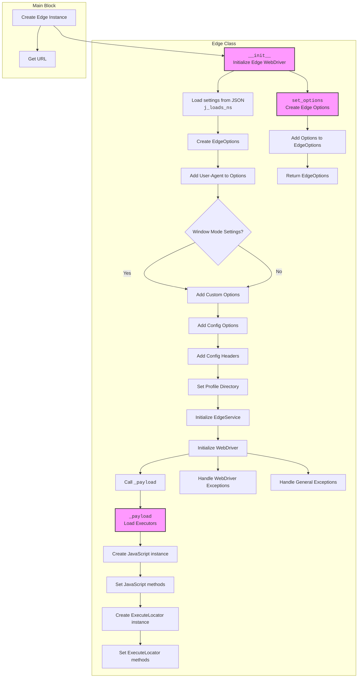

## <алгоритм>

1.  **Инициализация:**
    *   Импортируются необходимые модули, включая `os`, `Path`, `WebDriver`, `EdgeService`, `EdgeOptions`, `UserAgent`, `logger`, `j_loads_ns`.
    *   Создается класс `Edge`, наследующийся от `WebDriver`.
    *   В методе `__init__` происходит:
        *   Получение случайного `user_agent`, если не передан.
        *   Загрузка настроек из `edge.json` с использованием `j_loads_ns`.
        *   Инициализация объекта `EdgeOptions`.
        *   Добавление `user-agent` в опции.
        *   Установка режима окна из параметров или из конфига: `--kiosk`, `--headless`, `--start-maximized`
        *   Добавление кастомных опций, переданных при инициализации, если они есть.
        *   Добавление опций из конфига, если они есть.
        *   Добавление заголовков из конфига, если они есть.
        *   Определение директории профиля: сначала берётся из конфига,  затем добавляется `profile_name` если он был указан, если в пути профиля `'%LOCALAPPDATA%'`, то он будет заменён на реальный путь из `os.environ`.
        *   Добавление пути к профилю в опции.
        *   Инициализация `EdgeService` с путем к драйверу из настроек.
        *   Инициализация `WebDriver` с настроенными опциями и сервисом.
        *   Вызов метода `_payload`.
        *   Обработка исключений `WebDriverException`, `Exception`, если не удалось запустить драйвер.
2.  **Метод `_payload`:**
    *   Создаётся экземпляр класса `JavaScript`.
    *   Устанавливаются методы из `JavaScript` (например, `get_page_lang`, `ready_state`) как атрибуты текущего класса.
    *   Создаётся экземпляр класса `ExecuteLocator`.
    *   Устанавливаются методы из `ExecuteLocator` (например, `execute_locator`, `get_webelement_as_screenshot`) как атрибуты текущего класса.
3. **Метод `set_options`:**
    *  Создание и настройка опций для Edge Webdriver, принимая список опций.

    *   Принимает список опций `opts` и добавляет их в `EdgeOptions`.
    *   Возвращает настроенный объект `EdgeOptions`.
4.  **Пример использования:**
    *   В блоке `if __name__ == "__main__":` создается экземпляр `Edge` с `window_mode='full_window'`.
    *   Выполняется переход на `https://www.example.com`.

## <mermaid>

**Импорты и зависимости Mermaid:**

*   `os`: Используется для работы с переменными окружения, в частности, для замены `%LOCALAPPDATA%` в пути профиля.
*   `pathlib.Path`: Используется для создания путей к файлам и директориям, упрощая работу с файловой системой.
*   `typing.Optional, List`: Используются для аннотации типов, делая код более читаемым и помогая в отладке, в основном используется для опциональных параметров.
*    `selenium.webdriver.Edge as WebDriver`: Базовый класс для управления браузером Edge.
*    `selenium.webdriver.edge.service.Service as EdgeService`:  Класс для управления сервисом драйвера Edge, отвечает за взаимодействие с исполняемым файлом.
*    `selenium.webdriver.edge.options.Options as EdgeOptions`:  Класс для управления параметрами запуска Edge.
*    `selenium.common.exceptions.WebDriverException`: Исключение, которое возникает при проблемах с Webdriver.
*    `src.webdriver.executor.ExecuteLocator`: Класс для выполнения поиска элементов на странице.
*    `src.webdriver.js.JavaScript`: Класс для управления JS кодом.
*    `fake_useragent.UserAgent`: Класс для генерации случайных `user_agent`.
*    `src`:  Используется для импорта глобальных настроек (`src.gs`), которые могут включать пути к файлам и другие общие параметры.
*    `src.logger.logger`:  Используется для логирования событий.
*   `src.utils.jjson.j_loads_ns`: Используется для загрузки JSON файла, обрабатывая его как объект пространства имен.

## <объяснение>

### Импорты:

*   `os`: Модуль для взаимодействия с операционной системой, используется для получения значения переменной окружения `LOCALAPPDATA` для корректной установки директории профиля пользователя.
*   `pathlib.Path`: Модуль для работы с путями к файлам и директориям, облегчает конструирование и манипулирование путями.
*   `typing.Optional, List`: Модули для аннотации типов, используются для повышения читаемости кода и помощи в отладке. `Optional` указывает на то, что переменная может быть `None`, а `List` указывает на тип данных список.
*   `selenium.webdriver.Edge as WebDriver`: Импортирует основной класс `Edge` для управления браузером, переименовывая его в `WebDriver` для удобства.
*   `selenium.webdriver.edge.service.Service as EdgeService`: Импортирует класс `Service` для управления драйвером Edge, отвечает за взаимодействие с исполняемым файлом.
*   `selenium.webdriver.edge.options.Options as EdgeOptions`: Импортирует класс `Options`, предоставляющий методы для установки параметров запуска браузера Edge.
*   `selenium.common.exceptions.WebDriverException`: Импортируется класс исключения, которое может возникнуть при работе с веб-драйвером.
*   `src.webdriver.executor.ExecuteLocator`: Импортируется класс `ExecuteLocator` из модуля `src.webdriver.executor`, который предоставляет методы для поиска элементов на веб-странице и выполнения с ними действий.
*   `src.webdriver.js.JavaScript`: Импортируется класс `JavaScript` из модуля `src.webdriver.js`, который предоставляет методы для выполнения JavaScript на веб-странице.
*   `fake_useragent.UserAgent`: Импортируется класс `UserAgent` из библиотеки `fake_useragent`, который используется для генерации случайных строк `user-agent` для имитации различных браузеров.
*   `src`: Импортируется модуль `src`, который, вероятно, содержит глобальные настройки проекта.
*   `src.logger.logger`: Импортируется модуль `logger` для логирования событий.
*   `src.utils.jjson.j_loads_ns`: Импортируется функция `j_loads_ns` для загрузки JSON-файла и преобразования его в объект пространства имен.

### Класс `Edge`:

*   **Назначение:**
    *   Класс `Edge` представляет собой кастомную реализацию веб-драйвера для браузера Edge, которая расширяет стандартные возможности `selenium.webdriver.Edge`.
    *   Он добавляет функциональность для настройки `user-agent`, параметров запуска и профиля пользователя, а также предоставляет удобный интерфейс для выполнения JavaScript и поиска элементов на странице.
*   **Атрибуты:**
    *   `driver_name (str)`: Название драйвера, по умолчанию `edge`.
*   **Методы:**
    *   `__init__(self, profile_name, user_agent, options, window_mode, *args, **kwargs)`:
        *   Конструктор класса, который инициализирует драйвер Edge с заданными параметрами.
        *   Принимает параметры, такие как `user_agent`, `options`, `window_mode`, и `profile_name`.
        *   Загружает настройки из JSON файла `edge.json`.
        *   Создает объект `EdgeOptions` и добавляет в него `user-agent`, опции из JSON и переданные при инициализации, а также настраивает режим окна.
        *   Настраивает директорию профиля,  заменяя `%LOCALAPPDATA%`, если необходимо, на корректный путь.
        *   Создает объект `EdgeService` и запускает драйвер Edge с настроенными параметрами.
        *   Вызывает метод `_payload` для загрузки исполнителей.
        *   Перехватывает исключения `WebDriverException`, `Exception` и логирует ошибки.
    *   `_payload(self)`:
        *   Загружает исполнители для локаторов и JavaScript.
        *   Создает экземпляры классов `JavaScript` и `ExecuteLocator`.
        *   Назначает методы из этих классов текущему объекту `Edge` для удобства использования.
    * `set_options(self, opts)`:
        *  Создание и настройка опций для Edge Webdriver.
        *  Принимает список опций `opts` для добавления к EdgeOptions.
        *  Возвращает настроенный объект `EdgeOptions`.

### Функции:

*   **`__init__` (конструктор):**
    *   Принимает необязательные аргументы:
        *   `profile_name (Optional[str])`: Имя профиля пользователя.
        *   `user_agent (Optional[str])`: Строка `user-agent`, если не указана, то генерируется случайная.
        *   `options (Optional[List[str]])`: Список дополнительных опций для Edge.
        *    `window_mode (Optional[str])`: Режим окна браузера (`windowless`, `kiosk`, `full_window`).
    *   Устанавливает `user_agent` (случайный, если не передан).
    *   Загружает настройки из `edge.json`.
    *   Настраивает `EdgeOptions` (добавляет `user-agent`, опции, профиль).
    *   Инициализирует и запускает `WebDriver` с заданными параметрами.
    *   Вызывает метод `_payload` для инициализации исполнителей.
*   **`_payload`:**
    *   Не принимает аргументов.
    *   Создаёт экземпляры `JavaScript` и `ExecuteLocator`.
    *   Устанавливает атрибуты класса для управления JavaScript и локаторами.
*  **`set_options`:**
     *  Принимает необязательный список `opts`.
     *  Создаёт объект `EdgeOptions`, добавляет в него `opts` и возвращает его.

### Переменные:

*   `driver_name (str)`: Классовая переменная, представляющая имя используемого драйвера (`edge`).
*   `self.user_agent (str)`: `user-agent`, используемый для настройки браузера.
*    `settings`: Объект пространства имен, содержащий параметры из файла `edge.json`.
*    `options_obj`: Объект класса `EdgeOptions`, используемый для хранения и настройки опций Edge.
*    `profile_directory`: Строка, представляющая путь к профилю пользователя.
*   `edgedriver_path`: Путь к исполняемому файлу драйвера.
*    `service`: Объект класса `EdgeService`, управляющий драйвером Edge.
*   `j`: Экземпляр класса `JavaScript`.
*   `execute_locator`: Экземпляр класса `ExecuteLocator`.
*   `opts`: Список опций, передаваемых в `set_options`

### Потенциальные ошибки и улучшения:

*   Отсутствует проверка на существование `edge.json`. Если файл отсутствует, будет ошибка.
*   Пути к файлам в `edge.json` могут быть относительными, что может привести к ошибкам в зависимости от того, где запускается код.
*   Логирование ошибок может быть более подробным, включая информацию о том, какие именно настройки не были применены.
*   Метод `set_options` дублирует часть кода из `__init__`, можно вынести общий функционал в отдельный метод.
*   В `_payload` можно не делать атрибутами класса,  а создать переменные, если не планируется использовать их вне класса.
*   В `_payload` `self.get_referrer = j.ready_state`  может быть ошибкой, скорее всего, нужно `self.get_referrer = j.get_referrer`.

### Взаимосвязи с другими частями проекта:

*   `src.webdriver.executor.ExecuteLocator`: Зависит от `selenium` для взаимодействия с веб-элементами и от `src.webdriver.js.JavaScript` для выполнения JavaScript.
*   `src.webdriver.js.JavaScript`: Зависит от `selenium` для выполнения JavaScript в контексте браузера.
*   `src`: Используется для загрузки глобальных настроек, что делает класс `Edge` зависимым от конфигурации проекта.
*   `src.logger.logger`: Используется для логирования, обеспечивая мониторинг работы класса `Edge`.
*  `src.utils.jjson.j_loads_ns`: Используется для парсинга json файлов.
*   Класс `Edge` зависит от `selenium` для управления браузером и использует его возможности.

**Заключение:**

Код представляет собой кастомный класс для управления браузером Edge, который добавляет гибкость в настройке `user-agent`, профиля и параметров запуска. Он также интегрирован с другими частями проекта, такими как логгирование, глобальные настройки, и исполнители для локаторов и JavaScript. Есть несколько областей для улучшения, таких как обработка ошибок и дублирование кода, которые можно исправить.