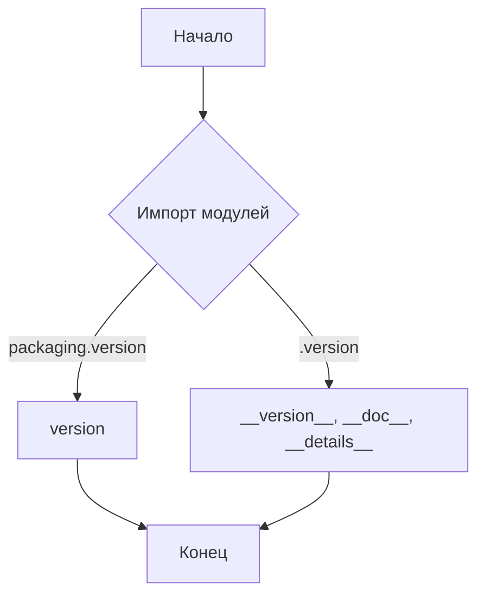
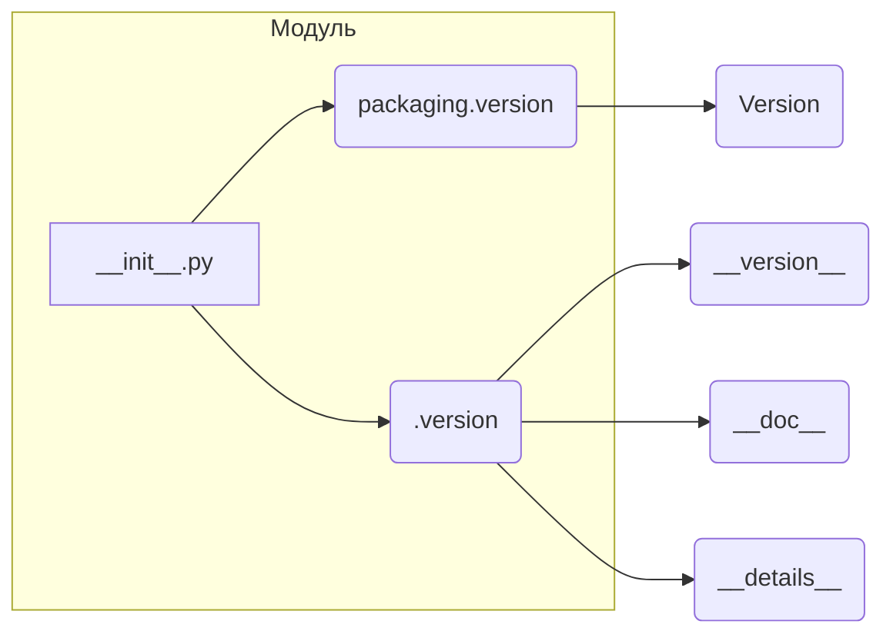

```MD
# Анализ кода hypotez/src/webdriver/edge/extentions/__init__.py

## <input code>

```python
## \file hypotez/src/webdriver/edge/extentions/__init__.py
# -*- coding: utf-8 -*-
#! venv/Scripts/python.exe
#! venv/bin/python/python3.12

"""
.. module: src.webdriver.edge.extentions 
	:platform: Windows, Unix
	:synopsis:

"""
MODE = 'dev'

"""
	:platform: Windows, Unix
	:synopsis:

"""


"""
	:platform: Windows, Unix
	:synopsis:

"""


"""
  :platform: Windows, Unix

"""
"""
  :platform: Windows, Unix
  :platform: Windows, Unix
  :synopsis:
"""MODE = 'dev'
  
""" module: src.webdriver.edge.extentions """


from packaging.version import Version
from .version import __version__, __doc__, __details__
```

## <algorithm>

Этот код представляет собой инициализационный модуль (`__init__.py`) для пакета `extentions` в подпакете `webdriver/edge`. Алгоритм работы сводится к импорту необходимых модулей и определению констант.  Логики в данном коде нет, он просто создаёт контекст для пакета.

**Блок-схема:**



**Примеры:**

В данном случае нет явного примера выполнения кода, так как он просто импортирует модули.


## <mermaid>



**Объяснение диаграммы:**

Модуль `__init__.py` импортирует модуль `packaging.version` и подмодули `__version__`, `__doc__`, `__details__` из `./version`.  Именно эти зависимости и определяют функциональность этого файла.

## <explanation>

**Импорты:**

- `from packaging.version import Version`: Импортирует класс `Version` из пакета `packaging.version`. Этот пакет используется для работы с версиями пакетов. Данный импорт позволяет работать с версиями в коде.  Он необходим для работы с версиями.

- `from .version import __version__, __doc__, __details__`: Импортирует переменные `__version__`, `__doc__`, и `__details__`.  Скорее всего эти переменные содержат информацию о версии, документации и некоторых подробностях текущего модуля, которая будет доступна во внешнем коде. Значение переменных `__doc__` и `__details__` следует искать в модуле `version.py` в папке `extentions` того же уровня.  Это типичная практика организации модулей в Python.

**Классы:**

Нет классов.

**Функции:**

Нет функций.

**Переменные:**

- `MODE = 'dev'`: Глобальная переменная, вероятно, задающая режим работы (например, 'dev' — для разработки, 'prod' — для производства).  Это константа.

**Возможные ошибки или области для улучшений:**

- **Недостаток документации**:  Несколько строк с комментариями `""" ... """`  в начале, но их содержание слишком скудное и повторяющееся. Нужно более полное описание целей и функциональности модуля.
- **Повторение констант**:  Переменная `MODE` определена несколько раз.
- **Неясная связь с проектом:** Нет информации о том, как этот модуль используется в остальных частях приложения.  Для более полного понимания нужны сведения о контексте и подключении к другим компонентам (например, какие драйверы используются или какова роль данного модуля в автоматизированном тестировании).


**Цепочка взаимосвязей с другими частями проекта:**

Модуль `__init__.py` является частью пакета `extentions`, который, в свою очередь, входит в пакет `webdriver/edge`.  Это предполагает, что он связан с драйвером для Edge WebDriver. Взаимодействие с остальными частями проекта возможно через импорты и использование переменных.