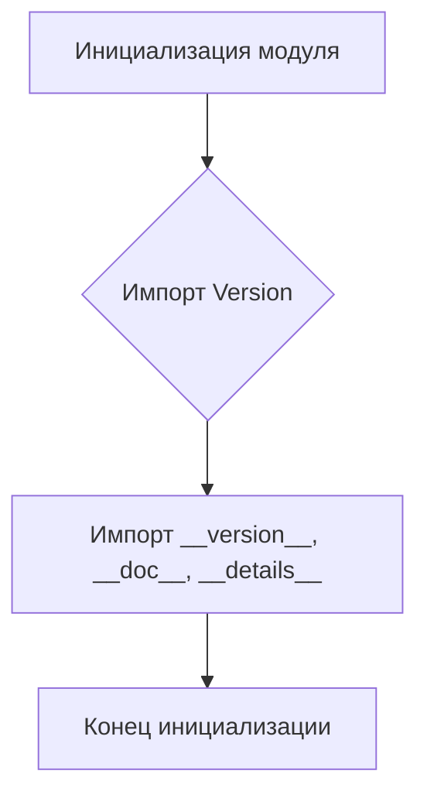
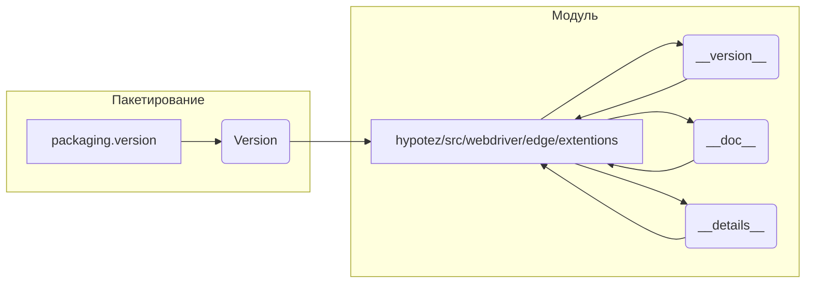

```MD
# Анализ кода hypotez/src/webdriver/edge/extentions/__init__.py

## <input code>

```python
## \file hypotez/src/webdriver/edge/extentions/__init__.py
# -*- coding: utf-8 -*-
#! venv/Scripts/python.exe
#! venv/bin/python/python3.12

"""
.. module: src.webdriver.edge.extentions 
	:platform: Windows, Unix
	:synopsis:

"""
MODE = 'dev'

"""
	:platform: Windows, Unix
	:synopsis:

"""


"""
	:platform: Windows, Unix
	:synopsis:

"""


"""
  :platform: Windows, Unix

"""
"""
  :platform: Windows, Unix
  :platform: Windows, Unix
  :synopsis:
"""MODE = 'dev'
  
""" module: src.webdriver.edge.extentions """


from packaging.version import Version
from .version import __version__, __doc__, __details__
```

## <algorithm>

Этот код представляет собой модуль инициализации для пакета `extentions` внутри проекта `hypotez`. Алгоритм работы довольно тривиален: он просто импортирует необходимые модули.  В данном случае, это `Version` из `packaging.version` и переменные `__version__`, `__doc__`, `__details__` из подмодуля `version`.  Нет сложной логики выполнения, нет циклов или условных операторов.

**Блок-схема:**



**Примеры:**

- Вход: Нет явных входных данных.
- Выход: Модуль инициализирован, доступны импортированные переменные и функции.


## <mermaid>



**Описание диаграммы:**

Диаграмма показывает зависимость модуля `hypotez/src/webdriver/edge/extentions` от внешнего пакета `packaging.version`. Пакет `packaging.version` предоставляет класс `Version`, который используется для работы с версиями.  Модуль `hypotez/src/webdriver/edge/extentions` импортирует необходимые переменные  из подмодуля `version`,  которые, вероятно, хранят метаданные о версии, документации и других деталях.

## <explanation>

**Импорты:**

- `from packaging.version import Version`: Импортирует класс `Version` из пакета `packaging.version`.  Этот пакет обычно используется для работы с версиями программного обеспечения.  Связь с `src.`- это то, что он импортируется из `hypotez`-пакета.
- `from .version import __version__, __doc__, __details__`: Импортирует переменные `__version__`, `__doc__`, `__details__` из модуля `version`, находящегося в текущем пакете (`hypotez/src/webdriver/edge/extentions`).  Эти переменные, вероятно, содержат метаинформацию о модуле (версию, описание, детали).  Связь: текущий модуль использует ресурсы другого модуля (`version.py`) внутри того же пакета `extentions`.


**Классы:**

Нет явных определений классов в данном коде.

**Функции:**

Нет определений функций в данном коде.

**Переменные:**

- `MODE = 'dev'`:  Строковая константа, вероятно, задаёт режим работы (например, `dev`, `prod`).


**Возможные ошибки или области для улучшений:**

- **Нет документации**: Не хватает более подробных комментариев к коду.
- **Неявные зависимости**:  Без контекста проекта не очень понятно, для чего нужны переменные `__version__`, `__doc__`, `__details__`, и как они используются в других частях проекта.  Требуется больше информации о проекте.


**Взаимосвязи с другими частями проекта:**

Этот `__init__.py` файл - точка входа в пакет `extentions`. Он импортирует данные из файла `version.py`, который, вероятно, определяет эти метаданные, что указывает на то, что  `version.py` находится в той же директории.  Использование `__init__.py` вложенными модулями (или в рамках пакета `edge`) предполагает, что `version.py` определяет некоторые данные, которые будут доступны, когда этот пакет будет импортирован другими частями проекта. Это  стандартный подход организации Python-проектов, когда модули группируются в папки/пакеты.