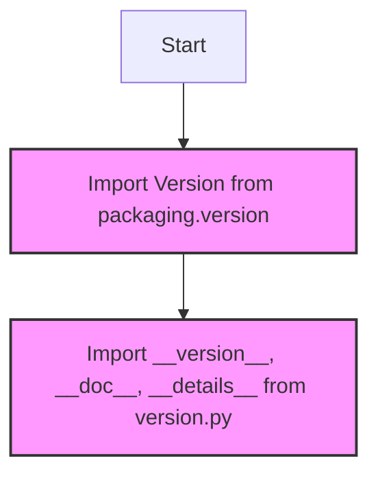

## ИНСТРУКЦИЯ:

Анализируй предоставленный код подробно и объясни его функциональность. Ответ должен включать три раздела:  

1. **<алгоритм>**: Опиши рабочий процесс в виде пошаговой блок-схемы, включая примеры для каждого логического блока, и проиллюстрируй поток данных между функциями, классами или методами.  
2. **<mermaid>**: Напиши код для диаграммы в формате `mermaid`, проанализируй и объясни все зависимости, 
    которые импортируются при создании диаграммы. 
    **ВАЖНО!** Убедитесь, что все имена переменных, используемые в диаграмме `mermaid`, 
    имеют осмысленные и описательные имена. Имена переменных вроде `A`, `B`, `C`, и т.д., не допускаются!  
    
    **Дополнительно**: Если в коде есть импорт `import header`, добавьте блок `mermaid` flowchart, объясняющий `header.py`:\
    ```mermaid\
    flowchart TD\
        Start --> Header[<code>header.py</code><br> Determine Project Root]\
    \
        Header --> import[Import Global Settings: <br><code>from src import gs</code>] \
    ```

3. **<объяснение>**: Предоставьте подробные объяснения:  
   - **Импорты**: Их назначение и взаимосвязь с другими пакетами `src.`.  
   - **Классы**: Их роль, атрибуты, методы и взаимодействие с другими компонентами проекта.  
   - **Функции**: Их аргументы, возвращаемые значения, назначение и примеры.  
   - **Переменные**: Их типы и использование.  
   - Выделите потенциальные ошибки или области для улучшения.  

Дополнительно, постройте цепочку взаимосвязей с другими частями проекта (если применимо).  

Это обеспечивает всесторонний и структурированный анализ кода.
## Формат ответа: `.md` (markdown)
**КОНЕЦ ИНСТРУКЦИИ**

## <алгоритм>

1.  **Импорт `Version` из `packaging.version`:**
    *   Импортируется класс `Version` из библиотеки `packaging.version`. Этот класс используется для сравнения и управления версиями программного обеспечения.
    *   *Пример:* `Version("1.2.3")` представляет собой объект версии.
2.  **Импорт переменных из `src.webdriver.edge.extentions.version`:**
    *   Импортируются `__version__`, `__doc__`, и `__details__` из модуля `version.py`, расположенного в той же директории.
    *   `__version__` - это строка, представляющая текущую версию расширения, например, `"1.0.0"`.
    *   `__doc__` - это строка документации (docstring) для модуля или пакета.
    *   `__details__` - это строка или словарь, содержащий подробную информацию о расширении.

## <mermaid>


## <объяснение>

**Импорты:**
*   `from packaging.version import Version`:
    *   Импортирует класс `Version` из библиотеки `packaging`. `packaging` — это библиотека Python, которая предоставляет утилиты для работы с версиями пакетов, включая синтаксический анализ, сравнение и сериализацию. Класс `Version` позволяет создавать объекты, представляющие версии, и сравнивать их между собой. Этот импорт используется, когда в коде необходимо сравнивать версии программного обеспечения.
    *   В рамках данного пакета, `packaging.version` скорее всего необходим для корректного сравнения текущей версии расширения с версиями драйвера Edge.
*   `from .version import __version__, __doc__, __details__`:
    *   Импортирует переменные `__version__`, `__doc__`, и `__details__` из модуля `version.py` находящегося в той же директории.
    *   `__version__` : Строка, представляющая текущую версию расширения, например, `"1.0.0"`. Используется для идентификации версии данного пакета.
    *   `__doc__` : Docstring модуля. Используется для документации.
    *   `__details__`: Строка или словарь, содержащие подробную информацию об расширении. Позволяет получить более развернутое представление о функционале пакета.

**Классы:**
*   В данном коде классы явно не определены. Импортируется лишь класс `Version`, который предоставляет функциональность для управления версиями пакетов.
    
**Функции:**
*   Функции явно не определены в данном файле.

**Переменные:**
*   `__version__`:  Строка, содержащая номер версии. Предназначена для хранения номера версии текущего расширения.
*  `__doc__`: Строка, содержащая docstring модуля. Используется для хранения документации о пакете.
*  `__details__`: Строка или словарь, содержащие детали об расширении. Предназначена для хранения дополнительной информации о пакете.

**Потенциальные ошибки и области улучшения:**

*   Документация модуля: Хотя в коде есть docstring, более подробное описание модуля в docstring, включая цель и функциональность, сделает код более понятным.
*   Зависимости: Если этот модуль зависит от других модулей, стоит явно их указать в файле `__init__.py` или документации.
*   Отсутствие комментариев: В коде отсутствуют комментарии, которые могли бы объяснить его назначение.

**Цепочка взаимосвязей:**

Этот модуль `__init__.py` является точкой входа в пакет `src.webdriver.edge.extentions`. Он импортирует необходимые компоненты (в данном случае информацию о версии) из модуля `version.py` и делает их доступными при импорте пакета. Это позволяет другим модулям проекта получать доступ к информации о версии и других метаданных расширения.

Например, если другой модуль в `src.webdriver` захочет узнать версию используемого расширения Edge, он сможет импортировать ее напрямую из `src.webdriver.edge.extentions` например:

```python
from src.webdriver.edge.extentions import __version__
print(__version__)
```

Этот код демонстрирует, как `__init__.py` позволяет сделать переменные и другие элементы доступными на уровне пакета.