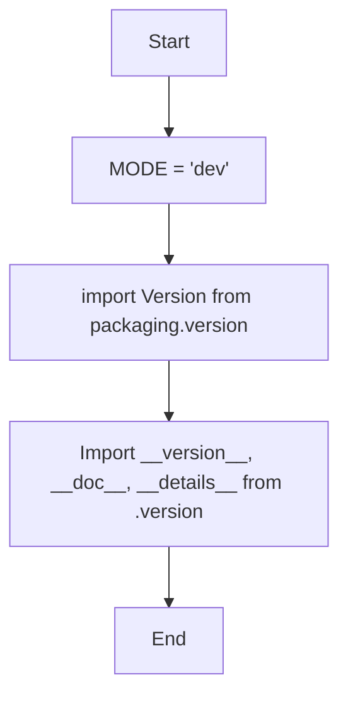

## Анализ кода `hypotez/src/webdriver/edge/extentions/__init__.py`

### 1. <алгоритм>

1. **Инициализация:**
   - Устанавливается переменная `MODE` в значение `'dev'`.
   - Импортируются `Version` из `packaging.version`.
   - Из модуля `src.webdriver.edge.extentions.version` импортируются `__version__`, `__doc__` и `__details__`.

2. **Работа с версиями:**
   - Используется `packaging.version.Version` для сравнения версий (не показано в данном коде).
   - Переменная `__version__` (предположительно строка, содержащая текущую версию) используется для определения версии.
   - Переменная `__doc__` (предположительно строка, содержащая документацию) содержит документацию модуля.
   - Переменная `__details__` (предположительно строка, содержащая детали) содержит детали о модуле.

**Примеры:**

-   `MODE = 'dev'` - устанавливает режим работы в режим разработки.
-   `from packaging.version import Version` - импортирует класс `Version` для работы с версиями.
-   `from .version import __version__, __doc__, __details__` - импортирует переменные для работы с версией, документацией и деталями модуля.

### 2. <mermaid>

**Объяснение:**

-   `Start`: Начало выполнения кода.
-   `SetMode`: Устанавливает переменную `MODE` в значение `'dev'`.
-   `ImportVersion`: Импортирует класс `Version` из библиотеки `packaging.version`.
-   `ImportModuleVersion`: Импортирует переменные `__version__`, `__doc__` и `__details__` из модуля `version.py` (находится в той же директории).
-   `End`: Завершение выполнения.

### 3. <объяснение>

**Импорты:**

-   `from packaging.version import Version`:
    -   Импортирует класс `Version` из библиотеки `packaging`.
    -   `packaging.version` используется для работы с версиями пакетов, позволяет сравнивать версии и выполнять другие операции.
    -   Это позволяет использовать `Version` для сравнения версий, что полезно для управления зависимостями и совместимостью.

-   `from .version import __version__, __doc__, __details__`:
    -   Импортирует переменные `__version__`, `__doc__` и `__details__` из модуля `version.py`, который находится в той же директории (`src.webdriver.edge.extentions`).
    -   `__version__` - строка, обычно содержащая версию текущего модуля/пакета.
    -   `__doc__` - строка документации, содержащая описание модуля/пакета.
    -   `__details__` - строка, содержащая детальную информацию о модуле/пакете.
    -   Этот импорт позволяет модулю получить доступ к информации о своей собственной версии, документации и деталях.

**Переменные:**

-   `MODE = 'dev'`:
    -   `MODE` - переменная, устанавливающая режим работы модуля.
    -   Значение `'dev'` указывает на то, что модуль находится в режиме разработки.
    -   Эта переменная может использоваться для определения поведения модуля в различных условиях (например, включение отладки в режиме разработки).

**Общая структура и назначение:**

-   `__init__.py` - файл инициализации пакета `src.webdriver.edge.extentions`.
-   Он устанавливает основную конфигурацию и экспортирует основные компоненты пакета.
-   Импорт `Version` и переменных из `version.py` позволяет пакету управлять версиями и предоставлять информацию о себе.
-   Установка `MODE = 'dev'` предполагает, что в пакете может быть логика, зависящая от режима работы.

**Потенциальные улучшения:**

-   Добавление комментариев, поясняющих назначение модуля.
-   Улучшение документации, `__doc__` и `__details__` в `version.py`.
-   Реализация логики, использующей `MODE` для настройки поведения.
-   Добавление обработки исключений при работе с `packaging.version`, если это необходимо.

**Цепочка взаимосвязей:**

-   Пакет `src.webdriver.edge.extentions` может быть использован для расширения функциональности веб-драйвера Edge.
-   Зависит от пакета `packaging` для управления версиями.
-   Использует модуль `version.py` для определения своей версии и документации.
-   Может быть частью более крупной системы, например, автоматизированных тестов или веб-скрапинга.