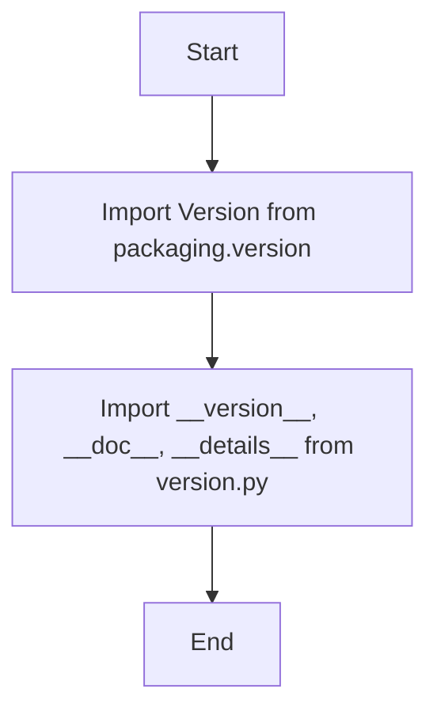

## Анализ кода `hypotez/src/webdriver/edge/extentions/__init__.py`

### 1. <алгоритм>

1. **Импорт модуля `Version` из `packaging.version`:**
   - Пример: `from packaging.version import Version`.
   - Этот шаг импортирует класс `Version` для сравнения и работы с версиями программного обеспечения.
   - Данные: `packaging.version` -> `Version`

2. **Импорт переменных из `src.webdriver.edge.extentions.version`:**
   - Пример: `from .version import __version__, __doc__, __details__`.
   - Импортируются строковые переменные `__version__`, `__doc__` и `__details__` из файла `version.py` внутри текущего пакета `extentions`.
     -`__version__` - содержит версию пакета в виде строки.
     -`__doc__` - строка документации.
     -`__details__`- строка с детальной информацией о пакете.
   - Данные: `src.webdriver.edge.extentions.version` -> `__version__`, `__doc__`, `__details__`

### 2. <mermaid>

**Объяснение зависимостей `mermaid`:**

-   **`Start`**: Начало выполнения скрипта.
-   **`ImportVersion`**: Импортирует класс `Version` из библиотеки `packaging.version`. Этот класс предназначен для работы с версиями, позволяя сравнивать их и т.д.
-   **`ImportFromVersionFile`**: Импортирует переменные `__version__`, `__doc__`, и `__details__` из файла `version.py` в том же пакете. Эти переменные содержат информацию о версии, документацию и подробности пакета.
-  **`End`**: Конец выполнения скрипта.

### 3. <объяснение>

**Импорты:**

-   `from packaging.version import Version`: Импортирует класс `Version` из библиотеки `packaging.version`. Этот класс позволяет работать с версиями пакетов, сравнивать их, и т.д. `packaging` не является частью пакета `src`. Это сторонняя библиотека, предназначенная для работы с версиями.
-   `from .version import __version__, __doc__, __details__`: Импортирует переменные `__version__` (строка, представляющая текущую версию пакета), `__doc__` (строка, содержащая документацию пакета) и `__details__` (строка с подробной информацией о пакете) из модуля `version.py`, который находится в том же пакете `extentions`.

**Переменные:**

-   `__version__`: Строка, которая указывает текущую версию пакета. Эта переменная используется для отслеживания версии и может быть использована в других частях проекта для проверки совместимости, вывода информации и т.д.
-   `__doc__`: Строка документации, предназначенная для описания модуля `extentions`.  Используется для предоставления информации о модуле при просмотре документации или использовании help().
-   `__details__`: Строка, которая содержит более подробные сведения о пакете.

**Общая функциональность:**

Файл `__init__.py` в Python используется для того, чтобы отметить каталог как пакет, и делает возможным импорт модулей из этого пакета. В данном случае, он импортирует `Version` для работы с версиями, а также версию, документацию и детали из `version.py`, делая их доступными при импорте пакета `src.webdriver.edge.extentions`. Это позволяет другим частям проекта получать информацию о версии данного пакета, документацию и другую метаинформацию.

**Потенциальные области для улучшения:**

1. **Согласованность:** Многочисленные строки `"""` в начале файла избыточны и не несут смысловой нагрузки. Их следует удалить.
2. **Документация:**  В `__doc__` переменной должна быть добавлена документация о пакете `extentions`.
3.  **`#!` shebang:** Она не имеет смысла внутри `__init__.py`, ее необходимо удалить. Она должна быть в скриптах, которые должны выполнятся как самостоятельные.

**Цепочка взаимосвязей:**

1. **`packaging.version`**: Используется для работы с версиями пакетов. Это внешняя зависимость.
2. **`src.webdriver.edge.extentions.version`**: Модуль, содержащий информацию о версии, документации и деталях текущего пакета. Этот модуль, скорее всего, определен внутри пакета `extentions`.
3. **Другие части проекта**: Могут использовать `__version__`, `__doc__`, и `__details__` после импорта пакета `src.webdriver.edge.extentions` для получения информации о его версии и другой метаинформации.

Этот файл представляет собой начальную точку для пакета `src.webdriver.edge.extentions` и предоставляет метаданные, такие как версия пакета и документация.