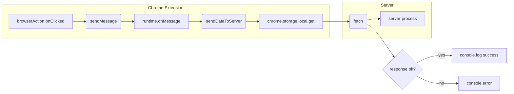

# Анализ кода background.js

## <input code>

```javascript
// background.js
chrome.browserAction.onClicked.addListener(tab => {
    chrome.tabs.sendMessage(tab.id, { action: 'collectData', url: tab.url });
});

/**
 * 
 * This function listens for messages sent from other parts of the extension, 
 * such as content scripts or other background scripts, using the `chrome.runtime.sendMessage()` method.
 */
chrome.runtime.onMessage.addListener((message, sender, sendResponse) => {
    if (message.action === 'collectData') {
        sendDataToServer(message.url);
    }
});

function sendDataToServer(url) {
    const serverUrl = 'http://127.0.0.1/hypotez.online/api/'; // Change to your server endpoint
    chrome.storage.local.get('collectedData', (result) => {
        const collectedData = result.collectedData;
        if (collectedData) {
            fetch(serverUrl, {
                method: 'POST',
                headers: {
                    'Content-Type': 'application/json'
                },
                body: JSON.stringify(collectedData)
            })
                .then(response => {
                    if (!response.ok) {
                        throw new Error('Failed to send data to server');
                    }
                    console.log('Data sent to server successfully');
                })
                .catch(error => {
                    console.error('Error sending data to server:', error);
                });
        } else {
            console.error('No collected data found');
        }
    });
}
```

## <algorithm>

**Блок-схема:**

```mermaid
graph TD
    A[Клик по иконке расширения] --> B{Получить ID вкладки};
    B --> C[Отправить сообщение в вкладку];
    C --> D{Принять сообщение 'collectData'};
    D --> E[Вызвать sendDataToServer(url)];
    E --> F[Получить 'collectedData' из хранилища];
    F -- data есть --> G[Отправить POST запрос на сервер];
    F -- data нет --> H[Вывести сообщение об ошибке];
    G --> I[Обработка ответа от сервера];
    I -- ok --> J[Вывести сообщение об успехе];
    I -- error --> K[Вывести сообщение об ошибке];
    H --> K;
```

**Пример:**

Пользователь кликает по иконке расширения на странице с URL `https://example.com`.

1. `chrome.browserAction.onClicked.addListener`:  Получает ID вкладки.
2. `chrome.tabs.sendMessage`: Отправляет сообщение в текущую вкладку с типом `collectData` и URL страницы.
3. `chrome.runtime.onMessage.addListener`: Принимает сообщение `collectData` и URL.
4. `sendDataToServer`: Получает URL.
5. `chrome.storage.local.get`:  Ищет данные в локальном хранилище по ключу `collectedData`. Предположим, что данные есть.
6. `fetch`: Отправляет POST-запрос на сервер с данными `collectedData`.
7. Обработка ответа: Сервер возвращает ответ. Если ответ успешен, выводится сообщение об успехе. В противном случае - сообщение об ошибке.


## <mermaid>



**Описание зависимостей:**

* `chrome.browserAction.onClicked`: Зависимость от Chrome API. Слушает клики по иконке расширения.
* `chrome.tabs.sendMessage`:  Зависимость от Chrome API. Отправляет сообщения вкладки.
* `chrome.runtime.onMessage.addListener`: Зависимость от Chrome API. Слушает сообщения, отправленные в расширение.
* `chrome.storage.local.get`: Зависимость от Chrome API.  Доступ к локальному хранилищу.
* `fetch`: Зависимость от JavaScript. Отправляет HTTP-запросы (POST в данном случае).

## <explanation>

**Импорты:**

Нет прямых импортов, т.к. используется API Chrome.

**Классы:**

Нет классов.

**Функции:**

* `chrome.browserAction.onClicked.addListener(tab => { ... })`: Обработчик клика по иконке расширения. Принимает объект `tab` с информацией о вкладке. Отправляет сообщение в вкладку, содержащее действие `collectData` и URL текущей вкладки.
* `chrome.runtime.onMessage.addListener((message, sender, sendResponse) => { ... })`: Обработчик сообщений, отправленных в расширение. Принимает `message` (объект с данными), `sender` (информация об отправителе) и `sendResponse` (функция для ответа).  Если сообщение имеет действие `collectData`, вызывает `sendDataToServer` с URL из сообщения.
* `sendDataToServer(url)`: Функция отправляет POST-запрос на сервер с собранными данными.  Принимает URL.  Использует `chrome.storage.local` для получения данных из локального хранилища.  Обрабатывает успешные и неудачные ответы от сервера.

**Переменные:**

* `serverUrl`: Строка, содержащая URL сервера.
* `collectedData`: Данные, полученные из хранилища.

**Возможные ошибки и улучшения:**

* **Отсутствие проверки URL:** Функция `sendDataToServer` не проверяет корректность входного URL, что может привести к ошибкам.
* **Обработка ошибок `fetch`:** Обработка ошибок `fetch` могла бы быть более подробной (например, с указанием статуса ответа).
* **Управление ошибками `chrome.storage.local.get`:** Нужно указать, что делать, если нет `collectedData`.
* **Проверка на пустоту `collectedData`:** Проверка на пустоту `collectedData` должна происходить до `JSON.stringify`.
* **Логирование:**  Добавление логирования для лучшего отслеживания ошибок, особенно при использовании `fetch`.
* **Задержка:** Необходимо учитывать возможность задержки при запросах к серверу.


**Взаимосвязь с другими частями проекта:**

Эта часть расширения взаимодействует с `content script` или другой частью расширения, которая собирает данные и сохраняет их в `chrome.storage.local`.  Например, скрипт на странице может выполнить сбор данных и сохранить результат в `collectedData`.