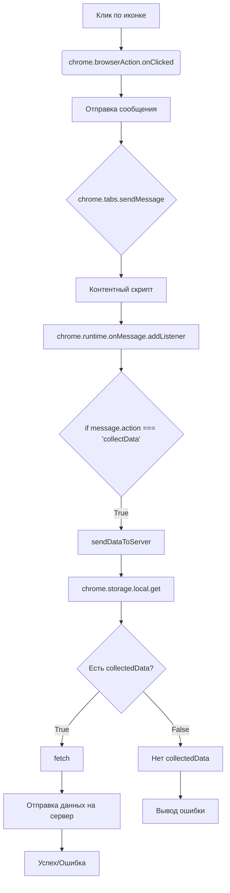

```MD
# Анализ кода background.js

## <input code>

```javascript
// background.js

chrome.browserAction.onClicked.addListener(tab => {
    chrome.tabs.sendMessage(tab.id, { action: 'collectData', url: tab.url });
});

/**
 * 
 * This function listens for messages sent from other parts of the extension, 
 * such as content scripts or other background scripts, using the `chrome.runtime.sendMessage()` method.
 *
Here's a breakdown of what each part does:
- `chrome.runtime.onMessage.addListener()`: 
This function sets up a listener for messages sent from other parts of the extension.
- `(message, sender, sendResponse) => { ... }`: This is an arrow function that defines what should happen when a message is received. It takes three parameters:
  - `message`: The message object sent from the sender.
  - `sender`: Information about the sender of the message, such as its ID and whether it is a tab or another extension.
  - `sendResponse`: A function that can be used to send a response back to the sender if needed.
- `if (message.action === 'collectData') { ... }`: This condition checks if the received message has a property named `action` with a value of `'collectData'`. This is often used to determine the purpose or type of the message.
- `sendDataToServer(message.url)`: If the received message has an action of `'collectData'`, this function calls another function named `sendDataToServer()` and passes the URL from the message as an argument. This typically triggers some action or behavior in response to the received message.

In summary, this function listens for messages with the action `'collectData'`, and when such a message is received, it triggers the `sendDataToServer()` function, presumably to collect data and send it to a server.
 */
chrome.runtime.onMessage.addListener((message, sender, sendResponse) => {
    if (message.action === 'collectData') {
        sendDataToServer(message.url);
    }
});

function sendDataToServer(url) {
    const serverUrl = 'http://127.0.0.1/hypotez.online/api/'; // Change to your server endpoint
    chrome.storage.local.get('collectedData', (result) => {
        const collectedData = result.collectedData;
        if (collectedData) {
            fetch(serverUrl, {
                method: 'POST',
                headers: {
                    'Content-Type': 'application/json'
                },
                body: JSON.stringify(collectedData)
            })
                .then(response => {
                    if (!response.ok) {
                        throw new Error('Failed to send data to server');
                    }
                    console.log('Data sent to server successfully');
                })
                .catch(error => {
                    console.error('Error sending data to server:', error);
                });
        } else {
            console.error('No collected data found');
        }
    });
}
```

## <algorithm>

**Шаг 1:**  `chrome.browserAction.onClicked.addListener(tab => { ... });` - Вешается обработчик на клик по иконке расширения.  
* **Пример:** Пользователь кликает по иконке.
* **Входные данные:** `tab` (объект, содержащий информацию о вкладке).

**Шаг 2:** `chrome.tabs.sendMessage(tab.id, { action: 'collectData', url: tab.url });` - Отправляется сообщение в активную вкладку с действием `collectData` и URL.
* **Входные данные:** `tab.id`, `tab.url`
* **Пример:** Отправляется сообщение в вкладку с URL `https://example.com`.

**Шаг 3:** `chrome.runtime.onMessage.addListener((message, sender, sendResponse) => { ... });` - Вешается обработчик на получение сообщений из других частей расширения (вероятно, из контентных скриптов).
* **Входные данные:** `message` (сообщение от контентного скрипта), `sender` (информация об отправителе), `sendResponse` (функция для отправки ответа).

**Шаг 4:** `if (message.action === 'collectData') { sendDataToServer(message.url); }` - Если полученное сообщение имеет `action: 'collectData'`, вызывается `sendDataToServer` для отправки данных на сервер.
* **Входные данные:** `message.url`
* **Пример:**  Получено сообщение с `message.url` = `https://example.com`.

**Шаг 5:** `function sendDataToServer(url) { ... }` -  Отправляет собранные данные на сервер с помощью `fetch`.
* **Входные данные:** `url` (URL страницы).
* **Пример:**  URL страницы `https://example.com` передается в `sendDataToServer`.
* **Внутренняя логика:** Получает данные из хранилища `chrome.storage.local`. Если данные есть, отправляет их на `serverUrl` с помощью POST запроса.


## <mermaid>



## <explanation>

**Импорты:** Нет явных импортов из других модулей (из `src`).  Код использует API Chrome Extensions.

**Классы:** Нет классов.

**Функции:**

* `chrome.browserAction.onClicked.addListener(tab => { ... });`: Обработчик клика по иконке расширения. Принимает объект `tab` с информацией о вкладке. Отправляет сообщение в текущую вкладку.
* `chrome.tabs.sendMessage(tab.id, { action: 'collectData', url: tab.url });`: Отправляет сообщение в активную вкладку с действием `collectData` и URL текущей вкладки.
* `chrome.runtime.onMessage.addListener((message, sender, sendResponse) => { ... });`: Обработчик сообщений, полученных из других частей расширения.
* `sendDataToServer(url)`: Функция, которая отправляет собранные данные на сервер. Принимает `url`.  Использует `chrome.storage.local.get` для получения данных и `fetch` для отправки POST запроса на сервер.

**Переменные:**

* `serverUrl`: Строковая переменная, содержащая URL сервера.  Значение должно быть изменено на корректный URL.
* `collectedData`: Переменная, хранящая собранные данные. Получается из хранилища `chrome.storage.local`.

**Возможные ошибки и улучшения:**

* **Обработка ошибок `fetch`:** Должны быть добавлены проверки ответа `response.ok` на случай, если сервер вернул ошибку.
* **Логирование ошибок:**  Более детальное логирование ошибок (вместо `console.error`) с указанием причин поможет в отладке.
* **Обработка случаев отсутствия данных:** Должна быть более ясная логика обработки случая, когда данные не найдены в `chrome.storage.local`.
* **Безопасность:**  Необходимо указать способ защиты от несанкционированного доступа к хранилищу.
* **Повторная отправка:** Если произошла ошибка отправки данных на сервер, код должен предусматривать механизм повторной попытки.
* **Управление состоянием:** Код не учитывает возможность одновременного отправления запросов. Нужно продумать механизм, который гарантирует, что только один запрос обрабатывается в одно время.
* **Асинхронность:** Необходимо учитывать асинхронность операций, особенно `fetch`.  Возможна потеря данных или одновременная обработка запросов.

**Взаимосвязи с другими частями проекта:**

Код взаимодействует с контентными скриптами, которые должны собирать данные и отправлять сообщения в `background.js` с указанием `action: 'collectData'` и `url`.  Кроме того, `background.js`  работает с хранилищем данных `chrome.storage.local`.  Расширение использует HTTP POST запрос к внешнему серверу (`hypotez.online/api`).