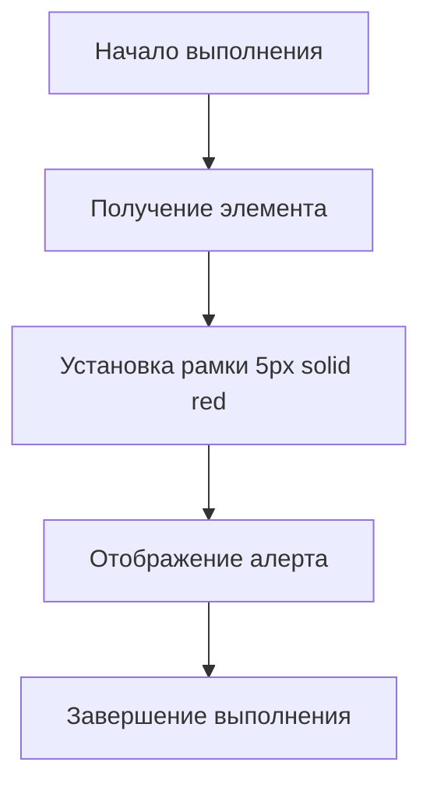

## АНАЛИЗ КОДА: `hypotez/src/webdriver/edge/extentions/test_extention/borderify.js`

### 1. <алгоритм>

1.  **Начало:** Скрипт начинает выполнение, как только страница полностью загружена в браузере.
2.  **Изменение стиля `body`:**
    *   Скрипт получает доступ к элементу `body` DOM дерева текущей веб-страницы (`document.body`).
    *   Свойству `style.border` элемента `body` присваивается значение `"5px solid red"`. Это добавляет красную рамку толщиной 5 пикселей вокруг содержимого веб-страницы.
    *   **Пример:** Если на странице есть текст, изображения и другие элементы, все они будут обведены красной рамкой.
3.  **Вывод оповещения (alert):**
    *   Функция `alert()` выводит модальное окно с сообщением (значение по умолчанию - undefined), блокируя дальнейшее взаимодействие с веб-страницей до подтверждения.
    *  **Пример:** На экране появляется окно с сообщением "undefined".
4. **Конец:** Выполнение скрипта завершается.

### 2. <mermaid>

**Объяснение `mermaid` диаграммы:**

*   `Start`: Начало выполнения скрипта.
*   `GetBody`:  Получение доступа к элементу `body` DOM дерева текущей веб-страницы. Это объект `document.body`.
*   `SetBorder`: Изменение CSS свойства `border` элемента `body`, добавление красной рамки.
*   `ShowAlert`: Вывод модального окна alert().
*   `End`: Завершение выполнения скрипта.

В этом коде нет импорта, поэтому дополнительный блок `mermaid` для `header.py` не требуется.

### 3. <объяснение>

**Общая функциональность:**

Данный JavaScript код, используемый как расширение для браузера, изменяет стиль веб-страницы, добавляя красную рамку вокруг всего её содержимого и выводит alert (без параметра).

**Детальный разбор:**

*   **`document.body`**:
    *   Это встроенный объект JavaScript, который представляет элемент `<body>` HTML-документа. Он является корнем содержимого видимой части веб-страницы.
    *   Свойство `document.body` позволяет получить доступ к этому элементу и манипулировать его свойствами.
    *   **Тип**: `HTMLElement`.
*   **`document.body.style.border`**:
    *   Свойство `style` элемента `body` предоставляет доступ к его стилям CSS.
    *   Свойство `border` позволяет установить или получить значение CSS свойства `border`.
    *   В данном случае, устанавливается значение `"5px solid red"`.
    *   **Тип**: `String`.
*   **`"5px solid red"`**:
    *   Строка, представляющая CSS свойство `border`.
    *   `5px`: толщина рамки 5 пикселей.
    *   `solid`: тип линии - сплошная.
    *   `red`: цвет рамки - красный.
*   **`alert()`**:
    *   Встроенная функция JavaScript, которая выводит модальное окно с сообщением. Если сообщение не передано в качестве аргумента, то выводится undefined.
    *   Она используется для отображения простых сообщений пользователю.
    *   **Возвращаемое значение**:  `undefined`.

**Потенциальные ошибки и области для улучшения:**

1.  **Отсутствие параметров в `alert()`**: Вывод `alert()` без параметров не является ошибкой, но это не очень информативно для пользователя. Следует передавать сообщение в `alert()`.
2.  **Жестко заданные значения**: Значение рамки (`5px solid red`) жестко закодировано. Можно было бы сделать более гибкий код, позволяющий настраивать толщину, тип и цвет рамки через параметры или настройки.
3. **Назначение кода**: Код подходит только для отладки и тестирования, так как добавляет рамку и выводит alert без параметров. Для реальных расширений браузера  код должен решать более прикладные задачи.
4. **Отсутствие взаимодействия с другими частями проекта**: Этот скрипт не взаимодействует с другими файлами проекта (нет импортов, вызовов других функций).

**Цепочка взаимосвязей с другими частями проекта:**

В данном коде нет явных связей с другими частями проекта. Этот код является самодостаточным и выполняется независимо в контексте браузера.  Он, по-сути, является примером простого расширения для браузера, которое  может быть частью более сложной системы тестирования веб-страниц.