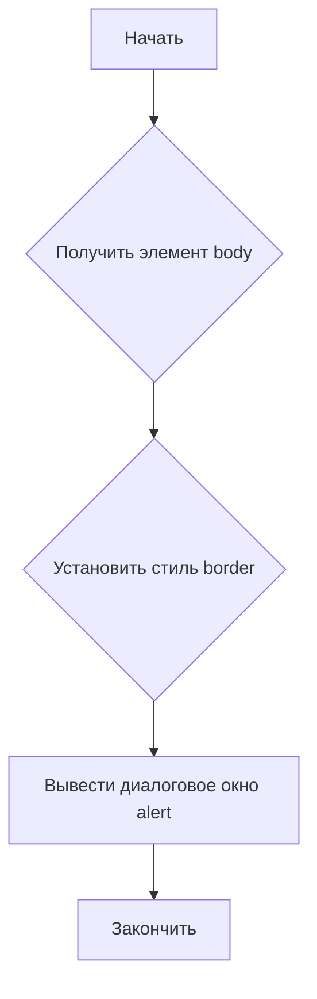

```MD
# Анализ кода borderify.js

**<input code>**

```javascript
document.body.style.border = "5px solid red";
alert()
```

**<algorithm>**



**Пример:**

1. **Начать:** Выполнение скрипта.
2. **Получить элемент body:** Код получает доступ к элементу `body` на странице.
3. **Установить стиль border:** Устанавливает свойство `border` для элемента `body` на значение "5px solid red".  В результате вокруг всего содержимого страницы появляется красная рамка.
4. **Вывести диалоговое окно alert:** Вызывает диалоговое окно `alert()`.  Пользователь видит всплывающее окно с сообщением.
5. **Закончить:** Выполнение скрипта завершается.

**<mermaid>**

```mermaid
graph LR
    A[document] --> B(body);
    B --> C{style.border = "5px solid red"};
    C --> D[alert()];
```

**Зависимости:**

Код напрямую использует встроенные возможности JavaScript, не зависящие от внешних библиотек или модулей.  `document`, `body` и `style` - это встроенные объекты языка JavaScript.  `alert()` также встроенная функция.

**<explanation>**

* **Импорты:** Нет импортов. Код использует только встроенные возможности языка JavaScript.
* **Классы:** Нет классов.
* **Функции:** Код использует встроенную функцию `alert()`, которая выводит диалоговое окно. Функция `document.body.style.border = "5px solid red";` - это инструкция, которая не возвращает значения.
* **Переменные:** Нет явно объявленных переменных.
* **Возможные ошибки или области для улучшений:**

    * Код не обрабатывает потенциальные ошибки. Например, если `document.body` не существует (например, страница не загрузилась полностью), код может вызвать ошибку.
    * Код может быть слишком простым для реального использования.  Для добавления динамики и взаимодействия с пользователем потребуется больше кода, который мог бы, например, реагировать на события, изменять стиль рамки или добавлять дополнительные элементы.

**Взаимосвязи с другими частями проекта:**

Код `borderify.js`  является самостоятельным скриптом, который, вероятно, исполняется на странице веб-приложения. Его действие ограничивается изменением внешнего вида страницы и отображением диалогового окна.  Он не взаимодействует напрямую с другими частями проекта, если только они не включают этот файл в свой HTML.  Его функциональность основана на базовых методах DOM и JavaScript.