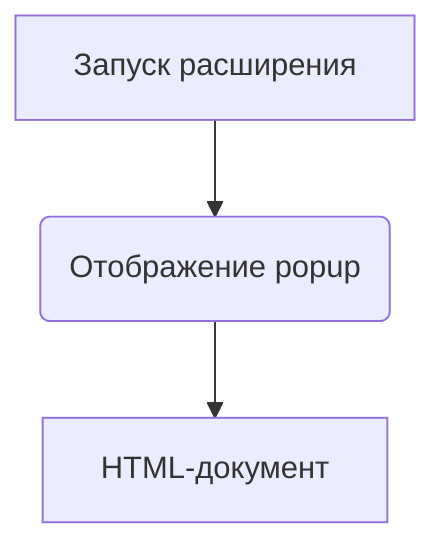

```MD
# Анализ кода popup.html

**1. <input code>**

```html
## \file hypotez/src/webdriver/edge/extentions/test_extention/html/popup.html
# -*- coding: utf-8 -*-\
#! venv/Scripts/python.exe

""" module: src.webdriver.edge.extentions.test_extention.html """
MODE = 'debug'
<!-- popup.html -->

<!DOCTYPE html>
<html>
<head>
    <title>hypotez</title>
    <style>
        body {
            width: 200px;
            padding: 10px;
        }
    </style>
</head>
<body>
    <h1>hypotez</h1>
    <p>Click the extension icon to collect data from the current webpage.</p>
</body>
</html>
```

**2. <algorithm>**

Этот код представляет собой HTML-документ, который отображается как всплывающее окно (popup) расширения браузера.  Алгоритм работы сводится к отображению простой HTML страницы.  Нет сложных вычислений или динамических процессов.

**Пример:** При запуске расширения браузера отображается всплывающее окно с заголовком "hypotez" и текстом "Click the extension icon to collect data...".



**3. <mermaid>**

```mermaid
graph LR
    A[popup.html] --> B(HTML-код);
    B --> C[Заголовок "hypotez"];
    B --> D[Текст "Click..."];
    B --> E[CSS стили];
```

**4. <explanation>**

* **Импорты:**  В данном файле нет импортов Python-модулей.  Файл целиком представляет собой HTML-шаблон. Он относится к папке `hypotez/src/webdriver/edge/extentions/test_extention/html`, что предполагает, что он предназначен для использования в контексте веб-расширения для браузера Edge.

* **Классы:** Нет определённых классов.

* **Функции:** Нет определённых функций.

* **Переменные:**  `MODE = 'debug'` — глобальная константа, хранящая строку 'debug'.  Она определяет режим работы, но в данном контексте  не влияет на функцинирование html страницы, а скорее на поведение кода, который будет использован расширением.  Его значение  может быть использовано  в  других частях  проекта для логирования или настройки.

* **Возможные ошибки или области для улучшений:**

    * **Недостаток динамики:**  Сейчас страница статическая. Для сбора данных с веб-страницы, необходимо будет использовать JavaScript и API расширения браузера.   Необходимо добавить JavaScript код для получения необходимых данных.
    * **Отсутствие обработки событий:** Отсутствует логика, реагирующая на события (например, клик на элементы).  Для сбора данных, нужна обработка событий, чтобы запустить соответствующие функции.
    * **Недостающая логика сбора данных:**  Отсутствует код для сбора данных с текущей веб-страницы, необходимой для расширения.


**Цепочка взаимосвязей:**

Файл `popup.html`  является частью расширения для браузера Edge.  Он предполагает существование других компонентов, которые будут взаимодействовать с ним (например, JavaScript код, который обрабатывает события клика и отправляет запросы на сервер для получения данных).  Таким образом,  `popup.html` является интерфейсом для взаимодействия пользователя с расширением, а  другие части  проекта будут обеспечивать  функциональность сбора и обработки данных.