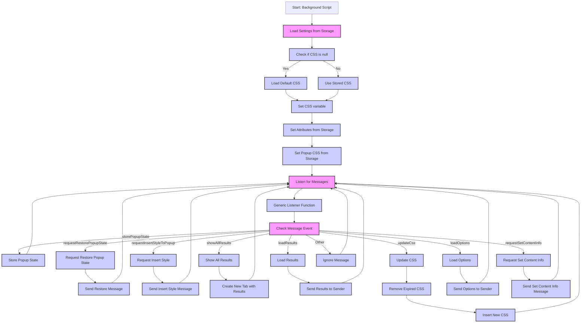

## <алгоритм>

1.  **Инициализация:**
    *   Объявляются переменные:
        *   `tx` (alias для `tryxpath`).
        *   `fu` (alias для `tryxpath.functions`).
        *   `popupState` (изначально `null`).
        *   `popupCss` (CSS для попапа, по умолчанию `body{width:367px;height:auto;}`).
        *   `results` (объект для хранения результатов, изначально пустой).
        *   `css` (строка для хранения CSS, изначально пустая).
        *   `attributes` (объект с атрибутами, такими как `element`, `context`, `focused` и т.д.).
    *   Создается функция `loadDefaultCss`, которая асинхронно загружает CSS из файла `/css/try_xpath_insert.css` и возвращает Promise.

2.  **Обработчик сообщений `genericListener`:**
    *   Создается функция `genericListener`, которая служит общим обработчиком для сообщений.
    *   `genericListener.listeners` - это объект, который хранит функции-обработчики для конкретных событий.
    *   Функция `genericListener` проверяет, есть ли обработчик для полученного события `message.event` в `genericListener.listeners`. Если есть, то вызывает его.
    *   Событие `browser.runtime.onMessage` добавляет слушателя `genericListener` для обработки сообщений.

3.  **Обработчики конкретных сообщений (в `genericListener.listeners`):**
    *   `storePopupState`:
        *   Принимает сообщение `message` и сохраняет значение `message.state` в `popupState`.
        *   Пример: сообщение `{"event": "storePopupState", "state": "someState"}` сохранит `"someState"` в `popupState`.
    *   `requestRestorePopupState`:
        *   Отправляет сообщение обратно в runtime с событием `restorePopupState` и текущим `popupState`.
        *   Пример: отправляет `{"timeout":0,"timeout_for_event":"presence_of_element_located","event": "restorePopupState", "state": "someState"}`.
    *   `requestInsertStyleToPopup`:
        *   Отправляет сообщение обратно в runtime с событием `insertStyleToPopup` и текущим `popupCss`.
        *   Пример: отправляет `{"timeout":0,"timeout_for_event":"presence_of_element_located","event": "insertStyleToPopup", "css": "body{width:367px;height:auto;}"}`.
    *   `showAllResults`:
        *   Получает результаты, удаляет из сообщения поле `event`, сохраняет результаты в переменную `results`, добавляет `tabId` и `frameId` и открывает новую вкладку с `show_all_results.html`.
        *   Пример: сообщение `{"event": "showAllResults", "xpath": "//div", "elements": ["element1", "element2"]}` приведет к открытию новой вкладки.
    *   `loadResults`:
        *   Отправляет текущие результаты `results` в ответ на запрос.
        *   Пример: сообщение `{"event": "loadResults"}` вернет объект `results`.
    *   `updateCss`:
        *   Получает `expiredCssSet` и `css`.
        *   Удаляет старый CSS (если есть) из вкладки, затем вставляет новый CSS.
        *   После удаления и добавления CSS отправляет подтверждающие сообщения `finishRemoveCss` и `finishInsertCss` соответственно.
        *   Пример: сообщение `{"event": "updateCss", "expiredCssSet": ["oldCss"], "css": "body{background:red}"}` удалит `oldCss` и добавит новый.
    *   `loadOptions`:
        *   Отправляет в ответ текущие значения `attributes`, `css` и `popupCss`.
        *   Пример: сообщение `{"event": "loadOptions"}` вернет объект со значениями.
    *   `requestSetContentInfo`:
        *   Отправляет сообщение `setContentInfo` с текущими `attributes` во вкладку, с которой пришел запрос.
        *   Пример: сообщение `{"event": "requestSetContentInfo"}` отправит `attributes` в активную вкладку.

4.  **Слушатель изменений хранилища `browser.storage.onChanged`:**
    *   Слушает изменения в `browser.storage`.
    *   Если изменились `attributes`, `css` или `popupCss`, обновляет соответствующие переменные.
    *   Пример: если в `browser.storage` изменится `attributes` то обновиться и локальная переменная `attributes`.

5.  **Загрузка настроек из хранилища `browser.storage.sync.get`:**
    *   Загружает настройки из `browser.storage.sync`.
    *   Если `css` равно `null`, то загружает CSS по умолчанию через `loadDefaultCss()`.
    *   Обновляет переменные `attributes`, `popupCss` и `css` на основе загруженных значений.
    *   Пример: после загрузки из `browser.storage` значения сохранятся в переменные `attributes`, `popupCss` и `css`.

## <mermaid>

**Объяснение зависимостей `mermaid`:**

*   **`Start`**: Начало выполнения скрипта.
*   **`LoadSettings`**: Загрузка настроек, включая `attributes`, `css` и `popupCss`, из хранилища `browser.storage.sync`.
*    **`CheckCSS`**: Проверяет, является ли `css` `null` или нет.
*    **`LoadDefaultCSS`**: Загружает CSS по умолчанию, если в хранилище `css` был `null`.
*    **`UseStoredCSS`**: Использует загруженный из хранилища `css`.
*   **`SetCSS`**: Устанавливает CSS переменную.
*   **`SetAttributes`**: Устанавливает переменную `attributes` из загруженных настроек.
*    **`SetPopupCss`**: Устанавливает переменную `popupCss` из загруженных настроек.
*   **`ListenForMessages`**: Устанавливает слушатель сообщений `browser.runtime.onMessage` для обработки входящих сообщений.
*   **`GenericListener`**: Функция-обработчик входящих сообщений, которая определяет тип сообщения и вызывает соответствующий обработчик.
*    **`CheckEvent`**: Проверяет тип сообщения.
*   **`StorePopupState`**: Сохраняет состояние попапа.
*   **`RequestRestoreState`**: Отправляет запрос на восстановление состояния попапа.
*   **`RequestInsertStyle`**: Отправляет запрос на вставку CSS в попап.
*   **`ShowResults`**: Обрабатывает запрос на отображение всех результатов, открывая новую вкладку.
*   **`LoadResults`**: Отправляет текущие результаты по запросу.
*    **`UpdateCSS`**: Обрабатывает запрос на обновление CSS, удаляя старый и добавляя новый.
*    **`LoadOptions`**: Отправляет текущие опции по запросу.
*    **`RequestSetInfo`**: Отправляет запрос на установку информации о контенте.
*   **`SendRestoreMessage`**: Отправляет сообщение с запросом на восстановление состояния.
*   **`SendInsertStyleMessage`**: Отправляет сообщение с запросом на вставку CSS.
*   **`CreateTab`**: Создает новую вкладку для отображения результатов.
*   **`SendResults`**: Отправляет результаты отправителю сообщения.
*    **`RemoveOldCSS`**: Удаляет старый CSS.
*    **`InsertNewCSS`**: Вставляет новый CSS.
*   **`SendOptions`**: Отправляет опции отправителю сообщения.
*    **`SendSetContentMessage`**: Отправляет сообщение с информацией о контенте.
*   **`IgnoreMessage`**: Игнорирует сообщения, которые не соответствуют ни одному из условий.

## <объяснение>

**Импорты:**

*   `browser.runtime`: API для взаимодействия с расширением, включает в себя отправку и прослушивание сообщений, управление вкладками и т.д.
*   `browser.storage`: API для хранения настроек расширения, как в локальном хранилище, так и в синхронизированном хранилище.
*   `browser.tabs`: API для взаимодействия со вкладками.

**Глобальные Переменные:**

*   `tx`: Псевдоним для пространства имен `tryxpath`, предполагается, что оно определено в другом месте и содержит функциональность для работы с XPath.
*   `fu`: Псевдоним для `tryxpath.functions`, также предполагается, что это объект с функциями, используемыми в данном коде (например, `onError`).
*   `popupState`: Состояние попапа (например, раскрыт или нет), используется для восстановления состояния.
*   `popupCss`: CSS стили для попапа.
*   `results`: Объект, содержащий результаты поиска XPath.
*   `css`: CSS стили для выделения элементов на странице.
*   `attributes`: Объект, содержащий имена атрибутов, которые используются для идентификации элементов (например, `data-tryxpath-element`).

**Функции:**

*   **`loadDefaultCss()`**:
    *   **Аргументы:** Нет.
    *   **Возвращаемое значение:** `Promise`, который разрешается со строкой CSS (текст файла `try_xpath_insert.css`).
    *   **Назначение:** Асинхронно загружает CSS из файла, используя `XMLHttpRequest`, и возвращает `Promise`, позволяя использовать `.then()` для обработки результата.
    *   **Пример**: Вызывается при первой загрузке или если CSS не был сохранен в `browser.storage`.
*   **`genericListener(message, sender, sendResponse)`**:
    *   **Аргументы:**
        *   `message`: Объект, содержащий сообщение от контент скрипта или другого компонента расширения.
        *   `sender`: Объект, содержащий информацию об отправителе сообщения.
        *   `sendResponse`: Функция для отправки ответа на сообщение.
    *   **Возвращаемое значение:** Возвращает результат вызова обработчика или ничего, если обработчик не найден.
    *   **Назначение:** Является общим обработчиком сообщений. Она определяет, есть ли функция-обработчик для определенного события (`message.event`) и вызывает ее.
    *   **Пример**: Когда контент-скрипт отправляет сообщение с событием `storePopupState`, `genericListener` вызывает `genericListener.listeners.storePopupState`.

**Обработчики сообщений (в `genericListener.listeners`):**

*   **`storePopupState(message)`**:
    *   **Аргументы:** `message` - сообщение с новым состоянием попапа.
    *   **Возвращаемое значение:** Нет.
    *   **Назначение:** Сохраняет состояние попапа (раскрыт или закрыт).
    *   **Пример**: `genericListener.listeners.storePopupState({"event": "storePopupState", "state": "opened"})` установит `popupState` в `"opened"`.
*   **`requestRestorePopupState(message)`**:
    *   **Аргументы:** `message` - входящее сообщение.
    *   **Возвращаемое значение:** Нет.
    *   **Назначение:** Отправляет сообщение обратно в runtime с текущим состоянием `popupState`.
    *   **Пример**:  Отправляет сообщение с событием `restorePopupState` и текущим значением `popupState` в runtime.
*   **`requestInsertStyleToPopup()`**:
    *    **Аргументы:** Нет.
    *   **Возвращаемое значение:** Нет.
    *   **Назначение:** Отправляет запрос на вставку CSS для попапа.
    *    **Пример**: Отправляет сообщение с событием `insertStyleToPopup` и текущим значением `popupCss` в runtime.
*   **`showAllResults(message, sender)`**:
    *   **Аргументы:**
        *   `message`: Объект сообщения с результатами.
        *   `sender`: Объект с информацией об отправителе.
    *   **Возвращаемое значение:** Нет.
    *   **Назначение:** Сохраняет результаты поиска XPath и открывает новую вкладку с HTML для показа результатов.
    *   **Пример**: `genericListener.listeners.showAllResults({"event": "showAllResults", "xpath": "//div", "elements": ["element1", "element2"]}, sender)` откроет новую вкладку с `show_all_results.html`.
*   **`loadResults(message, sender, sendResponse)`**:
    *   **Аргументы:**
        *   `message`: Сообщение.
        *   `sender`: Информация об отправителе.
        *   `sendResponse`: Функция для отправки ответа.
    *   **Возвращаемое значение:** `true` для указания, что ответ будет отправлен асинхронно.
    *   **Назначение:** Отправляет ранее сохраненные результаты `results`.
    *   **Пример**: `genericListener.listeners.loadResults({"event": "loadResults"}, sender, sendResponse)` отправит `results` обратно.
*   **`updateCss(message, sender)`**:
    *   **Аргументы:**
        *   `message`: Объект сообщения, содержащий `expiredCssSet` (CSS для удаления) и `css` (CSS для вставки).
        *   `sender`: Информация об отправителе.
    *   **Возвращаемое значение:** Нет.
    *   **Назначение:** Удаляет старый CSS из вкладки и добавляет новый, а также отправляет сообщения о завершении операций.
    *   **Пример**: `genericListener.listeners.updateCss({"event": "updateCss", "expiredCssSet": ["oldCss"], "css": "body{background:red}"}, sender)` удалит старый CSS и добавит новый.
*   **`loadOptions(message, sender, sendResponse)`**:
    *   **Аргументы:**
        *   `message`: Сообщение.
        *   `sender`: Информация об отправителе.
        *   `sendResponse`: Функция для отправки ответа.
    *   **Возвращаемое значение:** `true` для указания, что ответ будет отправлен асинхронно.
    *   **Назначение:** Отправляет текущие опции (атрибуты, CSS) отправителю.
    *   **Пример**: `genericListener.listeners.loadOptions({"event": "loadOptions"}, sender, sendResponse)` отправит объект с `attributes`, `css` и `popupCss`.
*  **`requestSetContentInfo(message, sender)`**:
    *   **Аргументы:**
        *   `message`: Сообщение.
         *   `sender`: Информация об отправителе.
    *   **Возвращаемое значение:** Нет.
    *   **Назначение:** Отправляет атрибуты `attributes` во вкладку, которая запросила информацию.
    *   **Пример**: `genericListener.listeners.requestSetContentInfo({"event": "requestSetContentInfo"}, sender)` отправит `attributes` в контент скрипт.

**Слушатель изменений `browser.storage.onChanged`:**

*   **Назначение:** Отслеживает изменения в хранилище `browser.storage` и обновляет локальные переменные `attributes`, `css` и `popupCss` при их изменении.

**Загрузка из `browser.storage.sync.get`:**

*   **Назначение:** При запуске скрипта загружает сохраненные настройки, включая `attributes`, `css` и `popupCss`. Если `css` не задан, загружает CSS по умолчанию.

**Потенциальные ошибки и области для улучшения:**

*   **Обработка ошибок**: Используется `fu.onError` для обработки ошибок, но нет детального логирования или оповещения об ошибках. Стоит добавить более детальную обработку.
*   **Асинхронность:** Код активно использует `Promises`, но в некоторых местах обработка ошибок может быть не совсем корректной, например, пропущен `catch` после `browser.tabs.sendMessage`.
*   **Использование `timeout_for_event`:** Выглядит как константа и, вероятно, должна быть вынесена в отдельную переменную или константу, либо убрана, если не используется.
*   **Зависимость от `tryxpath`:** Без контекста `tryxpath`, трудно оценить полную функциональность и потенциальные проблемы, но предполагается, что этот код зависит от его корректной работы.
*   **Отсутствует проверка на ошибки** в `browser.storage.sync.get`.
*  **Сообщения**: Не все сообщения обрабатываются, и возможно, некоторые из них нужно добавить, в зависимости от логики работы расширения.

**Цепочка взаимосвязей с другими частями проекта:**

1.  **Контент-скрипты:** Контент-скрипты используют `browser.runtime.sendMessage` для отправки сообщений в этот background script и получают от него данные о результатах поиска, CSS, и т.д.
2.  **Попап:** Попап также взаимодействует с background script для получения и установки состояния, CSS стилей и других параметров.
3.  **Страница результатов:** Страница `show_all_results.html` запрашивает у этого скрипта результаты поиска через сообщение `loadResults`.
4.  **Хранилище (`browser.storage`)**: Background script сохраняет и загружает настройки, такие как `attributes`, `css`, `popupCss` из хранилища, чтобы настройки сохранялись между сессиями.
5.  **Модуль `tryxpath`:** Этот код зависит от `tryxpath`, который, вероятно, предоставляет основную логику для работы с XPath и выделением элементов.
6.  **`header.py`**: В данном коде нет импорта `header`, поэтому диаграмма `header.py` не требуется.